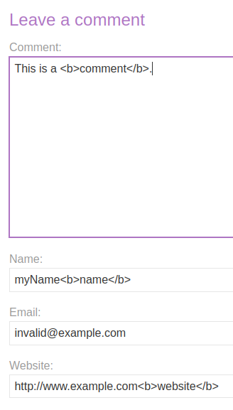
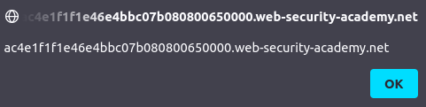
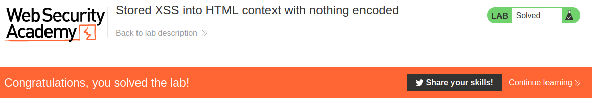

# Lab: Stored XSS into HTML context with nothing encoded

Lab-Link: <https://portswigger.net/web-security/cross-site-scripting/stored/lab-html-context-nothing-encoded>  
Difficulty: APPRENTICE  
Python script: [script.py](script.py)  

## Known information

- Lab contains a stored XSS vulnerability in the comments feature.
- Goals:
  - Submit a comment that triggers an `alert` box on page view.

## Steps

The application of this lab is the blog platform. To find out if I can insert tags in the inputs, I write a comment with tags in as many input fields as possible. The email fields has a validation to only allow valid addresses (however 'valid' is defined here), but that validation happens on the client side in JavaScript and can be bypassed easily by intercepting and modifying the request. However, as the email is nowhere used in the page content, it makes no difference for this lab.

This results in the following HTML code. While the tags in name and website are encoded, the comment contains the injected tags directly, generating valid HTML:

So let's leave a more alerting comment:

Refreshing the page brings this alert box, confirming the XSS vulnerability for this domain:

At the same time, the lab updates to

