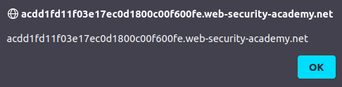

# Lab: Stored XSS into anchor href attribute with double quotes HTML-encoded

Lab-Link: <https://portswigger.net/web-security/cross-site-scripting/contexts/lab-href-attribute-double-quotes-html-encoded>  
Difficulty: APPRENTICE  
Python script: [script.py](script.py)  

## Known information

- Applications has a XSS vulnerability in the comment feature
- Goals:
  - Raise an `alert` box when the author name of a comment is clicked

## Steps

As usual, the first step is to analyse the application. As a test I post a comment with an HTML tag in all fields (except the email). It results in this HTML:

The name and comment fields escape the brackets, while the website does not. Therefore not all input is treated as equally malicious. Next is to find out what other characters may be allowed. As in the [last lab](../Reflected_XSS_into_attribute_with_angle_brackets_HTML-encoded/README.md), I use `xX';!--"<XSS>=&{()}Xx` as input in these fields:

This results in this interesting looking HTML code:

It shows clearly, that the double quote in the website URL terminates the string. So I can use it to inject other attributes or, as brackets are not encoded either, arbitrary other tags.

The lab states that the `alert` should be raised when the author name is clicked. So I inject `http://www.example.com" onclick="alert(document.domain)` as website to result in this HTML:

Clicking on the author name raises the expected `alert` box, confirming the XSS for the domain:

The lab updates to

(technically, the lab updates to 'solved' directly after sending the comment, not after clicking the link)
