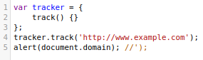
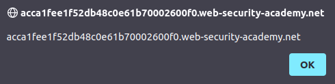
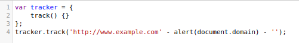

# Lab: Stored XSS into onclick event with angle brackets and double quotes HTML-encoded and single quotes and backslash escaped

Lab-Link: <https://portswigger.net/web-security/cross-site-scripting/contexts/lab-onclick-event-angle-brackets-double-quotes-html-encoded-single-quotes-backslash-escaped>  
Difficulty: PRACTITIONER  
Python script: [script.py](script.py)  

## Known information

- Application contains a stored XSS vulnerability in the comments feature
- Goals:
  - Create a comment that calls `alert` when the author name is clicked

## Steps

### Analysis

As a first step I use `xX';!--"<XSS>=\&{()}Xx` in all possible input fields to see how they get stored and send back to the browser. True to the name of the lab, angle brackets and double quotes are encoded and single quotes and backslah are escaped:

```html

<a id="author" href="http://www.example.comxX\';!--&quot;&lt;XSS&gt;=\\&{()}Xx" onclick="
  var tracker={track(){}};
  tracker.track('http://www.example.comxX\';!--&quot;&lt;XSS&gt;=\\&{()}Xx');
  ">
xX&apos;;!--&quot;&lt;XSS&gt;=\\&amp;{()}Xx
</a>
```

Interestingly, the application already adds an onclick event to the link, in which my input, specifically the URL, gets inserted. I can not immediately break out of the string as the single quote is escaped properly. I can also not add a manual single backslash in front of it like in [another lab](../Reflected_XSS_into_a_JavaScript_string_with_angle_brackets_and_double_quotes_HTML-encoded_and_single_quotes_escaped/README.md) as it gets escaped as well.

But from the code it is evident that the `&`-character does not get HTML-encoded. This allows me to inject any HTML encoded values that are valid within the attribute `onclick`. For example a single quote.

### Working non-solution

`http://www.example.com&apos;);alert(document.domain);//`


When the comment is sent to the browser, this is the resulting HTML:

```html

<a id="author" href="http://www.example.com&apos;);alert(document.domain);//" onclick="
  var tracker={track(){}};
  tracker.track('http://www.example.com&apos;);alert(document.domain);//');
  ">myName</a>
```

The single quote is HTML-encoded by the server, but before it is handed to the JavaScript it will be decoded into this JavaScript code:



This terminates the string, finishes the track command and adds the `alert` as a completely separate command. The remaining parts `');` that are added by the server are commented out. This results in valid JavaScript.

Clicking on the author link opens the expected JavaScript alert and confirms the XSS vulnerability:



But for some reason, this is not a valid solution for the lab.

### Solution that solves lab

Reading through the academy content that belongs to the lab it gives this example: `&apos;-alert(document.domain)-&apos;`.

This code does terminate the string, but does not finish the track command. Instead, it applies the [subtraction operator](https://262.ecma-international.org/12.0/#sec-subtraction-operator-minus) on it. I can't wrap my head around the official description given there. Fortunately, there is a [stackoverflow answer](https://stackoverflow.com/questions/47026942/minus-operator-on-strings-in-javascript) that uses and older version of the spec but states in clear language that the operands are converted to a number.

This means that the `alert` command is executed to evaluate its value. Afterwards, another `-'` is injected to form valid JavaScript again.

The resulting JavaScript code is:



Using this example from the academy solves the lab immediately after sending it. I guess evaluating client site exploits in the lab is rather difficult, so the lab just validates that it matches the 'expected' solution from the lab without checking whether the code actually calls `alert`. Fair enough I'd say, and I should learn to read through the academy before going into the labs :).


