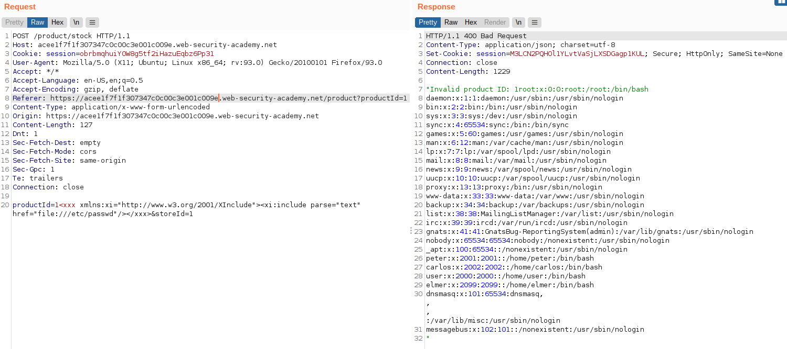
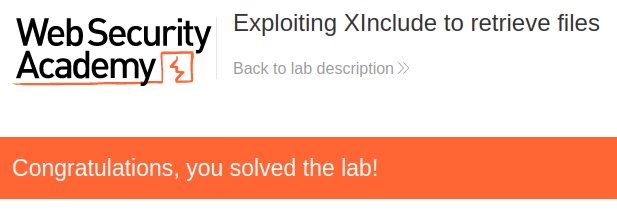

# Lab: Exploiting XInclude to retrieve files

Lab-Link: <https://portswigger.net/web-security/xxe/lab-xinclude-attack>  
Difficulty: PRACTITIONER  
Python script: [script.py](script.py)  

## Known information

- Application contains a stock checking feature vulnerable to XXE
- User input is included in an XML document on the server, but no control of full XML document
- Vulnerable to XInclude
- Goals:
  - Retrieve content of `/etc/passwd`

## Steps

### Analysis

As in the other labs in this chapter the lab application is the shop site with stock checking feature. This time, the request looks rather non-XML:


Assuming the result may be embedded in an XML document, it may look like this:

```xml
<?xml version="1.0" encoding="UTF-8"?>
<stockCheck>
  <productId>1</productId>
  <storeId>1</storeId>
</stockCheck> 
```

If I add some XML to one of the fields, it may end up inside the XML. For example, adding `<tag>content</tag>` may result in an XML like this:

```xml
<?xml version="1.0" encoding="UTF-8"?>
<stockCheck>
  <productId>1<tag>content</tag></productId>
  <storeId>1</storeId>
</stockCheck> 
```

The resulting XML is still well formed. If there is a schema defined for the document it will violate the schema, but if there is none or it is not validated, than the document may just go through.

### Exfiltrate

So in order to include the file, I create a new tag that references the `XInclude` namespace and provide the file to include:

```xml
<xxx xmlns:xi="http://www.w3.org/2001/XInclude"><xi:include parse="text" href="file:///etc/passwd"/></xxx>
```

Like in previous labs, the `productId` is echoed back if it is an invalid one. So I add this to the `productId` in the request to cause an error and have the resulting content of productId sent to me:



At the same time, the lab page updates to


