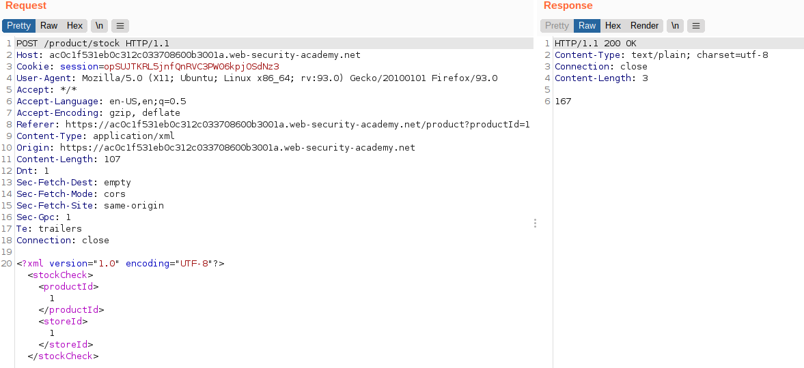
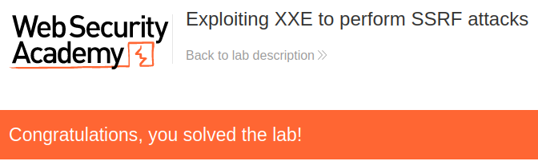

# Lab: Exploiting XXE to perform SSRF attacks

Lab-Link: <https://portswigger.net/web-security/xxe/lab-exploiting-xxe-to-perform-ssrf>  
Difficulty: APPRENTICE  
Python script: [script.py](script.py)  

## Known information

- Application contains a stock checking feature that is vulnerable to XXE
- A backend endpoint is running at `http://169.254.169.254` with EC2 metadata
- Goals:
  - Perform an SSRF attack and exfiltrate the IAM secret access key

## Steps

### Analysis

As usual, the web application is the shop website containing the product check feature:

The request looks similar to the [previous lab](../Exploiting_XXE_using_external_entities_to_retrieve_files/README.md). There, a file on the local file system was referenced as external entity. Here, another backend system need to be referenced instead.

### Exfiltration

On the AWS website there are information about [EC2 metadata retrieval](https://docs.aws.amazon.com/AWSEC2/latest/UserGuide/instancedata-data-retrieval.html) and [Instance metadata categories](https://docs.aws.amazon.com/AWSEC2/latest/UserGuide/instancedata-data-categories.html).

Especially interesting is this enpoint:

Requesting this endpoint without role name results in the error message `"Invalid product ID: admin"`, so I simply use this role (which would also be a very good first guess):

At that moment, the lab page updates to

