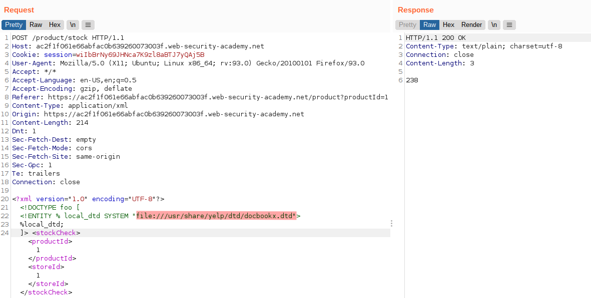
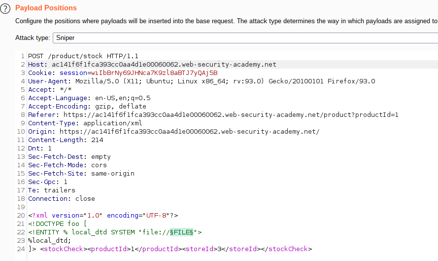
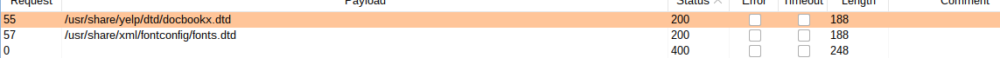
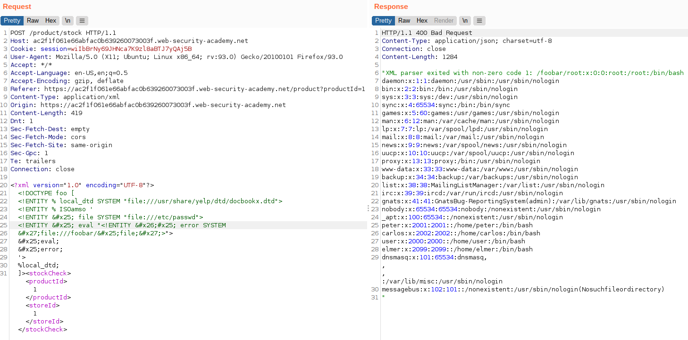

# Lab: Exploiting XXE to retrieve data by repurposing a local DTD

Lab-Link: <https://portswigger.net/web-security/xxe/blind/lab-xxe-trigger-error-message-by-repurposing-local-dtd>  
Difficulty: EXPERT  
Python script: [script.py](script.py)  

## Known information

- Application contains a stock checking feature vulnerable to XXE
- No result is displayed back
- Reference an existing DTD file and redefine on entity is required
- A DTD file exists (likely) at `/usr/share/yelp/dtd/docbookx.dtd` defining the entity `ISOamso`
- Goals:
  - Retrieve content of `/etc/passwd`

## Steps

As usual the first step is to analyse the application, specifically the store checking feature. It looks fairly straight forward similar to most of the previous labs:

As stated in the lab description, modifying the request like in the earlier labs does not lead to anything directly. Parsing errors lead to error messages, but without displaying any content.

Loading an external DTD file is blocked in this lab, however an existing local file can be used instead, as indicated in the description.

### Enumerate valid DTD file

It can be verified that a file exist on the target system by simply including it as local DTD. If the file does exist, the request goes through smoothly:

Otherwise, an error is shown:

This way it is possible to enumerate possible DTD until a valid one for the target system is found. A good description of this attack can be found on [gosecure](https://www.gosecure.net/blog/2019/07/16/automating-local-dtd-discovery-for-xxe-exploitation/), with a nice list of potential DTD file in their [github repo](https://github.com/GoSecure/dtd-finder/blob/master/list/dtd_files.txt).

For the lab, the correct file is already given in the description. But given the ability to enumerate, finding this is trivial:

- Attack type: Sniper
- Payload: List from the [github repo](https://github.com/GoSecure/dtd-finder/blob/master/list/dtd_files.txt) above
- Payload Encoding: No URL-encoding

This way, two possible existing DTDs are found, the one given in the description and another one:

### Exploit

Now that a valid local DTD is found, a existing entity can be redefined to dynamically expand into an error message containing the content of the target file in the same way as in the [Lab: Exploiting blind XXE to retrieve data via error messages](../Exploiting_blind_XXE_to_retrieve_data_via_error_messages/README.md). For this file, its content can be viewed at [apt-browse](https://www.apt-browse.org/browse/ubuntu/bionic/main/amd64/yelp/3.26.0-1ubuntu2/file/usr/share/yelp/dtd/docbookx.dtd) to find possible entities.

It is important to double encode the `%` character within the redefined entity and additionally the `&` and `'` within the eval:

After sending the request, the lab updates to

This is a good example why systems should be as tiny as possible, ideally single purpose. The more files, applications and services are available, the bigger the attack surface. In this case, if the web server would not contain any desktop environment, at least this specific file would not exist. And there is no reason why a web server should have a desktop.
