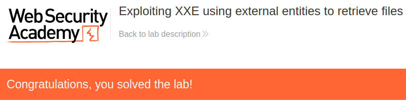

# Lab: Exploiting XXE using external entities to retrieve files

Lab-Link: <https://portswigger.net/web-security/xxe/lab-exploiting-xxe-to-retrieve-files>  
Difficulty: APPRENTICE  
Python script: [script.py](script.py)  

## Known information

- Application contains a stock checking feature vulnerable to XXE
- Goals:
  - Inject an XXE and retrieve content of `/etc/passwd` file

## Steps

### Analysis

The lab application is the shop website again, still containing the product stock checking feature known from previous labs. This time the request contains a rather lenghty and verbose XML description of the requested data:

If I request an invalid product ID, the application echoes the content of the productId back into the response:

That way, whatever ends up as productId will be visible in the response.

### Exploitation

The XML content is completely under my control. If no validation occurs on server side, I can inject any type of malicious content.

To reference a file on the local file system of the server, I can define it as external entity and reference within the document:

At the same time, the lab page updates to

