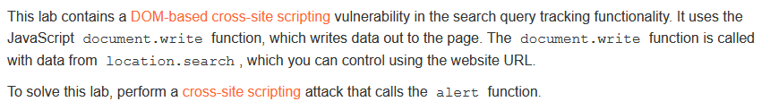
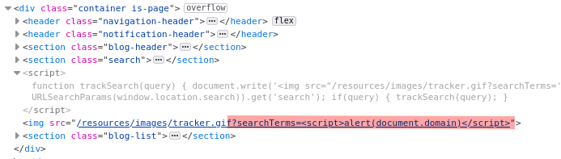
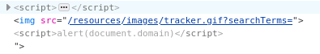

# Write-up: DOM XSS in document.write sink using source location.search @ PortSwigger Academy

This write-up for the lab *DOM XSS in document.write sink using source location.search* is part of my walkthrough series for [PortSwigger's Web Security Academy](https://portswigger.net/web-security).

**Learning path**: Client-side topics → Cross-site scripting

Lab-Link: <https://portswigger.net/web-security/cross-site-scripting/dom-based/lab-document-write-sink>  
Difficulty: APPRENTICE  
Python script: [script.py](script.py)  

## Lab description

## Steps

The lab application is a blog website with search functionality. After performing a search, the search term is included on the result page.

A simple XSS attempt fails:

Looking at the page source, the search term displayed is properly encoded. However, it also shows that a javascript takes the search term out of the URL and writes it into an img-tag for some type of tracking:

Using the browser tools, I can inspect the resulting HTML. It is visible that my search term is embedded without any apparent safeguards:

Of course, the script tags are within a string here, so they are harmless. However, if I can terminate the string by injecting double quotes, then I can manipulate the resulting HTML freely.

---

### The malicious payload

Injecting `">` results in the following HTML:

It is visible that I closed both the src-string and the img-tag, followed by valid JavaScript code triggering an alert-box. The remaining `">` of the original content is shown as plain text and does not interfere here:

At the same moment, the lab updates to

---

### Alternative

The same result can be achieved by injecting `" onload="alert(document.domain)`, which adds an attribute to the `img` tag and results in this HTML:

