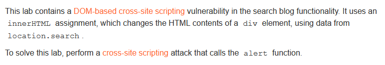
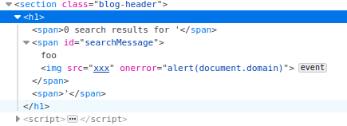

# Write-up: DOM XSS in innerHTML sink using source location.search @ PortSwigger Academy

This write-up for the lab *DOM XSS in innerHTML sink using source location.search* is part of my walkthrough series for [PortSwigger's Web Security Academy](https://portswigger.net/web-security).

**Learning path**: Client-side topics → Cross-site scripting

Lab-Link: <https://portswigger.net/web-security/cross-site-scripting/dom-based/lab-innerhtml-sink>  
Difficulty: APPRENTICE  
Python script: [script.py](script.py)  

## Lab description

## Steps

The lab application is a blog website with search functionality. The search term is included on the result page. 

This is not performed on the server side, but by using client side JavaScript:

If the `search` argument is provided, the `innerHTML` of a `span`-element is changed dynamically. Inserting JavaScript by using `foo` as search parameter results in this HTML:

This will raise the JavaScript `alert` box confirming the XSS vulnerability and updates the lab to

