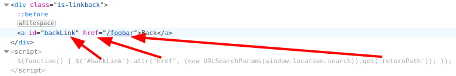
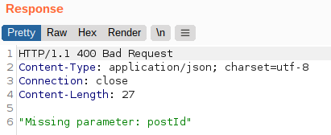

# Lab: DOM XSS in jQuery anchor href attribute sink using location.search source

Lab-Link: <https://portswigger.net/web-security/cross-site-scripting/dom-based/lab-jquery-href-attribute-sink>  
Difficulty: APPRENTICE  
Python script: [script.py](script.py)  

## Known information

- Application contains a DOM-XSS vulnerability in the feedback functionality
- jQuery `$` selector function is used to find an anchor element and changes it with user controlled input (`location.search`)
- Goals:
  - Raise an `alert` box containing the cookie content for the `back` link.

## Steps

### Analysis

Clicking on the `Submit feedback` link on the main page of the blog leads to the path `/feedback?returnPath=/`. It is not immediately apparent that the `back` link uses it, so I change the URL to end in `/feedback?returnPath=/foobar` and examine the resulting HTML:

It is visible that it takes whatever is in the `returnPath` parameter and puts in in the `href` attribute of a link with the id `backLink` (as far as I know the id selector uses a highlander approach - there must only be one element using the id).

Interestingly, the `Submit feedback` link within a blog post does not contain the postId parameter. The URL just contains `feedback?returnPath=/post`. Therefore using the `feedback link --> back link` from a post will lead to an invalid request as `/post` itself requires that parameter:

### Exploitation

In any case, I now know how the URL parameter propagates into the back link. Javascript is a valid target within the `href`-attribute, so injecting `javascript:alert(document.cookie);` as returnPath will result in this HTML:

Clicking on the link raises the alert box and the lab page updates to

