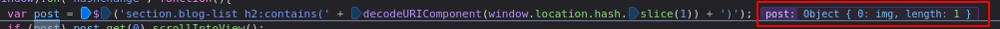

# Lab: DOM XSS in jQuery selector sink using a hashchange event

Lab-Link: <https://portswigger.net/web-security/cross-site-scripting/dom-based/lab-jquery-selector-hash-change-event>  
Difficulty: APPRENTICE  
Python script: [script.py](script.py)  

## Known information

- Application contains a DOM-XSS vulnerability on the homepage
- jQuery `$` selector function is used to auto-scroll to a post based on the location.hash property
- Goals:
  - Deliver an exploit that calls `print`

## Steps

### Analysis

The first step is to analyse the web application. An interesting script can be found at the bottom of the page:


A quick check in some [online documentation](https://developer.mozilla.org/en-US/docs/Web/API/Window/hashchange_event) shows that the script is used to scroll to a post indicated by the fragment part of the URL. Using the title of a post after a `#`, the browser scrolls to the post.

When I use a non-existing title, the console shows an error:


### Creating an exploit

So I can use content from the URL to trigger an error. If I am able to also inject an onerror handler, than I can call any command I want.

Fortunately there is the exploit server that I can use to prepare and deliver a custom made page. So I can create a page including an iframe to the vulnerable page. With an `onload` event I change the fragment which in turn triggers the `hashchange` event.

As a first step I try to trigger an error with this payload:

```html
<iframe src="https://ac8a1f4d1e3d1aa3c06b541e0003009a.web-security-academy.net/#" onload="this.src+='xxx'"></iframe>
```

Switching on the breakpoints in the debugger, I can confirm that it triggers the hashchange:


It also shows an error similar to the one shown in the previous section.

Unfortunately, I can not simply attach an onerror handler on the iframe, I guess because of differing origins of the page itself (exploit server) and the iframe.

Instead, I try to inject an `img` tag with an invalid source and local onerror handler:

```html
<iframe src="https://ac8a1f4d1e3d1aa3c06b541e0003009a.web-security-academy.net/#" onload="this.src+=''"></iframe>
```

This causes the `post` variable to evaluate to a single image object:



and shows the alert box confirming that the script triggers on the main domain:


### Exploit

Now it is simple: Changing the error handler to call `print` and deliver the exploit to the victim:

```html
<iframe src="https://ac8a1f4d1e3d1aa3c06b541e0003009a.web-security-academy.net/#" onload="this.src+=''"></iframe>
```

Sending the page to the victim results in


