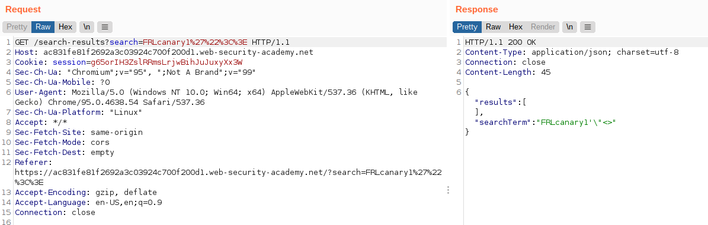
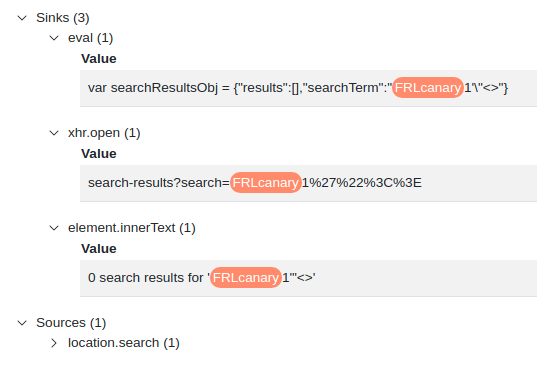
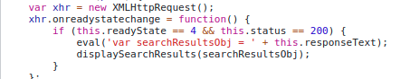
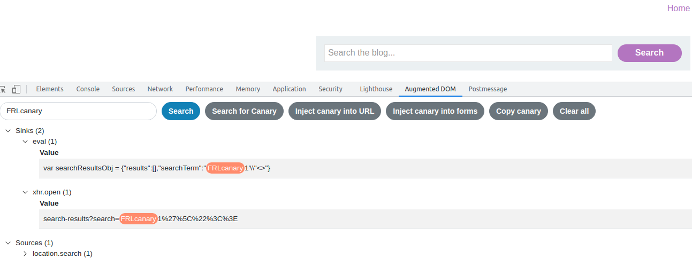
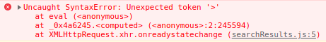
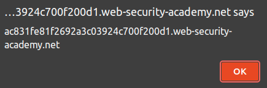
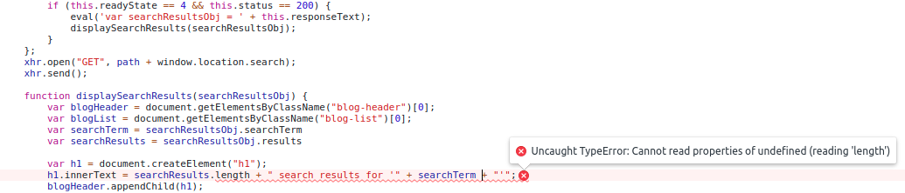
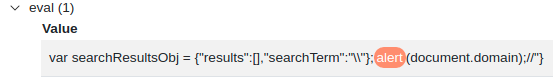

# Lab: Reflected DOM XSS

Lab-Link: <https://portswigger.net/web-security/cross-site-scripting/dom-based/lab-dom-xss-reflected>  
Difficulty: PRACTITIONER  
Python script: [script.py](script.py)  

## Known information

- Application contains a reflected DOM vulnerability by including user provided input in the response
- Client side JavaScript uses these reflected data
- Goals:
  - Raise an `alert` box

## Steps

For this lab, I used the DOM Invader of Burp Suite for the first time. To identify possible injection points I use the `Inject canary into forms` button and start the search. The search result is sent as JSON response containing my search term. The double quote is escaped on the server side, the other characters are reflected directly:

DOM Invader shows that my canary is present in three possible sinks on the client side script:

The innerText property automatically inserts the value as plain so it is less useful for JavaScript injection.

Looking at the code of the eval, it does look promising:

In order to inject anything I need to terminate the `searchTerm`. Let's see what happens if I include a `\` in my request:

The `element.innerText` sink is not hit, and thus the page does not contain my search term. This is a good sign, as I was able to change, or interrupt in this case, the data flow through the code with my input. On the console, a syntax error is shown:

My injected `\"` was not escaped by the server side, for the client application it escapes the `\`, leaving the double quote active in place. The following `<>` then caused the syntax error.

So in order to execute my payload, I can terminate the string and json structure, append a function call and finish off with ignoring what comes next: `\"}+alert(document.domain);//`. This results in the following response

which causes this code as part of the eval

and successfully raises the alert box confirming the injection

While it solves the task, it also causes the application to error out:

Without much knowledge about JavaScript my guess is that adding the alert box as concatenation screws the structure of the variable, so when `searchResultsObj.results` is called, it is not the empty results list but something else.

However, this can quickly rectified by using `\"};alert(document.domain);//` instead, which results in this response:

This appears to keeps the original json structure intact and the client side application runs without errors.

In any case, the lab updates to

