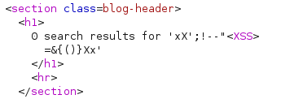
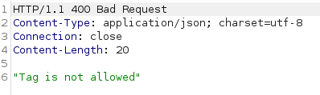
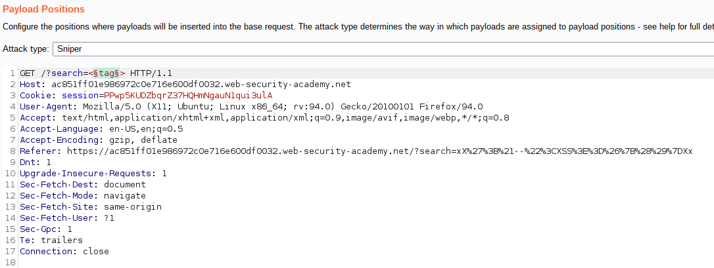
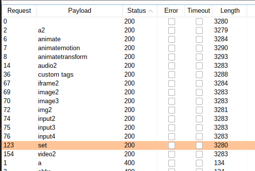

# Lab: Reflected XSS into HTML context with all tags blocked except custom ones

Lab-Link: <https://portswigger.net/web-security/cross-site-scripting/contexts/lab-html-context-with-all-standard-tags-blocked>  
Difficulty: PRACTITIONER  
Python script: [script.py](script.py)  

## Known information

- Application has a reflected XSS vulnerability
- Goals:
  - Perform XSS to inject a custom tag and automatically `alert(document.cookie)`

## Steps

As usual, the first step is to analyse the application and its reaction to input. Using `xX';!--"<XSS>=&{()}Xx` as input results in this HTML code:



My invented tag `<XSS>` is inserted directly into the page source. However, when I try the same with an existing tag, for example `<b>someText</b>`, it results in:



### Find allowed tags

Therefore some filtering is done on the tags. To find out which tags might be allowed, I use the [cheat sheet](https://portswigger.net/web-security/cross-site-scripting/cheat-sheet) provided by PortSwigger to enumerate allowed tags. For this, I send the request to Burp Intruder:



- Attack type: **Sniper**
- Payload: Simple list, copied tags from [XSS cheat sheet](https://portswigger.net/web-security/cross-site-scripting/cheat-sheet) and pasted here.



The result shows that no HTML tag is allowed. Custom tags are possible, as well as some tags that are only valid within XML based structures, like `<svg><animate>`. Unfortunately, `<svg>` itself is forbidden, so this does not help.

### Find allowed events

Next I try to find out what events, if any, are allowed within my custom tag. I repeat the last step, just with the event list:


- Attack type: **Sniper**
- Payload: Simple list, copied events for `<body>` from [XSS cheat sheet](https://portswigger.net/web-security/cross-site-scripting/cheat-sheet) and pasted here

The result shows that all events from that list are allowed and result in syntactically valid HTML:


The first naive attempt whether `onload` on a custom tag does anything on page load is not successful. Another option is the `onfocus` event if I can arrange that the tag gets focused on page load. The `autofocus` attribute unfortunately only exists for `<input>` tags, so does not help here.

Another possibility to focus an element is to use [tabindices](https://developer.mozilla.org/en-US/docs/Web/HTML/Global_attributes/tabindex). It marks an element as focusable, but requires keyboard interaction.

However, using a URI fragment causes the browser to foxus the indicated element if there is one with the given `id` or `name` in the document.

Therefore, my exploit page needs to one that redirects to the search URL containing `<foobar onfocus=alert(document.cookie) tabindex=1 id=foo>` as search parameter and focusing the fragment `#foo`

```javascript
<script>
document.location = 'https://ac5d1f7f1e2499ccc05e09e800c500cf.web-security-academy.net/?search=<foobar onfocus=alert(document.cookie) tabindex=1 id=foo>#foo'
</script>
```

The search term needs to be URLencoded to avoid that the browser interprets it in the exploit page, resulting in this final exploit:

```javascript
<script>
document.location = 'https://ac5d1f7f1e2499ccc05e09e800c500cf.web-security-academy.net/?search=%3c%66%6f%6f%62%61%72%20%6f%6e%66%6f%63%75%73%3d%61%6c%65%72%74%28%64%6f%63%75%6d%65%6e%74%2e%63%6f%6f%6b%69%65%29%20%74%61%62%69%6e%64%65%78%3d%31%20%69%64%3d%66%6f%6f%3e#foo
</script>
```

Sending the exploit to the victim results in the lab updating to


