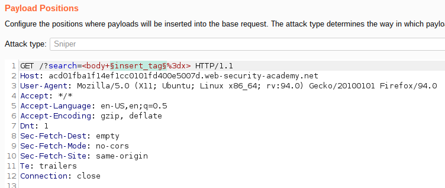
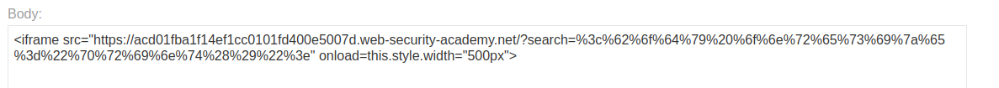

# Lab: Reflected XSS into HTML context with most tags and attributes blocked

Lab-Link: <https://portswigger.net/web-security/cross-site-scripting/contexts/lab-html-context-with-most-tags-and-attributes-blocked>  
Difficulty: PRACTITIONER  
Python script: [script.py](script.py)  

## Known information

- Application has a reflected XSS vulnerability in the search feature
- Common XSS vectors are blocked by a web application firewall
- Goals:
  - Call the `print` function

## Steps

### Analysis

As a first step I use the search term `xX';!--"<XSS>=&{()}Xx` to find out of common characters get encoded. Interestingly, this turns into the following HTML:

No characters get encoded, even the tag is there with an added line break. So in principle I can inject HTML tags.

Next step is using a basic XSS vector to see how the application deals with it. The input  `` result in an `400 Bad Request` error and the message `Tag is not allowed`.

This implies that the filtering is done based on a blacklist approach as the non-existing `<XSS>` tag in the initial search term went through unharmed.

### Find allowed tags

So I need to find allowed tags next. Fortunately, PortSwigger has a nice [cheat sheet](https://portswigger.net/web-security/cross-site-scripting/cheat-sheet) containing a huge number of vectors and prepared lists of tags, events and payloads.

So I send the search request to Burp Intruder:

- Attack type: **Sniper**
- Payload: Simple list, copied tags from [XSS cheat sheet](https://portswigger.net/web-security/cross-site-scripting/cheat-sheet) and pasted here.

The result comes back very quickly:

It shows that in addition to custom tags the `<body>` tag is allowed as well.

### Find allowed events

Now that I know which tag I can use, I need to find an allowed event as well

- Attack type: **Sniper**
- Payload: Simple list, copied events for `<body>` from [XSS cheat sheet](https://portswigger.net/web-security/cross-site-scripting/cheat-sheet) and pasted here

### Send exploit

I have now both an allowed tag and an allowed event. The proper payload therefore is the search term `<body onresize="print()">`. To deliver it to victim, an exploit server is provided to prepare and send the exploit.

The print command needs to be performed automatically without any user interaction. Therefore I need a way to enforce the `resize` event without requiring the victim to do it.

For this I use an iframe that contains the search that resizes on load. I URL-encode the entire search term to ensure nothing goes amiss inside the iframe:

When I check the exploit with the `View exploit` button, the iframe opens correctly and the print window shows.

Therefore I click `Deliver exploit to victim`. The page immediately updates to

