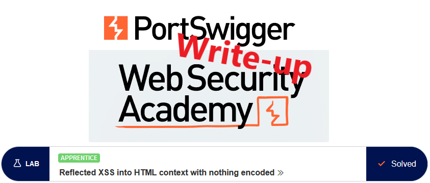

# Write-up: Reflected XSS into HTML context with nothing encoded @ PortSwigger Academy

This write-up for the lab *Reflected XSS into HTML context with nothing encoded* is part of my walkthrough series for [PortSwigger's Web Security Academy](https://portswigger.net/web-security).

**Learning path**: Client-side topics → Cross-site scripting

Lab-Link: <https://portswigger.net/web-security/cross-site-scripting/reflected/lab-html-context-nothing-encoded>  
Difficulty: APPRENTICE  
Python script: [script.py](script.py)  

## Lab description

## Steps

As usual, the first step is to analyze the application. In this case, it is the blog website with search functionality.

When searching for a term, it is reflected back in the result:

This behavior can cause issues if the search string is not sanitized correctly. 

I try by including simple HTML tags within my search input. These tags are embedded into the HTML source of the response without any escaping:

The most trivial XSS is to simply use `<script>` tags within the search term and hope that they, too, are embedded in the HTML:

Sure enough, this raises the alert box confirming the XSS vulnerability on the domain:

At the same time, the lab updates to

