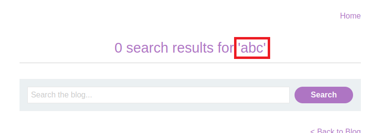
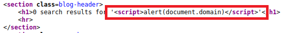

# Lab: Reflected XSS into HTML context with nothing encoded

Lab-Link: <https://portswigger.net/web-security/cross-site-scripting/reflected/lab-html-context-nothing-encoded>  
Difficulty: APPRENTICE  
Python script: [script.py](script.py)  

## Known information

- Applications contains a reflected cross site scripting in the search functionality
- Goals:
  - Raise an `alert` box

## Steps

As usual, the first step is to analyse the application. In this case, it is the blog website with a new feature: a search functionality.

When searching for a term, it is reflected back in the result:

Using HTML tags as search input, these tags are embedded into the HTMl source of the response without any escaping:

The most trivial XSS is to simply use `<script>` tags within the search term and hope that they, too, are embedded in the HTML:

Sure enough, this raises the alert box confirming the XSS vulnerability on the domain:

Meanwhile, the lab updates to

