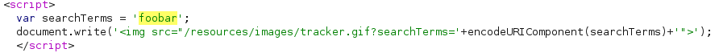
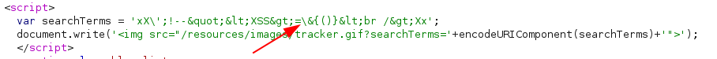
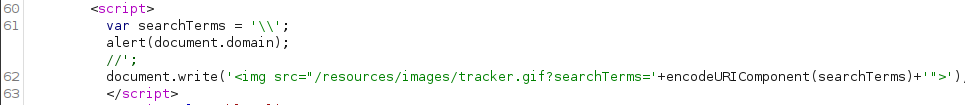
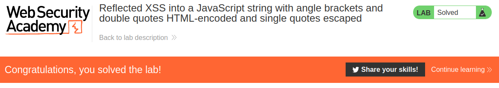

# Lab: Reflected XSS into a JavaScript string with angle brackets and double quotes HTML-encoded and single quotes escaped

Lab-Link: <https://portswigger.net/web-security/cross-site-scripting/contexts/lab-javascript-string-angle-brackets-double-quotes-encoded-single-quotes-escaped>  
Difficulty: PRACTITIONER  
Python script: [script.py](script.py)  

## Known information

- Application has a reflected XSS vulnerability in the search tracking feature
- Angle brackets and double quotes are HTML encoded, single quotes are escaped
- Goals:
  - Raise an `alert` box

## Steps

As usual, the first step is to analyse the page and the vulnerable functionality. Like in some other labs, the search term is reflected twice in the HTML response. In the blog header and the search term tracker:

To find out what characters are encoded, escaped or removed, I use `xX';!--"<XSS>=\&{()} Xx` as search term. This results in this response code:

While double quotes and brackets are escaped and the single quote is escaped, the backslash itself gets neither treatment. This allows me to manually escape the backslash added by the server to escape the single quote. As a result, this leaves me with a literal backslash and the single quote terminating the string.

I then finish the command with `;`, call my `alert` and comment out the remainder of the line with `//` so that the statement remains valid JavaScript. The full payload is `\';alert(document.domain);//`. This results in the following HTML, Burp Suite conveniently adds visual line breaks:

This shows the expected `alert` message, confirming the XSS vulnerability on the domain. At the same moment, the lab updates to

