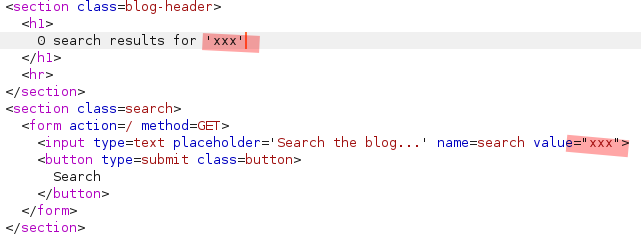
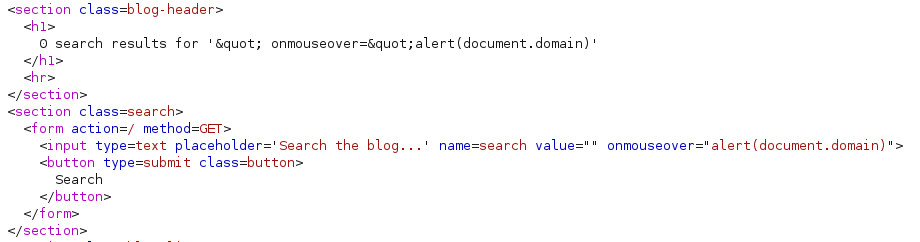
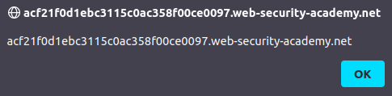

# Lab: Reflected XSS into attribute with angle brackets HTML-encoded

Lab-Link: <https://portswigger.net/web-security/cross-site-scripting/contexts/lab-attribute-angle-brackets-html-encoded>  
Difficulty: APPRENTICE  
Python script: [script.py](script.py)  

## Known information

- Application is vulnerable to reflected XSS in the search feature
- Angle brackets are HTML encoded
- Goals:
  - Inject an attribute and raise an `alert`

## Steps

As a first step, I perform a search and check the result. The response contains the search term in two places, within the text informing me about the number of results, and as prefilled content of the search input field:

The next step is to find out what characters might be encoded on the way, if any (ignoring the fact that the lab title answers this already). So I use `xX';!--"<XSS>=&{()}Xx` as search string to find this response:

I can see that the visible response text containing my search string has a couple of HTML encodings, including both quotations, both brackets and ampersand.

The form input field is a completely different story though. While it encodes the brackets, the other safeguards are missing. The `value` content is terminated on the double quotes, the remainder of the search term is then used as some nonsensical HTML.

Both `<` and `>` are encoded so I can not close the input and inject for example an `img` tag. But I I can use this to inject arbitrary attributes to the `input` tag. A quick look in the [documentation](https://www.w3schools.com/tags/tag_input.asp) shows all attributes for the `input` tag. unfortunately, a promising event like `onload` is not executed for this type of input field..

Surprisingly, my first attempt to use `onfocus` did raise an alert box when the input field got the focus but failed to solve the lab. The second attempt to use `onmouseover` was successful. I used the search term `" onmouseover="alert(document.domain)`. The double quote closed the value attribute, then injected the onmouseover event. The existing double quote that normally closes the value attribute now closes the onmouseover:

At the same time, the lab updates to

