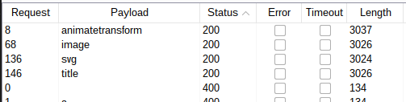
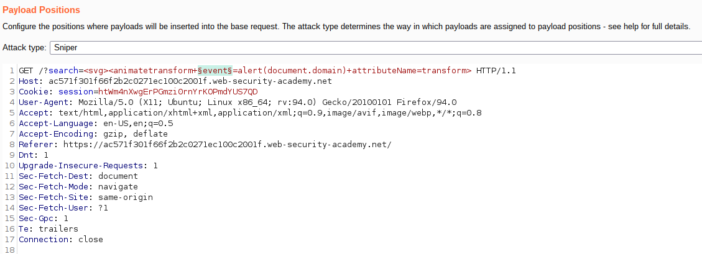
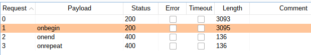

# Lab: Reflected XSS with some SVG markup allowed

Lab-Link: <https://portswigger.net/web-security/cross-site-scripting/contexts/lab-some-svg-markup-allowed>  
Difficulty: PRACTITIONER  
Python script: [script.py](script.py)  

## Known information

- Application has a reflected XSS vulnerability
- Common tags are blocked, but some SVG tags and events are missed
- Goals:
  - Raise an `alert` box

## Steps

As usual, the first step is to analyse the application and the input options. Using `xX';!--"<XSS>=&{()}Xx` as search input leads to a new behaviour this time:

PortSwigger has an extensive [XSS cheat sheet](https://portswigger.net/web-security/cross-site-scripting/cheat-sheet) that provides a lot of different options of tags, events and their browser compatibility.

Going down the list manually is time consuming, so in any real world scenario some type of automation is required. Of course here in the lab I have the lab name providing information of the correct tag: `<svg>`. The correct way is to enumerate possible tags, for example with Burp Intruder:

- Attack type: **Sniper**
- Payload: Simple list, copied tags from [XSS cheat sheet](https://portswigger.net/web-security/cross-site-scripting/cheat-sheet) and pasted here

This goes on for a while, afterwards a few tags show as allowed:

When I select the `svg -> animatetransform` on the cheat sheet, only three events show: `onbegin`, `onend` and `onrepeat`.

I can either repeat the Intruder step above, or manually try them out.

- Attack type: **Sniper**
- Payload: Simple list, copied events for `svg -> animatetransform` from [XSS cheat sheet](https://portswigger.net/web-security/cross-site-scripting/cheat-sheet) and pasted here

This quickly comes back with this result:

So I use this search term on the lab: `<svg><animatetransform onbegin=alert(document.domain) attributeName=transform>` to raise the `alert` box and solve the lab (technically, the lab was already solved with the Intruder request though):

