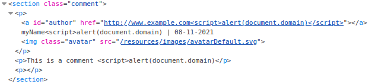
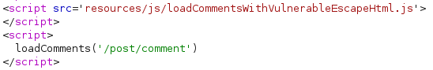
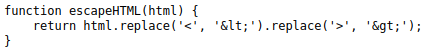
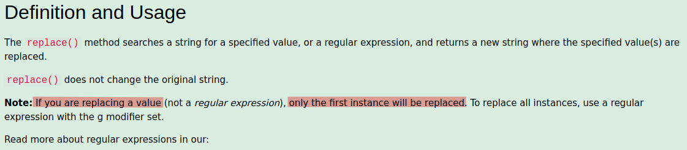
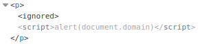
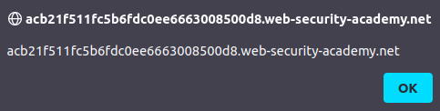

# Lab: Stored DOM XSS

Lab-Link: <https://portswigger.net/web-security/cross-site-scripting/dom-based/lab-dom-xss-stored>  
Difficulty: PRACTITIONER  
Python script: [script.py](script.py)  

## Known information

- Application contains a stored DOM vulnerability in the comment function
- Goals:
  - Raise an `alert` box

## Steps

### Analysis

As usual, the first step is to analyse the website. A comment function is always a nice playground to try to do something not intended, as by its very definition it takes user provided content. If this content is not validated and sanitized properly, evil things may happen.

To I try the naive approach to inject things. I know it will not work (as there is another lab for this), but it will help me identify what may or may not be filtered.

So I post this comment:

and it results in this comment:

The more interesting part is the resulting HTML code though:

It shows that at least some countermeasures take place. What is interesting is that in both name and comment the first `` as payload. Unfortunately this does not work. It results in syntactically correct HTML/JavaScript:

But the script is not running. Taking a guess it may be because the code was already parsed by the JavaScript and called the `loadComments` script. Anything that this script adds to the page source is never visited by the parser as the JavaScript pass is finished already.

### Exploit

Therefore, next try is to add something that is native HTML like an `` tag. Using the payload `<ignored>` finally results in the desired alert box confirming the vulnerability on the domain:

At the same moment, the lab updates to

