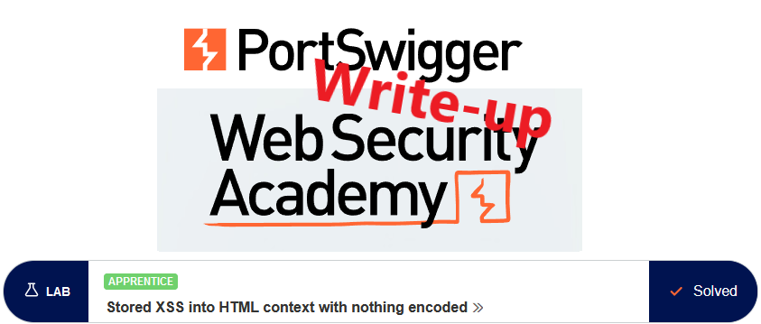
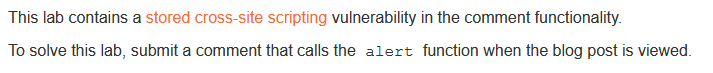
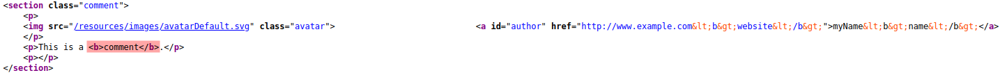
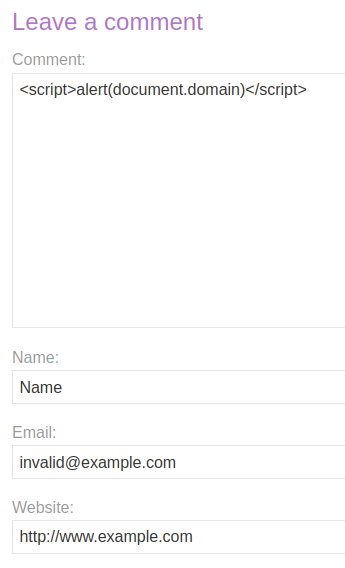

# Write-up: Stored XSS into HTML context with nothing encoded @ PortSwigger Academy

This write-up for the lab *Stored XSS into HTML context with nothing encoded* is part of my walkthrough series for [PortSwigger's Web Security Academy](https://portswigger.net/web-security).

**Learning path**: Client-side topics → Cross-site scripting

Lab-Link: <https://portswigger.net/web-security/cross-site-scripting/stored/lab-html-context-nothing-encoded>  
Difficulty: APPRENTICE  
Python script: [script.py](script.py)  

## Lab description

## Steps

The application of this lab is a blog platform that allows for comments. 

To find out if I can insert tags in the inputs of the comments, I write one with tags in as many input fields as possible. 

The email field has a validation to only allow valid addresses (however 'valid' is defined here), but that validation happens on the client side in JavaScript and can be bypassed easily by intercepting and modifying the request. However, the email is nowhere used in the page content so it makes no difference for this lab.

This results in the following HTML code. While the tags in name and website are encoded, the comment contains the injected tags directly, generating valid HTML:

So let's leave a more alerting comment:

Refreshing the page brings this alert box, confirming the XSS vulnerability for this domain:

At the same time, the lab updates to

