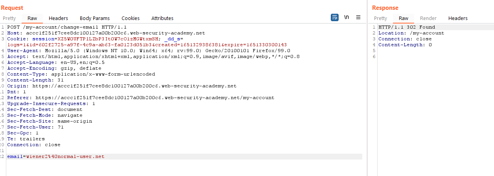
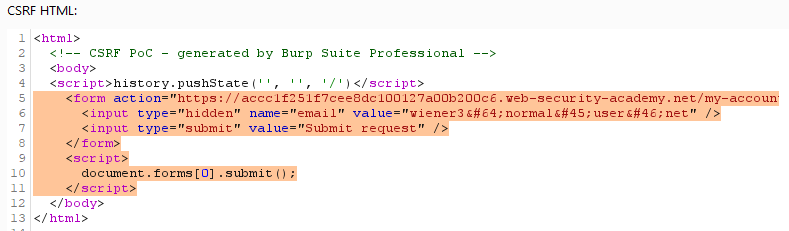
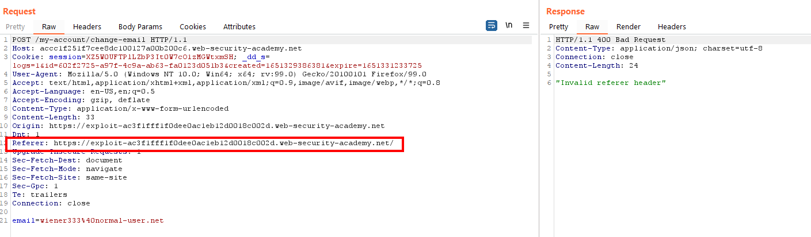
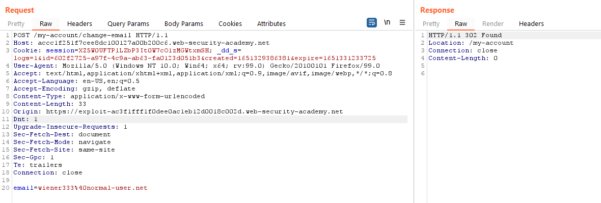
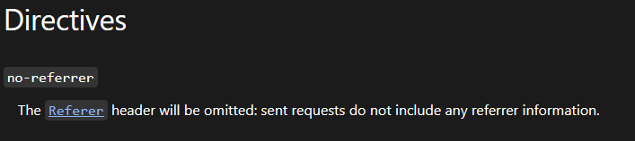
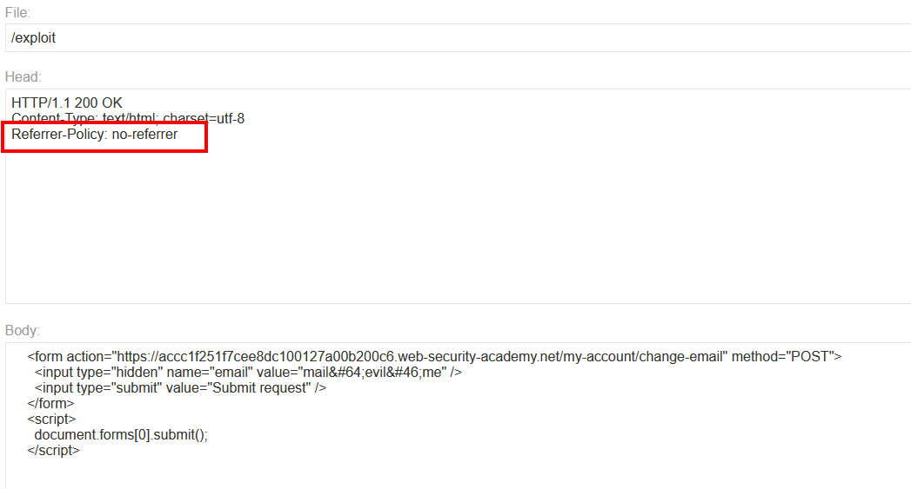
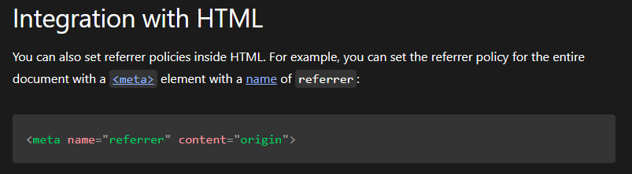

# Lab: CSRF where Referer validation depends on header being present

Lab-Link: <https://portswigger.net/web-security/csrf/lab-referer-validation-depends-on-header-being-present>  
Difficulty: PRACTITIONER  
Python script: [script.py](script.py)  

## Known information

- Lab application contains a email change feature vulnerable to CSRF
- CSRF protection uses Referer header
- Goals:
  - Create some HTML to change a viewers email address
  - Known good credentials `wiener:peter`

## Steps

### Find weak CSRF protection

As usual, the lab application is the blog website. The vast majority of considerations are the same as in the [Lab: CSRF where token validation depends on request method](../CSRF_where_token_validation_depends_on_request_method/README.md) so I will not duplicate it in here, please refer to that document.

I login with the known credentials for `wiener` and change the email address. This results in the following request:

There is no CSRF-token or any obvious protection visible, sending the request to Repeater and change the email again works without issues. 

The first attempt is to use a trivial attack like in the [Lab: CSRF vulnerability with no defenses](../CSRF_vulnerability_with_no_defenses/README.md):

The lab name contains the spoiler alert already: It does not work here

Fortunately, the error message gives a clear indication about what might be wrong. 

The referer header is usually added by the browser automatically when a link is followed. In this case, the referer for my malicious form is my exploit server. So the next step is to put this request into Repeater and simply remove the header, and:

The request goes through and the email gets changed. So the only protection that is in place here is the content of the referer. This is a violation of the condition **Validate on every action**.

Relying on a client provided value is always a bad thing. A malicious actor that is able to intercept the traffic can manipulate it at will.

While I can modify my own traffic, I do not have the capability for the traffic of my victim. In this case I need to coerce the browser of the victim to not send the header.

Fortunately, the documentation at [mozilla.org](https://developer.mozilla.org/en-US/docs/Web/HTTP/Headers/Referrer-Policy) shoes the answer: `Referrer-Policy`, specifically: 

So I update my exploit page with the relevant header:

This time after viewing the exploit my email address got changed.

As an alternative, the directive can also be integrated into the HTML code itself:

All that is left now is to press `Deliver exploit to victim` in order to

Bottom line of this lab is to never trust any client provided data in security decisions.
