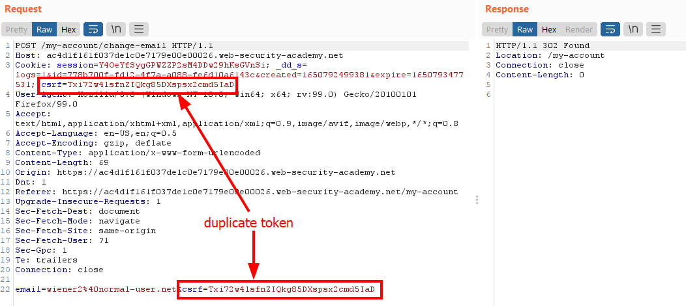
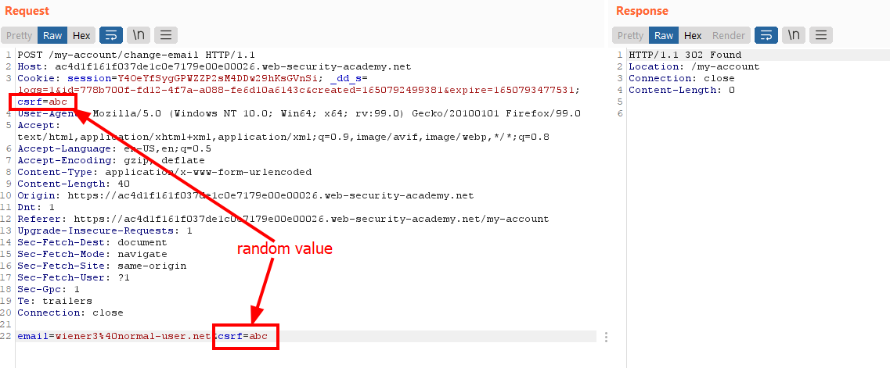
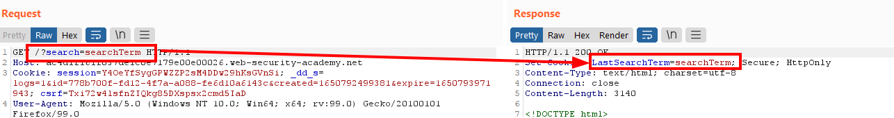
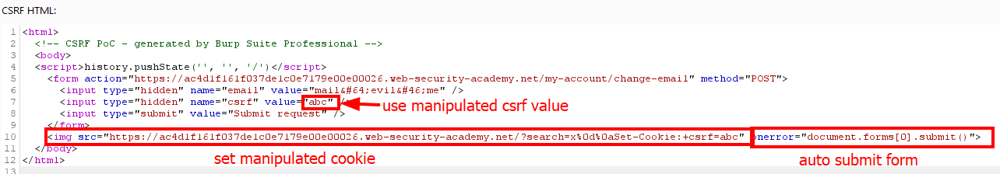

# Lab: CSRF where token is duplicated in cookie

Lab-Link: <https://portswigger.net/web-security/csrf/lab-token-duplicated-in-cookie>  
Difficulty: PRACTITIONER  
Python script: [script.py](script.py)  

## Known information

- Lab application contains a email change feature vulnerable to CSRF
- CSRF protection uses CSRF tokens in both cookie and form data
- Goals:
  - Create some HTML to change a viewers email address
  - Known good credentials `wiener:peter`

## Steps

### Find weak CSRF protection

As usual, the lab application is the blog website. I am again provided with two sets of valid credentials. The vast majority of considerations are the same as in the [Lab: CSRF where token validation depends on request method](../CSRF_where_token_validation_depends_on_request_method/README.md) so I will not duplicate it in here, please refer to that document.

I login with the known credentials for `wiener` and change the email address. This results in the following request:

It is immediately obvious that the csrf token appears twice: in the request body as well as in a cookie. This could mean two things:

1. The backend tracks the csrf tokens as usual, just uses the cookie value as additional line of defense
2. The backend does not do any csrf tracking and just verifies that the body token equals the cookie token which was set at some time earlier (in this case, during the initial visit of the `/login` page)

Option (2) would be rather bad. As soon as an adversary is able to set cookie values, the CSRF-protection can be circumvented entirely.

The token may or may not require the proper format, so I just try it out with an arbitrary short value:

Sure enough, the request goes through and the email is updated.

### Find ways to set the token

The vulnerable CSRF-protection requires me to be able to set a cookie in the context of the website. So finding this way is the next step.

Fortunately, the blog suffers the same vulnerability in the search feature as the [Lab: CSRF where token is tied to non-session cookie](../CSRF_where_token_is_tied_to_non-session_cookie/README.md) and I can abuse it in the same way to manipulate the cookie value:

### Putting both together

To create the exploit, I use the CSRF PoC generator of Burp Suite Pro again. For the community version, take the email change form from the page and modify it accordingly.

I use an image tag to force loading of the URL that manipulates the CSRF-cookie. This tag also contains the auto submit code. It is a more robust way compared with a plain script as it only executes after the image URL failed to produce a valid image.

After deliverying the exploit to the victim, the lab updates to

