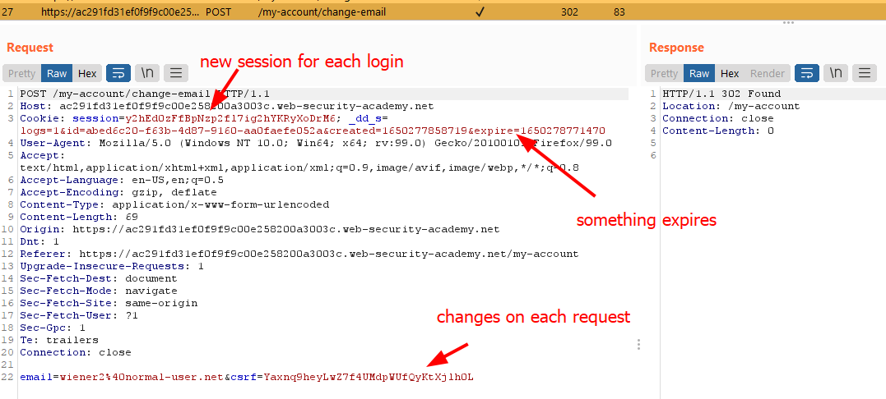
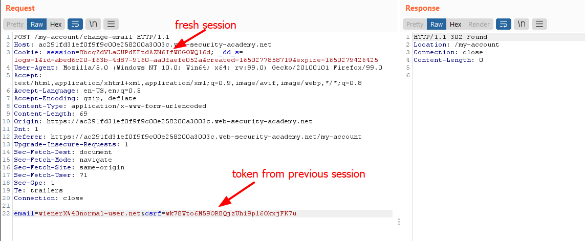
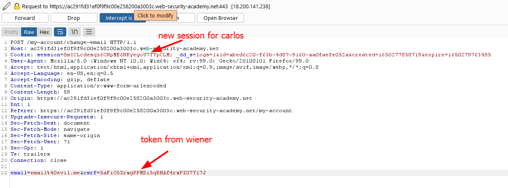
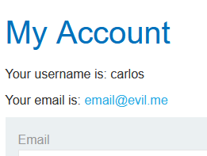
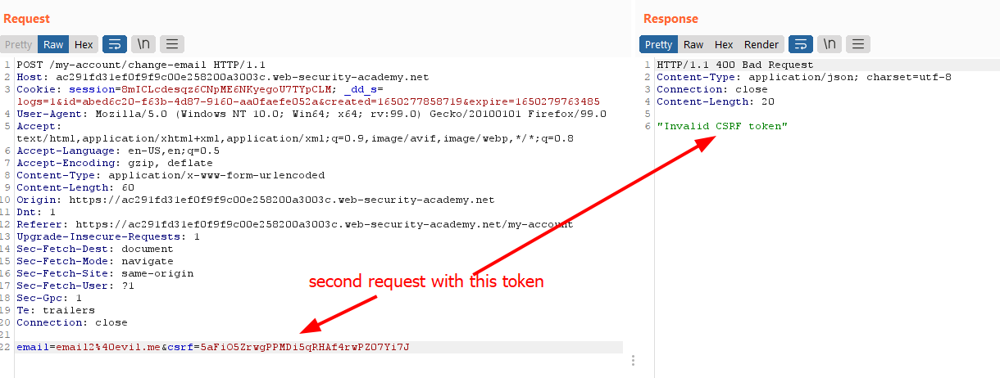
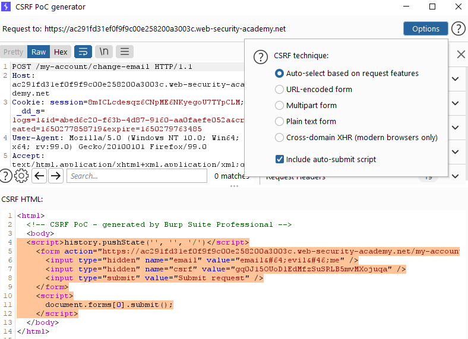
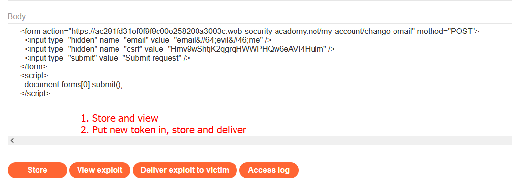

# Lab: CSRF where token is not tied to user session

Lab-Link: <https://portswigger.net/web-security/csrf/lab-token-not-tied-to-user-session>  
Difficulty: PRACTITIONER  
Python script: [script.py](script.py)  

## Known information

- Lab application contains a email change feature vulnerable to CSRF
- Goals:
  - Create some HTML to change a viewers email address
  - Known good credentials `wiener:peter`
  - Known good credentials `carlos:montoya`

## Steps

As usual, the lab application is the blog website. This time, however, I am provided with two sets of valid credentials. The vast majority of considerations are the same as in the [
Lab: CSRF where token validation depends on request method](../CSRF_where_token_validation_depends_on_request_method/README.md) so I will not duplicate it in here, please refer to that document.

### Analysis

As in the previous labs, I do not question the randomness of the token apart for obviously visible issues, which are not present here.

My second condition for CSRF-tokens requires the token to be tighly connected to its purpose. In an ideal world this could mean that every single usage of a CSRF-token generates a new and unique token. In the real world, the housekeeping required for this is prohibiting in most circumstances. 

As a compromise, a new token on login is commonly used. Once a user logs in, a new token is generated. Depending on the business context of an application there are conditions where the invalidation of existing tokens make sense:

-  During login, any pre-existing token is invalidated (at least for the same access path. So one login in the browser and one in a mobile app is OK, but two concurrent browser sessions are not).
-  On logout, the token for the current session is invalidated
-  Token lifetime can be limited, so once-in-a-while the token within a session might get exchanged. This of course requires the application to ensure that the users do not get disrupted

### Check for uniqueness

To see how often the tokens get regenerated, I change the email for `wiener` a couple of times, across multiple login sessions.

I notice that I get a new CSRF-token on each request of the `/my-account` page, even within a session. A new session contains a new session token, and each request contains some expiration information (could be expiration of sessions, the token, ...)

The next thing to check is whether the tokens are bound to the sessions. I reload the `/my-account` page a few times, logout and login again (all as `wiener`).

Now I use Repeater to take one of my old email change requests, copy the new session data from the fresh login inside and a CSRF-token from before the logout:

And the email change goes through. This means that the tokens are not bound to the current session, which is a serious flaw. 

The next step is to find out whether the tokens are bound to the user. As I have two sets of credentials, I login as `carlos`, change his email address and intercept the request. In Burp, I exchange the CSRF-token with one of the tokens that were sent for user `wiener`:

Sure enough, the email of carlos gets changed:

A reuse of a token does not appear to be possible. If I repeat the previous request with Repeater, I get an error message:

The next steps are easy:

- Prepare the HTML form for the email change
- Use one of the existing but not used CSRF-tokens
- Add an auto-submit feature

For this, I use the `CSRF PoC generator` from Burp Suite Pro (without Pro, just take the form from the page itself and modify it):

As the tokens are single-use, I need to include a new token after the test:

Once the victim has the exploit, the lab changes to

