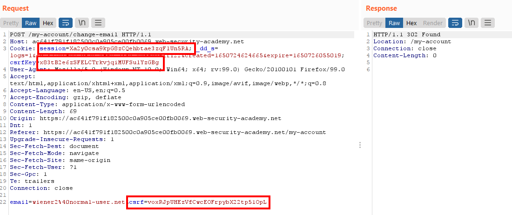
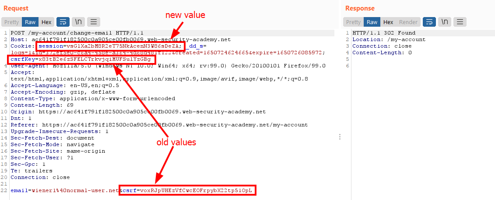
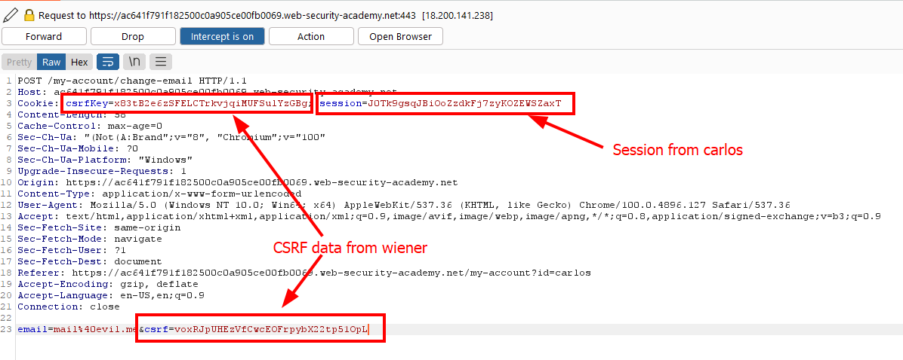
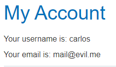
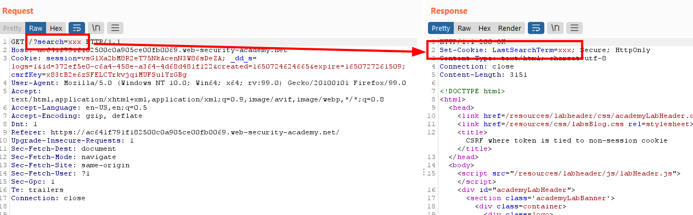
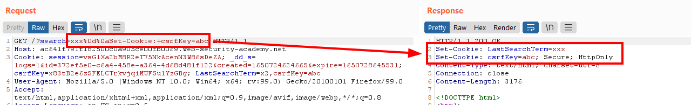
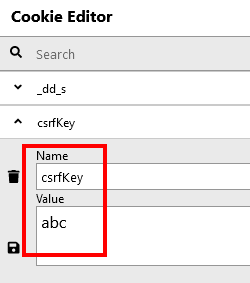
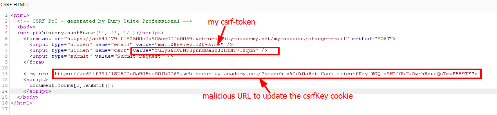

# Lab: CSRF where token is tied to non-session cookie

Lab-Link: <https://portswigger.net/web-security/csrf/lab-token-tied-to-non-session-cookie>  
Difficulty: PRACTITIONER  
Python script: [script.py](script.py)  

## Known information

- Lab application contains a email change feature vulnerable to CSRF
- CSRF protection is not integrated into the session handling functionality
- Goals:
  - Create some HTML to change a viewers email address
  - Known good credentials `wiener:peter`
  - Known good credentials `carlos:montoya`

## Steps

### Find weak CSRF protection

As usual, the lab application is the blog website. I am again provided with two sets of valid credentials. The vast majority of considerations are the same as in the [Lab: CSRF where token validation depends on request method](../CSRF_where_token_validation_depends_on_request_method/README.md) so I will not duplicate it in here, please refer to that document.

I login with the known credentials for `wiener` and change the email address. This results in the following request:

There are some things expected and other things rather interesting. The session cookie and the csrf-tokens are the expected parts. But there is a second cookie `csrfKey`, that looks very similar to a second session value.

All values remain static for the session. When I logout and login again as the same user, the session cookie changes (this is expected) but csrfKey and csrf-token remain the same.

This indicates that the system providing the CSRF protection does not integrate into the session system, but creates its own type of session that is not in sync. This might violate the **tightly connected** property mentioned earlier.

So I check with the second user account. To ensure the sessions do not get mixed up I use the Burp Browser for this. So I login as `carlos`, switch intercept on and change the email address.

The intercepted request I then modify in Burp to contain the session ID from the current `carlos`-session, but both `csrfKey` as well ass `csrf`-token 

Sure enough, the request goes through and carlos email is changed:

I can change a victims email with my own CSRF-data. Including the csrf-token in the malicious HTML form is easy, but the `csrfKey` is taken from the cookie. So the next step is to find a way to manipulate the cookie values.

### Manipulate victims cookie

The account page only allows changing of the email, and I can't see a way to use it to manipulate the cookie. So for the first time it is actually due to check the public blog page.

I see two places to input data, the search feature and the `leave a comment` functionality.

The comment feature does not show anything interesting, but when searching something the response looks interesting:

The search term is reflected into a `LastSearchTerm` cookie. If I can manage to break out of the cookie and set another one, specifically the `csrfKey` cookie, than I have a way to manipulate the cookie value of my victim.

So I put the search term in Repeater to play around.

#### Multiple cookies in one header

The [Set-Cookie docu on mozilla.org](https://developer.mozilla.org/en-US/docs/Web/HTTP/Headers/Set-Cookie) states that `To send multiple cookies, multiple Set-Cookie headers should be sent in the same response.`. An interesting detail is the `should` here - perhaps multiple cookies can be set in a single `set-cookie` header even if it is discouraged?

The respective [rfc6265](https://www.rfc-editor.org/rfc/rfc6265#section-3) also contains this should:  `Origin servers SHOULD NOT fold multiple Set-Cookie header fields into a single header field`. 

Looking all the way back to [rfc2109](https://www.rfc-editor.org/rfc/rfc2109) (via the `Obsoletes` links) it shows that this was allowed to have this property: `Informally, the Set-Cookie response header comprises the token Set-Cookie:, followed by a comma-separated list of one or more cookies.`

So I try this out by using `xxx,csrfKey=abc` as search term. Unfortunately, regardless of what encodings I try the browser does ignore this (rightfully so).

#### Inject additional header

The next attempt is now to inject an additional `set-cookie` header with the `csrfKey` data. So I inject a line break into my search term, followed by another `set-cookie` header:

And it worked, the server issued two cookie headers. As it was a valid server response containing them, the browser changed the stored cookie to the value choosen by me:

### Delivery

For delivery one additional hurdle is there: how to force the victim, or its browser, to issue the manipulated search request?

One way is to add this URL as image location. Of course, there will be no image but the request will be made.

So the attack is basically two distinct parts:

1. Update the cookie value to contain my csrfKey value
2. Submit the form with my csrf-token

This is a bit of a race condition, as it relies on the fact that the image request and response are done by the time the auto submit script is executed. I do not know whether there is any parse order that can be relied on. 

So a better way would be to use the `onError` event to submit the form as it enforces the order of first request the picture and process the response and only submit the form once it fails to result in an image. 

For this, the full script part in the image above needs to be removed and `onerror="document.forms[0].submit()"` is added to the img-tag.

After delivering the form to the victim, the lab updates to

