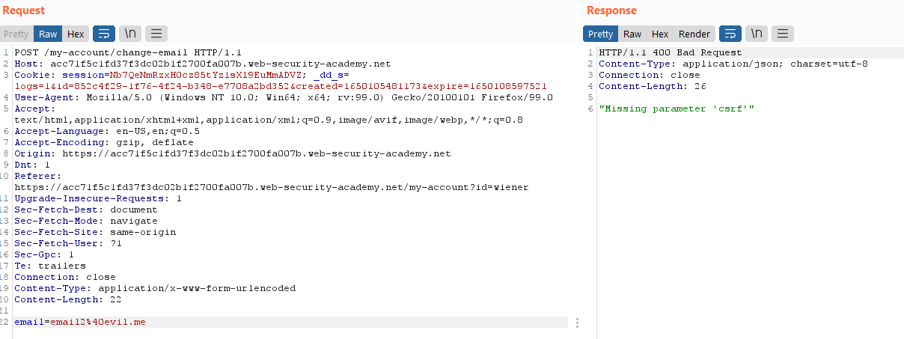
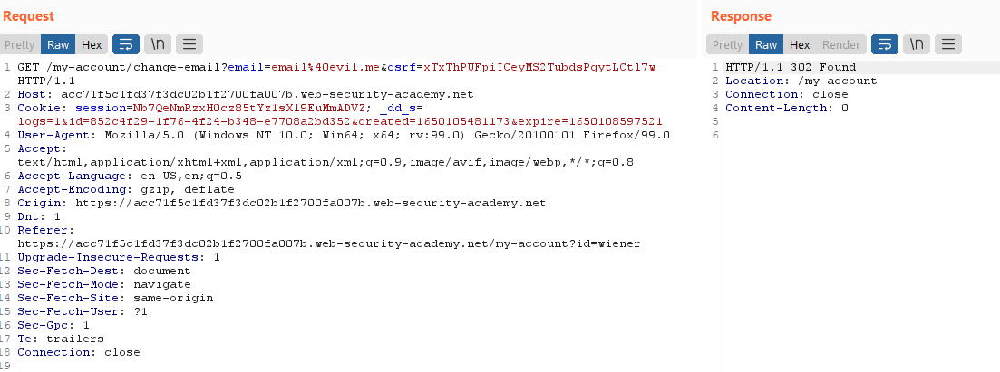
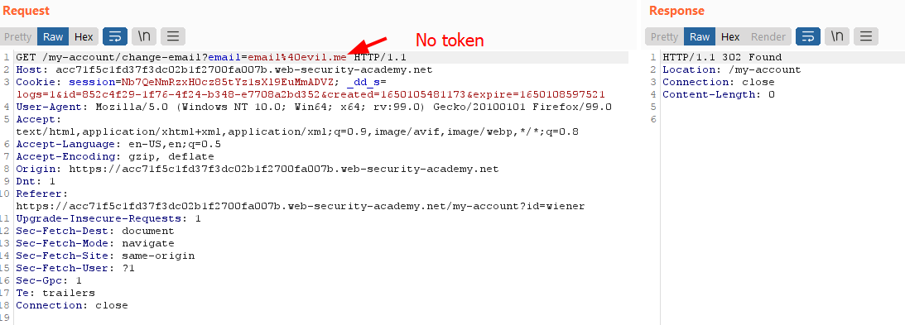
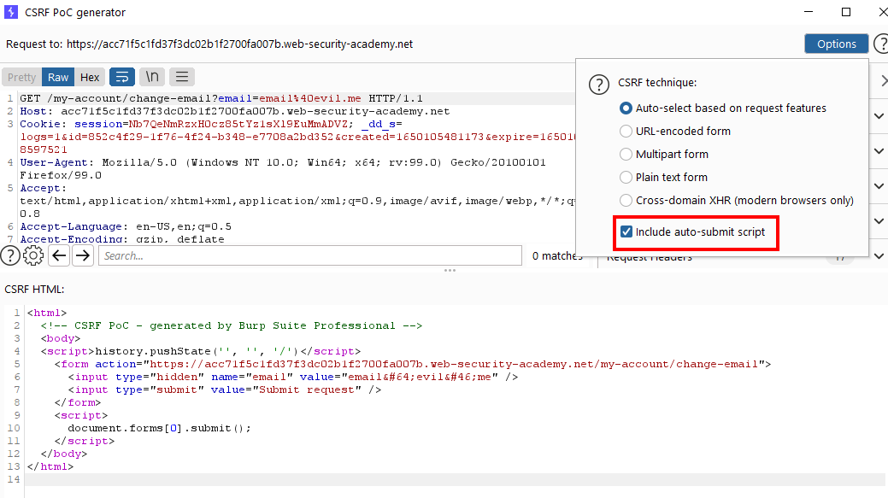
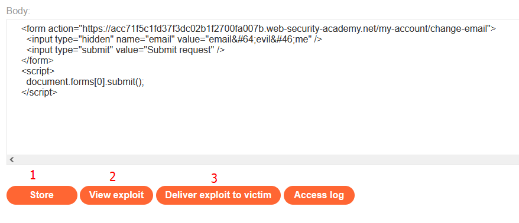
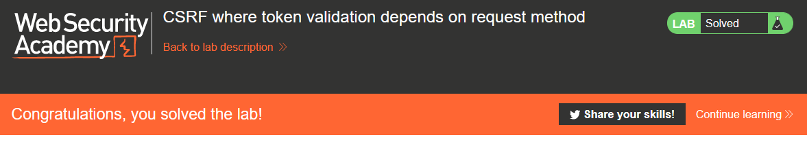

# Lab: CSRF where token validation depends on request method

Lab-Link: <https://portswigger.net/web-security/csrf/lab-token-validation-depends-on-request-method>  
Difficulty: PRACTITIONER  
Python script: [script.py](script.py)  

## Known information

- Lab application contains a email change feature vulnerable to CSRF
- Goals:
  - Create some HTML to change a viewers email address
  - Known good credentials `wiener:peter`

## Steps

The lab application is the blog page again. I move straight to the account page with the known credentials for `wiener`.

This time, the change email feature is protected by a CSRF-Token, which is supposed to 

1. consist of random characters,
2. should be as tightly connected to its purpose as possible and 
3. must be validated every time a user triggered action is performed.

If any of these conditions are violated it may be an entry point for me.

**Randomness**

This condition is the hardest to check for unless the token is obviously flawed (for example, using a timestamp). In this application, the tokens do not show such an obvious problem. As I am not that much of a crypto analysis guy, I move on to the next part.

**Tightly connected**

In this application the CSRF-token appears to get regenerated on each login. Subsequent email changes within one login session contain the same token. Additionally, the tokens are bound to the session, so I can not reuse the csrf-token from a previous session.

In this regards, the application gets some things right.

**Validated on every action**

The first test here is to check what happens when I simply remove the CSRF-token from the request. Sure enough, the application tells me that it is missing:

The same happens if I try to use an empty token (`&csrf=`).

The "validation every time a user triggered action is performed" contains a hidden second part: "comming along any possible entry paths". A huge part of securing an application is to know the data flows and what are possible ingress/egress points.

Depending on the knowledge of the developer and the setup of the environment this may lead to some paths being protected better than others.

Web requests mainly come in two forms: `GET` and `POST` (there are others, but they are much less common for basic websites).

A `GET` request contains all parameters in the URL, a `POST` request keeps them in the body of the message. Using `GET` for any sensitive data is a serious flaw, as it can be stored in a lot of places: in links if simply copied, in bookmarks, and in all server and router logs along the way.

Here, a `POST` request is used to transfer the token, which is the correct way. Depending on the server used and the application code, these different requests type may be handled differently. For example, PHP has a `$_GET` variable that contains all `GET` parameters and a `$_POST` variable that contains all `POST` parameters. It also provides a `$_REQUEST` variable that contains all parameters regardless of origin.

If different parts of the application treat requests differently, it may lead to injection points. 

To check whether I can change the email with a `GET` request, I send the password change request to Repeater and select `Change request method` from the context menu. Sure enough, the email changes:

Now I repeat the test regarding missing tokens for the `GET` request:

In this case, the application lets me change the email. I use the CSRF PoC generator to obtain a HTML form:

In the community edition, simply get the the form from the HTML of the application and perform the required changes to it (specifically: change the method and action, remove the csrf token and add the auto-submit script)

Copying the form into the exploit server, it is as simple as 1-2-3 to store, test and deliver the exploit:

Right after, the lab updates to

