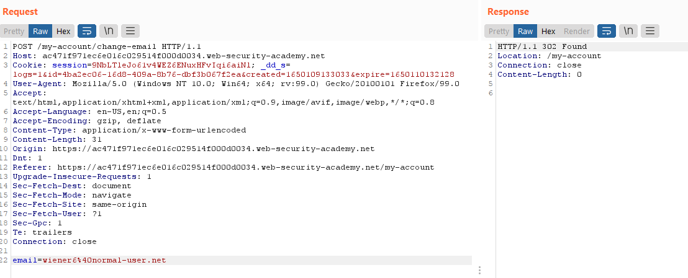
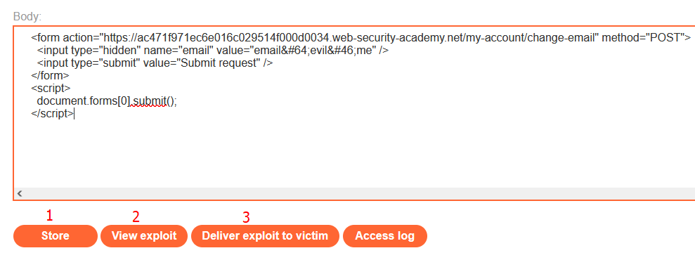
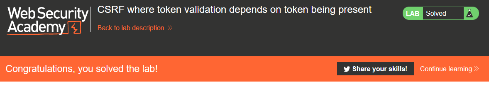

# Lab: CSRF where token validation depends on token being present

Lab-Link: <https://portswigger.net/web-security/csrf/lab-token-validation-depends-on-token-being-present>  
Difficulty: PRACTITIONER  
Python script: [script.py](script.py)  

## Known information

- Lab application contains a email change feature vulnerable to CSRF
- Goals:
  - Create some HTML to change a viewers email address
  - Known good credentials `wiener:peter`

## Steps

As usual, the lab application is the blog website. The vast majority of considerations are the same as in the [previous lab](../CSRF_where_token_validation_depends_on_request_method/README.md), please refer to this document.

The questions about randomness and tight connection can be answered the same, so I go to the last point of **validation on every action**

The very first test is to simply remove the token from the request so I send the request to Repeater, delete it and voila:

So I send the request to the `CSRF PoC generator` to get my HTML form that I can use on the exploit server:

On the exploit server, it is again a simple store-test-deliver activity

After delivering the exploit to the victim, the lab updates to

