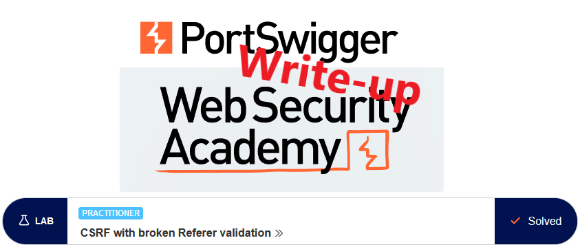
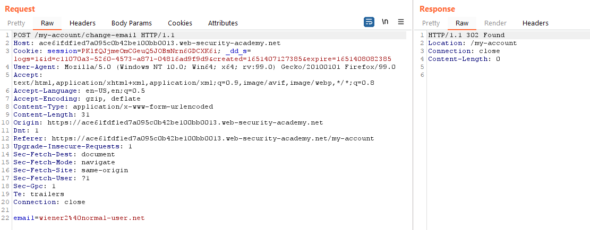
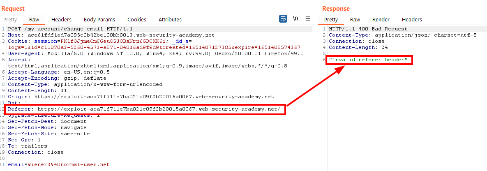
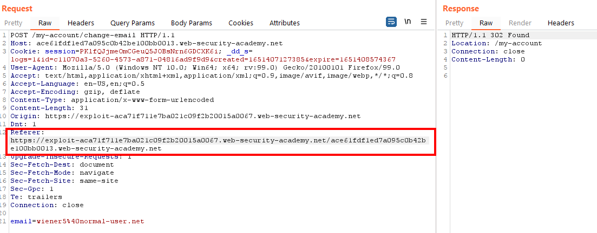
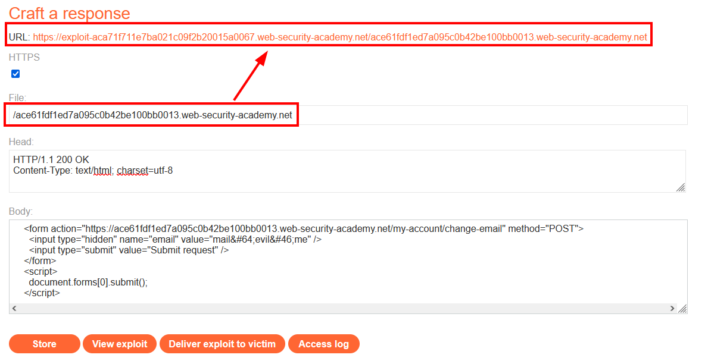
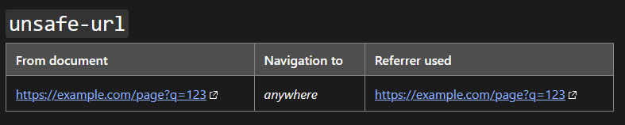
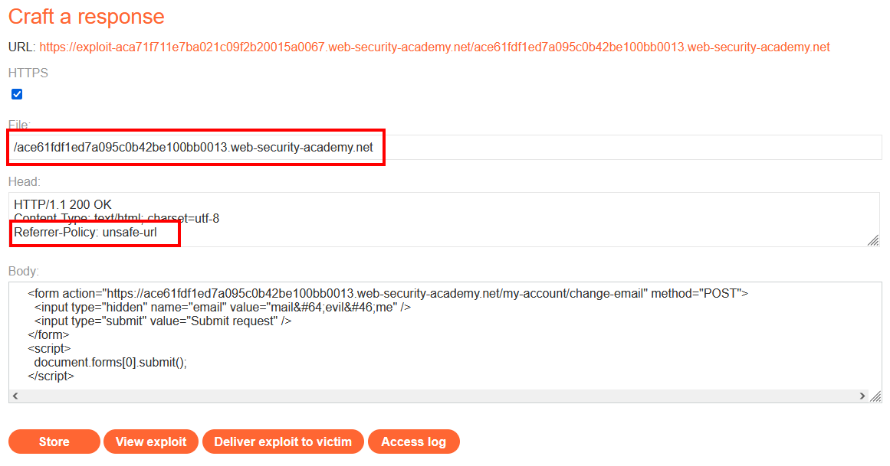
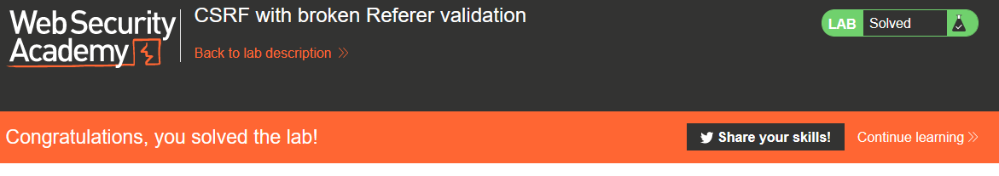

# Write-up: CSRF with broken Referer validation @ PortSwigger Academy

This write-up for the lab `CSRF with broken Referer validation` is part of my walk-through series for [PortSwigger's Web Security Academy](https://portswigger.net/web-security).

Lab-Link: <https://portswigger.net/web-security/csrf/lab-referer-validation-broken>  
Difficulty: PRACTITIONER  
Python script: [script.py](script.py)  

## Lab description

- Lab application contains an email change feature that is vulnerable to CSRF
- Attempts to detect cross domain requests
- Known good credentials `wiener:peter`

### Goals

- Create some HTML to change a viewers email address

## Steps

As usual in the lab section, the lab application is the blog website. The vast majority of considerations are the same as in the [Lab: CSRF where token validation depends on request method](../CSRF_where_token_validation_depends_on_request_method/README.md) so I will not duplicate it in here, please refer to that document.

I login with the known credentials for `wiener` and change the email address. This results in the following request:

No obvious protections against CSRF is visible, sending the request to Repeater and change the email again works without issues.

The first attempt is to use a trivial attack like in the [Lab: CSRF vulnerability with no defenses](../CSRF_vulnerability_with_no_defenses/README.md). As expected this fails with a descriptive error message indicating the referer-header:

The same occurs if I simply remove the referer in Repeater. If I copy the original referer-header in, it passes. Therefore I need to manipulate the referer in a way that passes the validation even though it is sent by the exploit server. 

As a first attempt, I simply add the correct URL at the end of the referer-header, basically forming a path:

The request goes through and the email gets changed. So as a first attempt I rename the exploit file to be the URL of the allowed host. The form I get from the `CSRF PoC generator` of Burp Suite Pro. If you use the community edition, copy the form from the account website and update it accordingly:

Unfortunately, the browser removes the path and I still get just the domain part in the URL.

Fortunately, the documentation regarding referrer-policy on [mozilla.org](https://developer.mozilla.org/en-US/docs/Web/HTTP/Headers/Referrer-Policy) shows the solution:

I create the final HTML page to include this header:

Viewing the exploit changes my email address, after `deliver exploit to victim` the lab updates to

