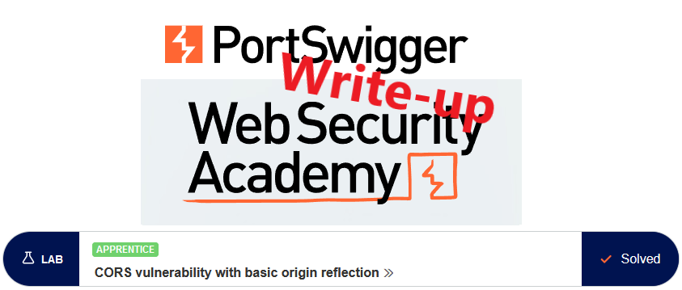
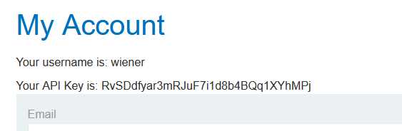
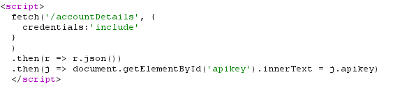
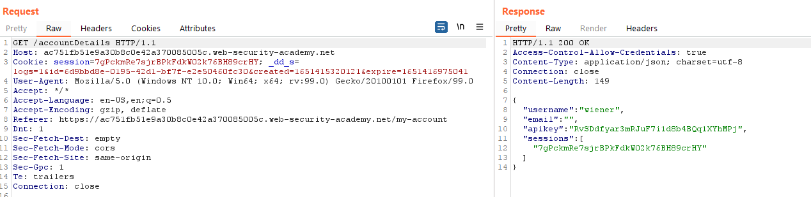
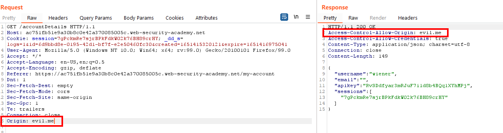
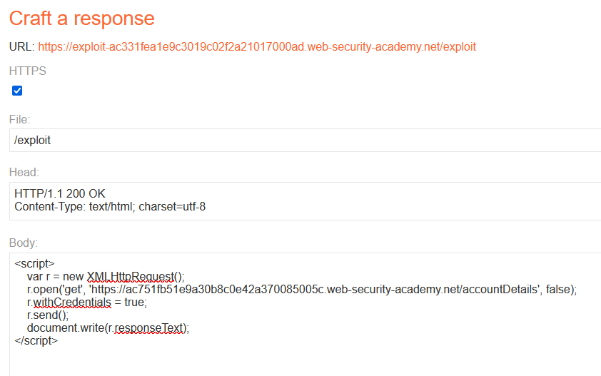
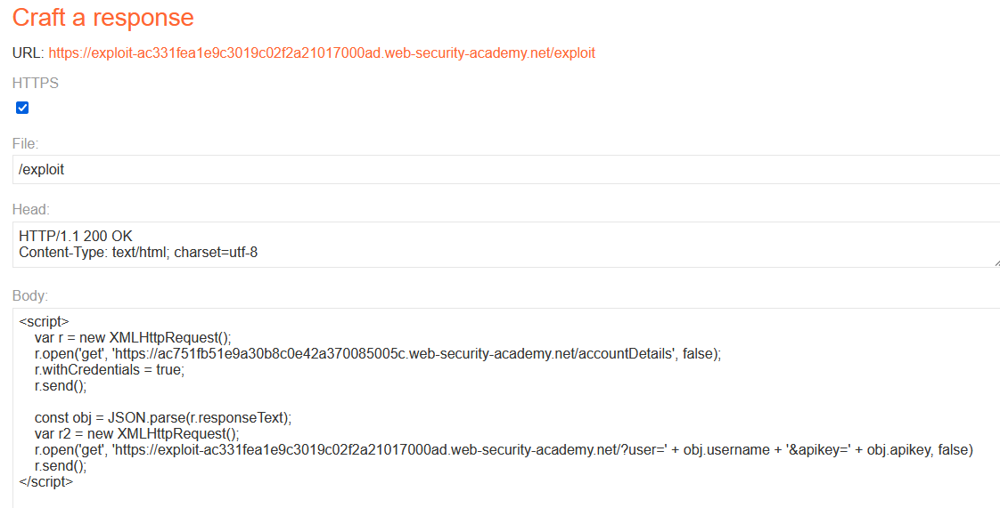
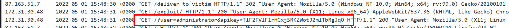
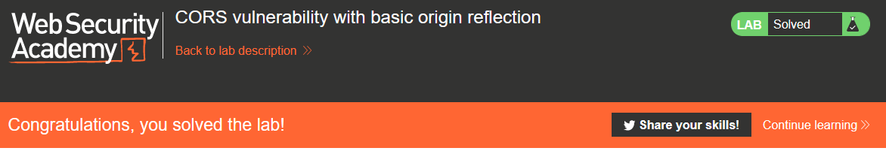

# Write-up: CORS vulnerability with basic origin reflection @ PortSwigger Academy

This write-up for the lab "CORS vulnerability with basic origin reflection" is part of my walk-through series for [PortSwigger's Web Security Academy](https://portswigger.net/web-security).

Lab-Link: <https://portswigger.net/web-security/cors/lab-basic-origin-reflection-attack>  
Difficulty: APPRENTICE  
Python script: [script.py](script.py)  

## Lab description

- Lab application has an insecure CORS configuration trusting all origins
- Known good credentials `wiener:peter`

### Goals

- Create some JavaScript that
  - retrieves the admin API key
  - uploads it to the exploit server

## Steps

The web application in question is a shop website. I log in with the provided credentials and see the API key of `wiener`:

Looking in the Burp HTTP history, I can that the `/my-account` page uses a request to `/accountDetails` to obtain the API key.

The response contains a CORS header (`Access-Control-Allow-Credentials`), so I put the request into Repeater to see how this plays with the `Origin` header in the request:

The origin is reflected within the `Access-Control-Allow-Origin` header. This basically tells the browser that any origin value is allowed to access resources of the vulnerable site.

So my JavaScript needs to do three things:

1. call the `/accountDetails` page
2. get the `apikey` from the response
3. issue a request to the exploit server containing this value

As a first attempt I try to access the response from `/accountDetails` within a JavaScript on the exploit server and simply write it to the page. Fortunately, the documentation on mozilla.org for [XMLHttpRequest](https://developer.mozilla.org/en-US/docs/Web/API/XMLHttpRequest) shoes everything that is required:

Sure enough, testing the exploit writes the structure obtained from `/accountDetails` on the screen:

So I update the script to generate a second request to my exploit server, containing username and APIkey. I also use `JSON.parse()` to have a cleaner log entry:

Once delivered to the victim, the log shows the required data:

After submitting the `apikey`, the lab updates to

