# Write-up: CORS vulnerability with trusted null origin @ PortSwigger Academy

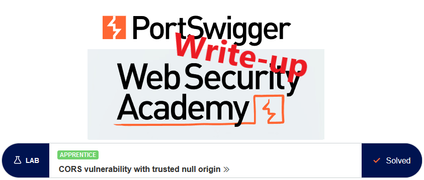

This write-up for the lab `CORS vulnerability with trusted null origin` is part of my walk-through series for [PortSwigger's Web Security Academy](https://portswigger.net/web-security).

Lab-Link: <https://portswigger.net/web-security/cors/lab-null-origin-whitelisted-attack>  
Difficulty: APPRENTICE  
Python script: [script.py](script.py)  

## Lab description

- Lab application trusts the "null" origin in its CORS configuration
- Known good credentials `wiener:peter`

### Goals

Craft some JavaScript that

- retrieves the admin API key
- uploads it to the exploit server

## Steps

### Analysis

The lab application is the shopping website. I log in with the provided credentials and check the requests made with Burp:

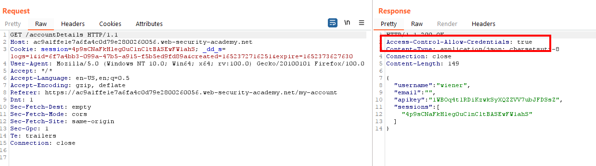

The response header `Access-Control-Allow-Credentials` hints that CORS is configured and that the browser will allow my JavaScript to read the response. I send the request to Repeater to play a bit.

**Reflected origin**

The first attempt is to add an origin to see whether basic reflection works. In this case, it does not (and this is expected as this was the content of the [first lab](../CORS_vulnerability_with_basic_origin_reflection/README.md) in this section):

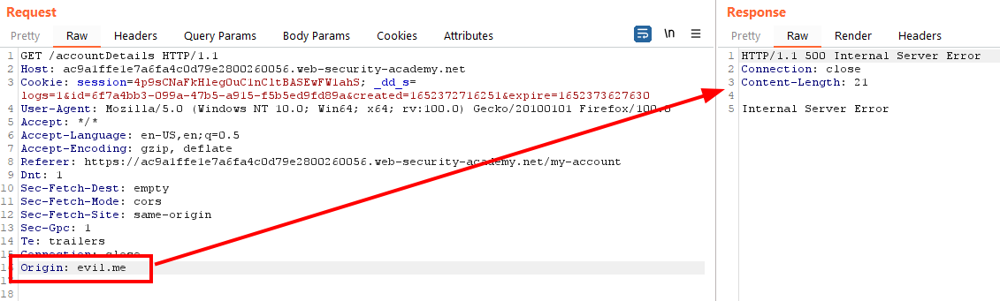

**Wildcard origin**

Another problem with CORS can be wildcard origin, which is allowing any domain to access the response. However, browsers will never send cookies if wildcard origins are used, regardless of the content of the `Access-Control-Allow-Credentials` header. 

As we need the inclusion of the session cookies in the request, wildcard origins can not be abused here.

**Null origin**

Similar to wildcard origin, a null origin is another way to allow the whole world to access the resources on websites. But unlike wildcard origin, null origin allows access to the response if the `Access-Control-Allow-Credentials` header is set to `true`.

In the case of this web application this is what happens:

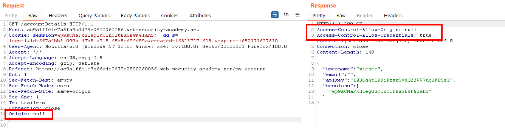

The response contains the desired combination of response headers:

```
Access-Control-Allow-Origin: null
Access-Control-Allow-Credentials: true
```

### Craft a payload

The next issue is how to instruct the browser to issue a null origin in its request.

A quick google search leads to a post on [stackoverflow](https://stackoverflow.com/questions/42239643/when-do-browsers-send-the-origin-header-when-do-browsers-set-the-origin-to-null) that contains a longish list of cases that cause the browser to include a null origin, including:

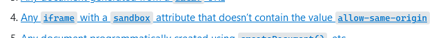

A quick check on [webdbg.com](https://webdbg.com/test/sandbox/frames.htm) appears to confirm this:

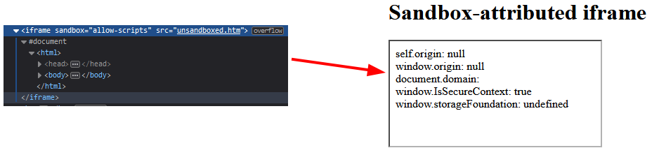

So I try to request the `accountDetails` page in a script within an iframe:

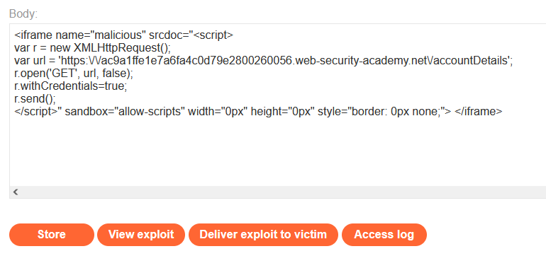

The request now contains a null origin and the response has the desired CORS-headers:

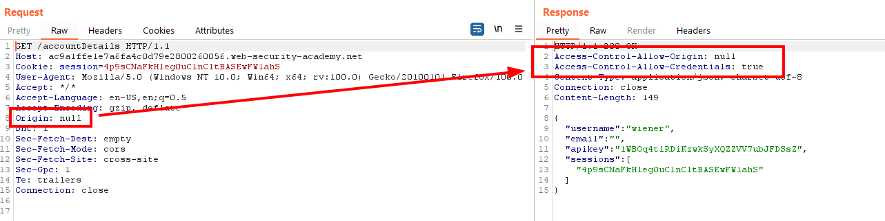

I take the script from the [first lab](../CORS_vulnerability_with_basic_origin_reflection/README.md) of this section and modify it to use an iframe:

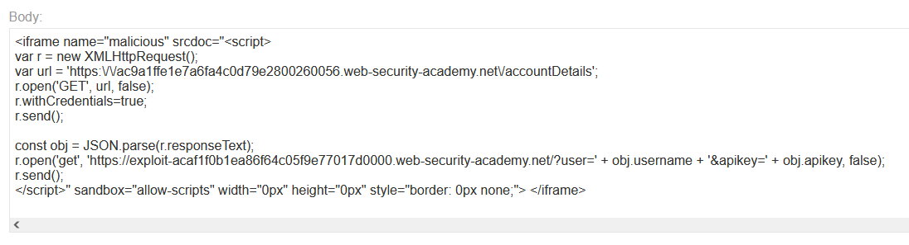

After testing it, the log of the exploit server contains the data I want:

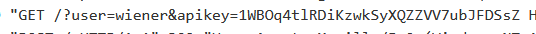

Sending the exploit to the victim results in the key of the administrator:

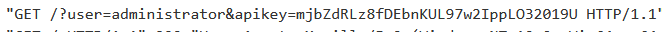

and the lab updates to


