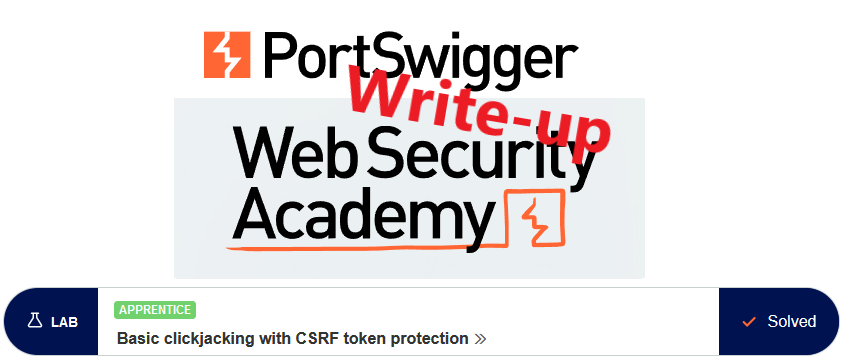
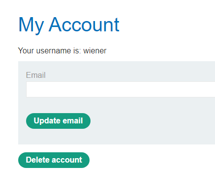
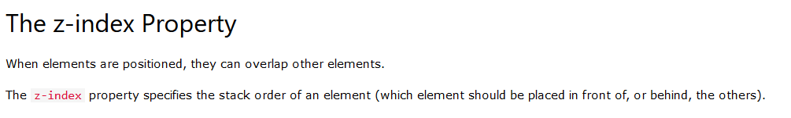
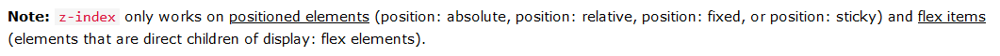
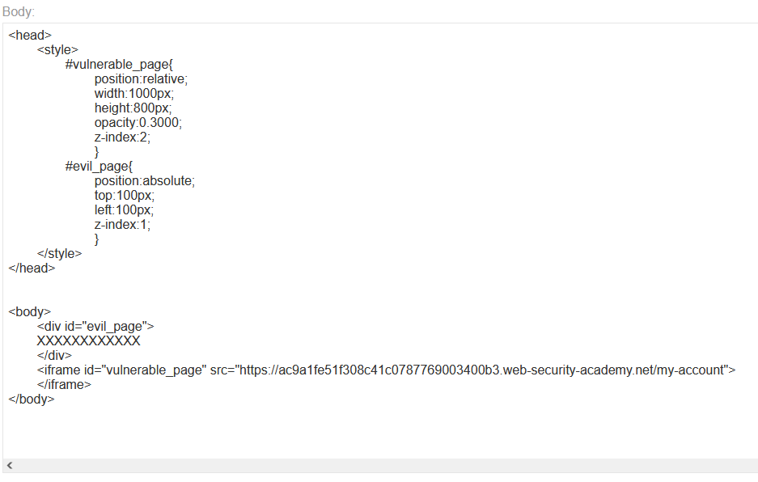
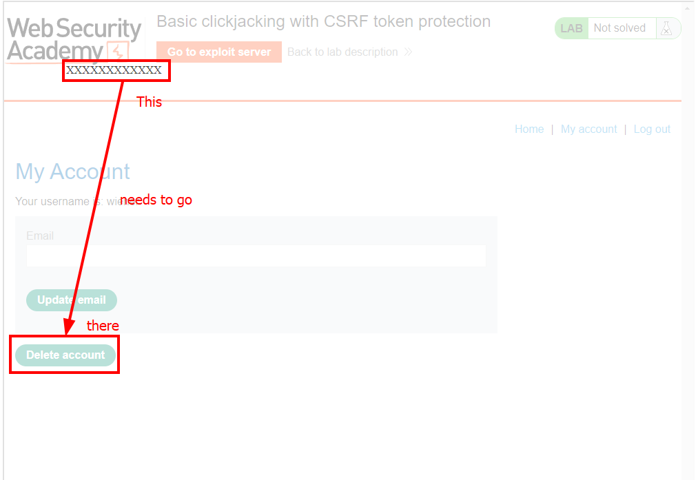
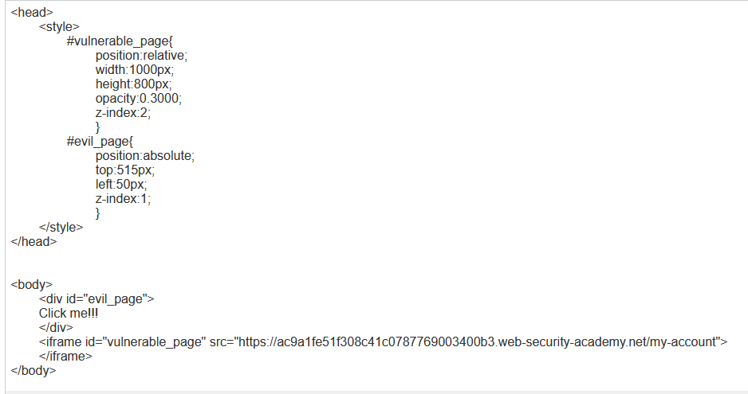
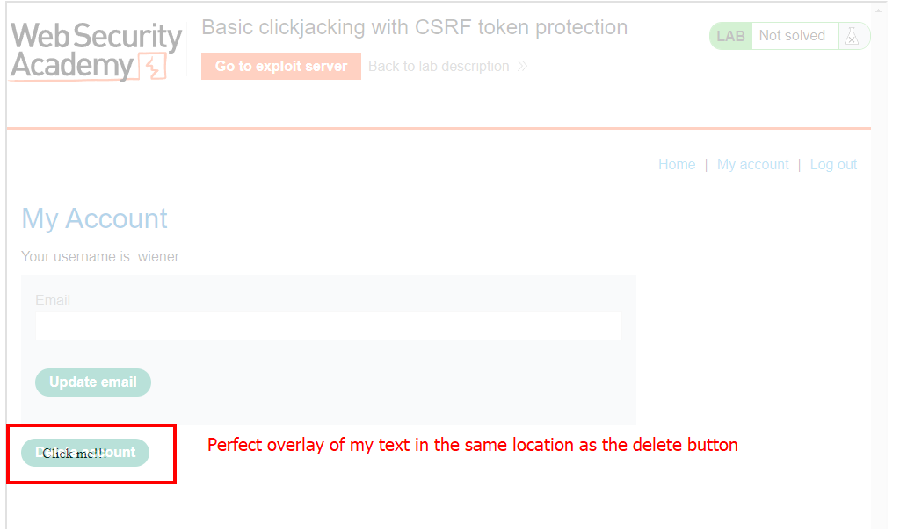
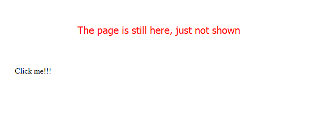
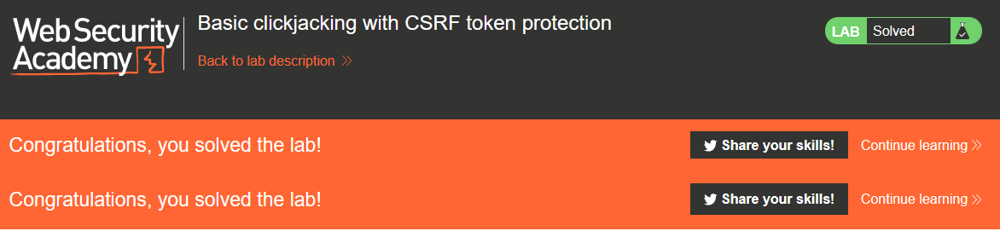

# Write-up: Basic clickjacking with CSRF token protection @ PortSwigger Academy

This write-up for the lab `Basic clickjacking with CSRF token protection` is part of my walk-through series for [PortSwigger's Web Security Academy](https://portswigger.net/web-security).

Lab-Link: <https://portswigger.net/web-security/clickjacking/lab-basic-csrf-protected>  
Difficulty: APPRENTICE  
Python script: [script.py](script.py)  

## Lab description

- Delete account functionality protected by CSRF token
- The victim will click on anything that shows the word `click`
- Known good credentials `wiener:peter`

### Goals

Craft some malicious HTML that

- frames the account page
- makes the user delete their account

## Steps

### Analysis

This lab uses again the blog website. The goal is an action that requires authentication, so I log in with the credentials provided.

The delete button is part of a simple form that sends a POST request to `/my-account/delete`. In the message body, a CSRF token is included.

This token prevents me from just faking a complete delete form, as I have no way of knowing it.

One way of circumventing this is to load two pages:

- A webpage with arbitrary content that convinces a user to click on it.
- Show the vulnerable web page in front of it but keep it invisible to the user.

When the user tries to click on my website, the browser will interpret it as a click on the vulnerable page as it is the topmost one. 

So my goal is to put something visible behind the invisible `Delete account` button that the user attempts to click on. The browser interprets this as a click on the button. The CSRF protection does not play any role here. The vulnerable page is received from the real server and contains the valid token.

### Craft the malicious HTML

A quick google search leads to the [w3schools.com](https://www.w3schools.com/cssref/pr_pos_z-index.asp) documentation of the CSS property `z-index`:

On the same site, documentation for [opacity](https://www.w3schools.com/css/css_image_transparency.asp) and [positioning](https://www.w3schools.com/css/css_positioning.asp) can be found.

So I create an HTML page using this property and see how it looks in the browser. For the target page, I give myself some room to have it rendered. I also use `0.5` for opacity so I can see the page for positioning:

As it is visible, the page loads nicely. For the `XXXXXXXXXXXX` marker, I chose random position values. I can see it needs to move a bit left and quite a bit down.

After a bit of trial and error, I get the position correct. I also change the text to `Click me!!!` so that I can align using the correct wording (and show some [insanity](https://wiki.lspace.org/Multiple_exclamation_marks) on my part):

All that is left now is to change the opacity of the vulnerable page to `0.0000`. Upon reload, the page shows completely blank:

After delivering the exploit to the victim, the lab updates to

