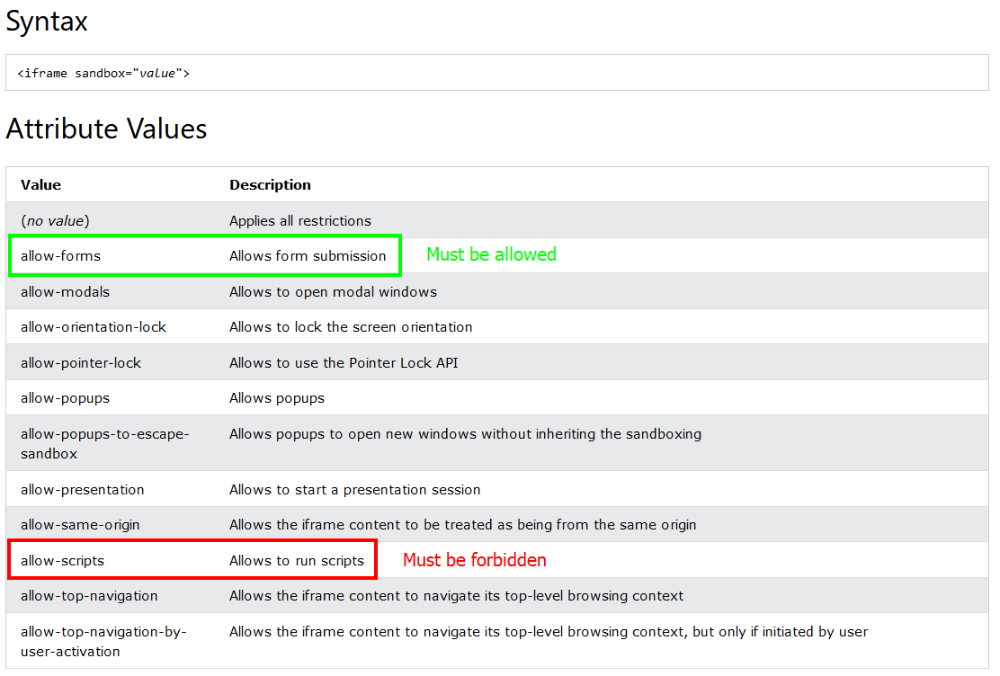

# Write-up: Clickjacking with a frame buster script @ PortSwigger Academy

This write-up for the lab *Clickjacking with a frame buster script* is part of my walk-through series for [PortSwigger's Web Security Academy](https://portswigger.net/web-security).

Lab-Link: <https://portswigger.net/web-security/clickjacking/lab-frame-buster-script>  
Difficulty: APPRENTICE  
Python script: [script.py](script.py)  

## Lab description

- The application is protected against clickjacking with a frame-busting script.
- The victim will click on anything that shows the word `click`
- Known good credentials `wiener:peter`

### Goals

Craft some malicious HTML that

- frames the account page
- makes the user change the email address

## Steps

### Analysis

This lab uses again the blog website. The goal is an action that requires authentication, so I log in with the credentials provided.

The email change functionality is a simple form, this time with an added script:

The general analysis and basic creation of the malicious are identical to the [first clickjacking lab](../Basic_clickjacking_with_CSRF_token_protection/README.md), please refer to that document for details.

The new script checks whether its own window object is identical to the topmost window object. If this is not true, then it replaces the full content of the page with a simple text message. This prevents the clickjacking attack as there is no invisible button that my victim can click. If I try it, the intended clickjacking protection can be seen:

Therefore, I need a way to prevent the script from the framed page wither from running at all or from accessing the actual browser context. A quick google search leads to [stackoverflow](https://stackoverflow.com/questions/369498/how-to-prevent-iframe-from-redirecting-top-level-window) and [w3schools](https://www.w3schools.com/tags/att_iframe_sandbox.asp).

### Craft the malicious HTML

Iframes can be created with restrictions for their content. On the [iframe sandbox docu](https://www.w3schools.com/tags/att_iframe_sandbox.asp) on w3schools the possible values of the `sandbox` attribute are listed:

As I want the user to submit the email change form, I must give it the `allow-forms` permission. The frame-busting script will only run if the iframe gets the respective permission, so by omitting it I can entirely circumvent this protection. Of course, this will prevent all scripts on the target page, so while it breaks the frame-busting it may also break functionality.

Testing it changes the email of `wiener`, so all that is left is to `Deliver exploit to victim` and the lab updates to

