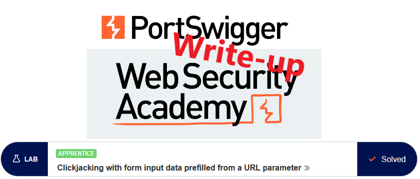
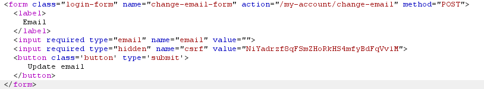
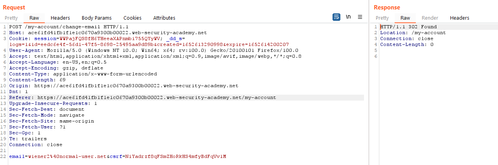
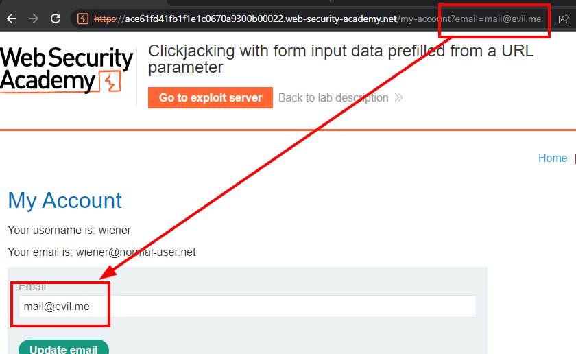
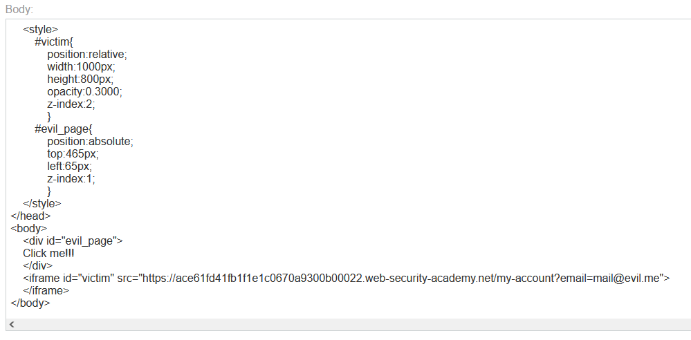
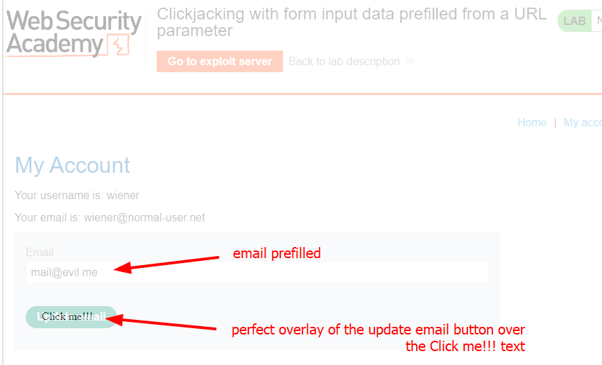
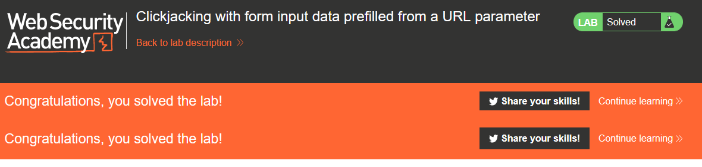

# Write-up: Clickjacking with form input data prefilled from a URL parameter @ PortSwigger Academy

This write-up for the lab *Clickjacking with form input data prefilled from a URL parameter* is part of my walk-through series for [PortSwigger's Web Security Academy](https://portswigger.net/web-security).

Lab-Link: <https://portswigger.net/web-security/clickjacking/lab-prefilled-form-input>  
Difficulty: APPRENTICE  
Python script: [script.py](script.py)  

## Lab description

- Email change functionality protected by CSRF token
- The victim will click on anything that shows the word `click`
- Known good credentials `wiener:peter`

### Goals

Craft some malicious HTML that

- frames the account page
- makes the user change the email address

## Steps

### Analysis

This lab uses again the blog website. The goal is an action that requires authentication, so I log in with the credentials provided.

The email change functionality is a simple form:

I change the email address of `wiener` and check the content of the request in Burp: 

The general analysis is identical to the [previous lab](../Basic_clickjacking_with_CSRF_token_protection/README.md), please refer to that document for details.

### Craft the malicious HTML

The basic steps are the same here:

- Frame the vulnerable page in an invisible iframe
- Load some page in the (visible) background that entices the user to click on the location that contains the invisible `Update email` button.

For this lab, I also need an additional step: to fill the email field in the form that I load.

**The rabbit hole**

A quick google search leads again to the [w3schools.com](https://www.w3schools.com/) website and their documentation of [getElementsByName](https://www.w3schools.com/jsref/met_doc_getelementsbyname.asp).

This, unfortunately, is the wrong path to follow. To be able to access the iframe by javascript it needs to be on the same domain. As I have different domains here, my exploit server and the real website, the browser does not allow it.

**The real path**

Fortunately, there is an easier way. If I would have read the lab name properly I would have noticed it earlier.

The website allows for input fields to be pre-filled by aptly named URL arguments. In this case, if I add a `?email=mail@evil.me` to the URL, it will fill the email field on load:

My final test payload now looks like this:

The malicious page now looks like it should be:

All that is left now is to change the opacity to 0.0 and deliver the page to the victim. The lab updates to:

