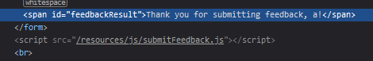

# Write-up: Exploiting clickjacking vulnerability to trigger DOM-based XSS @ PortSwigger Academy


This write-up for the lab *Exploiting clickjacking vulnerability to trigger DOM-based XSS* is part of my walk-through series for [PortSwigger's Web Security Academy](https://portswigger.net/web-security).

Lab-Link: <https://portswigger.net/web-security/clickjacking/lab-exploiting-to-trigger-dom-based-xss>  
Difficulty: PRACTITIONER  
Python script: [script.py](script.py)  

## Lab description

- The application has an XSS vulnerability triggered by a click.
- No information about clickjacking protection.
- The victim will click on anything that shows the word `click`

### Goals

Craft some malicious HTML that

- frames the page
- calls the `print()` function

## Steps

### Analysis

The lab application is again the blog website. This time, no credentials are provided. 

After a first look at the page, I see two options to send input:

- The `Submit feedback` form that is linked at the top
- The `comments` feature on each article

While browsing, Burp confirms for both pages that they are frameable:

 

### Pre-fill the content

The submit feedback form allows pre-filling from the URL arguments, while the comments form does not. 


Such pre-filling allows me to get arbitrary content into the DOM of the page. So I  focus on the submit feedback form first. 

The first attempt is to break out of the `value` context by injecting some encoded form of `" id=x"`.

Unfortunately, the page gets this right. I try different encoding, but they get correctly encoded into `&quot;` and do not allow me to escape the `value` context:


### Submit a feedback

So next I submit the feedback form. The name gets reflected in the page content


The request results in an empty JSON response, so this reflection is done somewhere client-side.




Looking at this script referenced reveals an injection point:


Without any form of validation, whatever is in the name field gets inserted back into the HTML `<span>` directly above.

It is not part of any specific tag context, so I can insert anything I want directly into the DOM. 

Inserting a new `<script>` block does not work. The browser parsed the page for script blocks already, any script block added now will just sit there without being executed.

The easiest way to use a script to add a new script is to include some HTML (which will be parsed afterward) that comes with an embedded script. 

For example, an `` tag with invalid file as source and an `onerror()` script:

```HTML

```

### Craft the malicious HTML

Now that I have all pieces in place, getting to the final malicious HTML is easy:


A final test shows a properly filled and aligned page:


All that is left now is changing the opacity to `0.000`, `Store` and `Deliver exploit to victim`. The lab updates to


