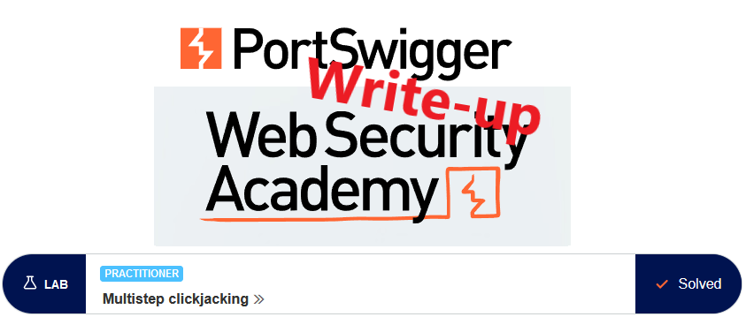
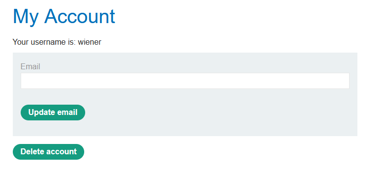
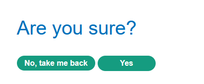
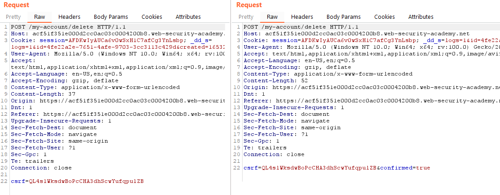
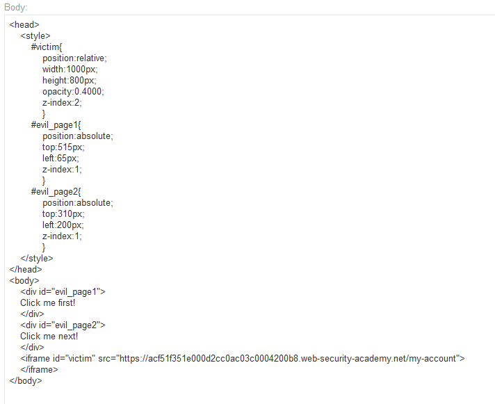
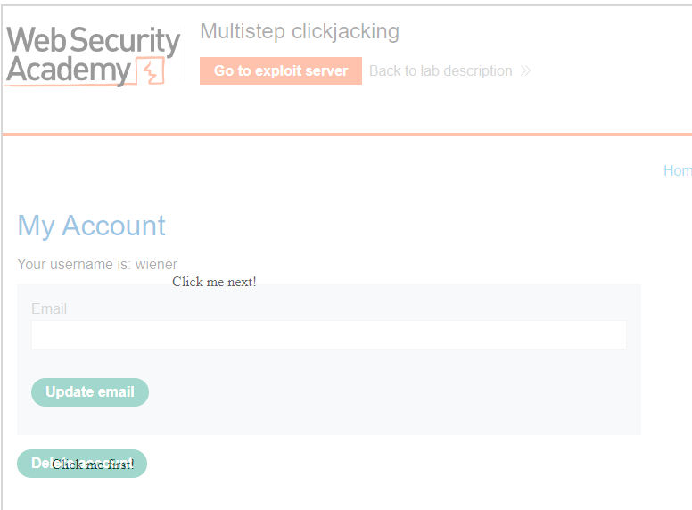
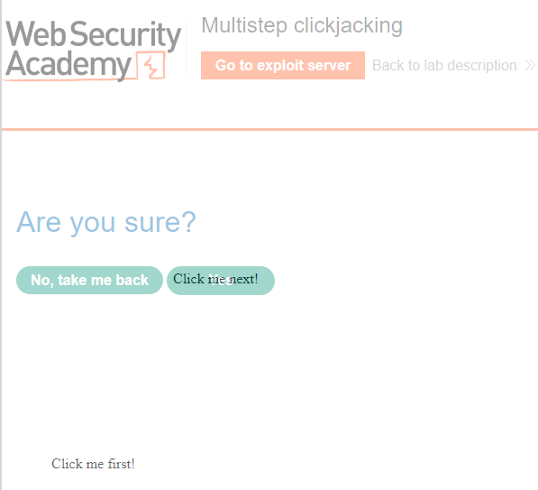
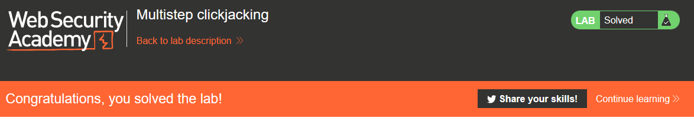

# Write-up: Multistep clickjacking @ PortSwigger Academy

This write-up for the lab *Multistep clickjacking* is part of my walk-through series for [PortSwigger's Web Security Academy](https://portswigger.net/web-security).

Lab-Link: <https://portswigger.net/web-security/clickjacking/lab-multistep>  
Difficulty: PRACTITIONER  
Python script: [script.py](script.py)  

## Lab description

- The delete account functionality is protected by a CSRF token.
- An additional confirmation dialog to protect against clickjacking.
- The victim will click on anything that shows the word `click`, and will obey the order for texts like `Click me first` and `Click me next`
- Known good credentials `wiener:peter`

### Goals

Craft some malicious HTML that 

- frames the page,
- has decoys for both the delete and confirm buttons, and
- coaxes the victim user to delete his account.

## Steps

### Analysis

The lab application is the already well-known blog website. The targetted functionality is an authenticated one, so I log into the account of `wiener` to have a look.

The account page features a prominent `Delete account` button.

Once I click on it, an additional dialog is shown:

The requests are very similar: 

Two obvious possibilities are not possible here:

- I cannot manipulate the form itself, otherwise, it would be easy to skip the second check by adding the `confirmed` value to the form. 
- The CSRF token prevents me from trying to issue the `delete` requests directly in an iframe. Furthermore, the `/my-account/delete` endpoint is not accessible with GET requests so can't be directly loaded into an iframe.

So I need to convince the user to click twice. In real life, knowing common user behaviour will be important to convince them not only to click but also the order of clicks. Knowing as much about my victim (or victim group) is key here - some are triggered by cars, others I can get rage-clicking by using politics, and for some audiences, nudes are always best.

### Craft the malicious HTML

Here in the lab, I have the information that the user clicks on anything that tells him to click. My victum user even obeys the order I tell him to click.

So that is exactly what I'll do:

This renders the page with two `Click me` fields, the first perfectly overlays the `Delete account` button,

whereas the next does the same for the confirmation

After reducing the opacity to `0.000`, `Store` and `Deliver exploit to victim`, the lab updates to

