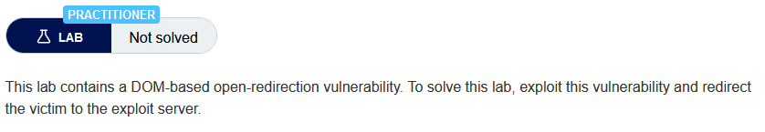
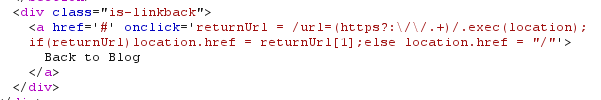

# Write-up: DOM-based open redirection @ PortSwigger Academy

This write-up for the lab *DOM-based open redirection* is part of my walk-through series for [PortSwigger's Web Security Academy](https://portswigger.net/web-security).

Learning path: Client-side → DOM-based vulnerabilities

Lab-Link: <https://portswigger.net/web-security/dom-based/open-redirection/lab-dom-open-redirection>  
Difficulty: PRACTITIONER  
Python script: [script.py](script.py)  

## Lab description

## Steps

### Analysis

As usual, the first step is to analyze the functionality of the lab application, in this case, a blog website. After I browse through the page, I go check the HTML sources. One interesting piece of HTML can be found:

This link is found under every blog article and is used to determine the target of the link dynamically. If there is no parameter `url` in the URL of the page, then it redirects to the local base `/`. 

However, if the `url` parameter exists and starts with either `http://` or `https://`, it will be used as the destination of the link.

No further validation is performed on the destination target.

### The malicious link

Now I know how to craft a URL that redirects to any target of my choice. 

`https://0aa4001903e8eff4c0973a9a00d3008e.web-security-academy.net/post?postId=5&url=https://exploit-0a610014032cefa6c0983abd01bd00c8.web-security-academy.net/exploit`

As soon as I load that URL, the lab updates to

If you found this article helpful, please give it a clap. To get notified of more write-ups, follow me on [Github](https://github.com/frank-leitner) or [medium.com](https://medium.com/@frank.leitner).
