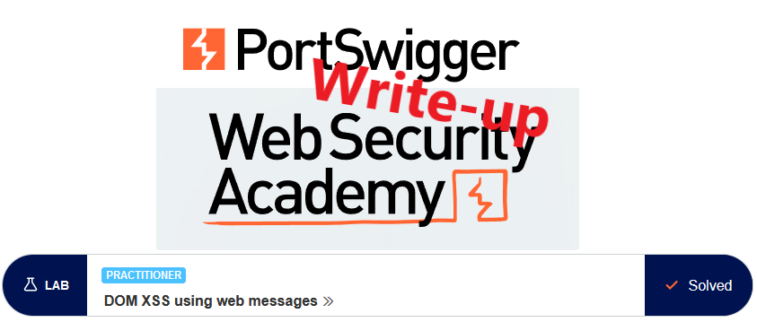
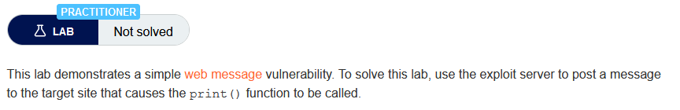
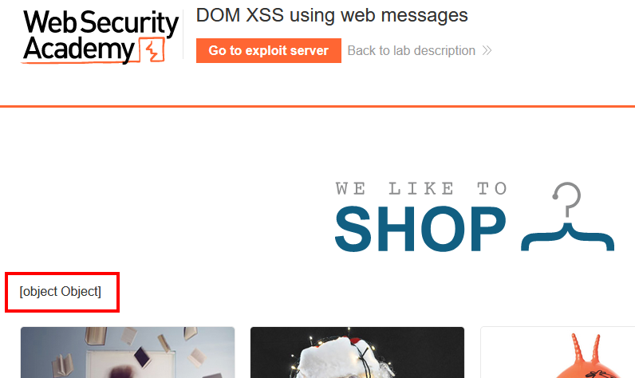
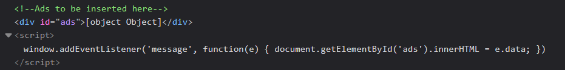
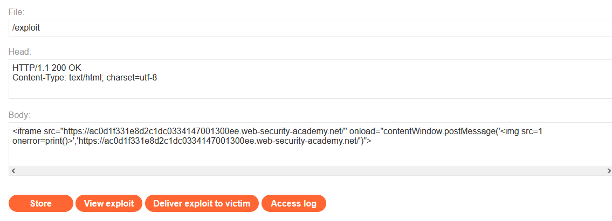

# Write-up: DOM XSS using web messages @ PortSwigger Academy



This write-up for the lab *DOM XSS using web messages* is part of my walk-through series for [PortSwigger's Web Security Academy](https://portswigger.net/web-security).

Learning path: Client-side → DOM-based vulnerabilities

Lab-Link: <https://portswigger.net/web-security/dom-based/controlling-the-web-message-source/lab-dom-xss-using-web-messages>  
Difficulty: PRACTITIONER  
Python script: [script.py](script.py)  

## Lab description



## Steps

### Analysis

As usual, the first step is to analyze the functionality of the lab application, in this case, a shop website. 

What immediately jumps at me is a weird `[object Object]` string above the product listing:



With the help of the browser inspector, I review the corresponding part of the HTML:



Whenever a message is sent to the window, an element of the DOM is changed. What is good news is that there are no forms of sanitization going on here, the raw message data is taken and put straight into the DOM.

### The theory

If I can load the page in an iframe within a page I control, I can send arbitrary data to the application. A quick google search brought me to the [mozilla documentation for iframe](https://developer.mozilla.org/en-US/docs/Web/HTML/Element/iframe#scripting). 
Interesting for the lab is the scripting information:


So I can access the window object of the lab application to send the message. I cannot inject a `<script>` tag straight away as the script parsing for the victim page is already finished. 

To have the browser run my script I need to include it in a way that it runs while it tries to render the page, for example, in the `onerror` property of an `` tag.

The Mozilla documentation also shows the correct syntax for [sending a message](https://developer.mozilla.org/en-US/docs/Web/API/Window/postMessage) to the window object of the `iframe`:

```
postMessage(message, targetOrigin)
postMessage(message, targetOrigin, transfer)
```

My payload will be transported in the `message`, while the `targetOrigin` is the target domain or a `*` as a synonym for *the full world*. 

### The malicious page

Now I have all the information I require to craft a malicious page on the exploit server. As I care about the security of my exploit page, I use the full URL of my victim as `targetOrigin`:



Storing the exploit and viewing it opens the print dialog as expected. Directly after sending the exploit to the victim, the lab updates to


