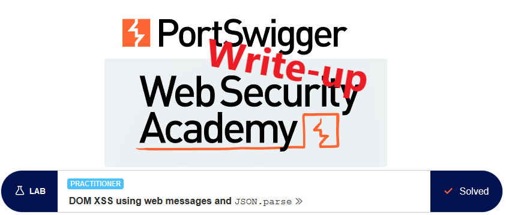
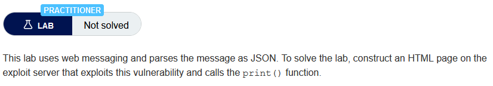
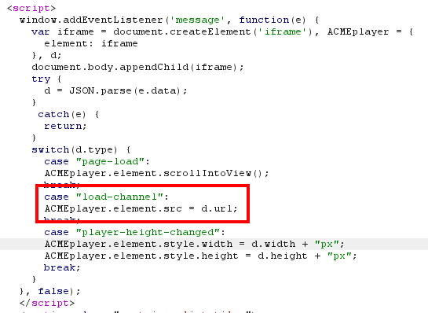
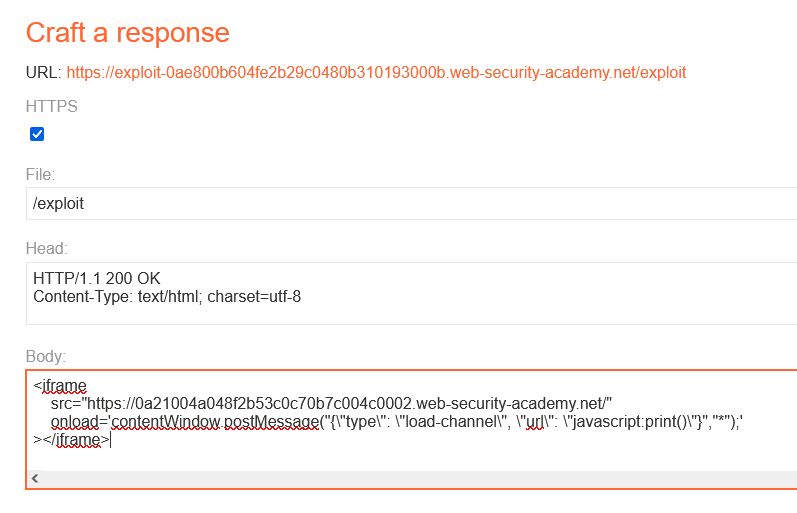
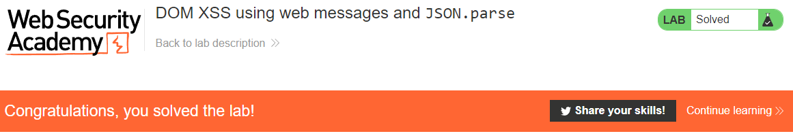

# Write-up: DOM XSS using web messages and JSON.parse @ PortSwigger Academy



This write-up for the lab *DOM XSS using web messages and JSON.parse* is part of my walk-through series for [PortSwigger's Web Security Academy](https://portswigger.net/web-security).

Learning path: Client-side topics → DOM-based vulnerabilities

Lab-Link: <https://portswigger.net/web-security/dom-based/controlling-the-web-message-source/lab-dom-xss-using-web-messages-and-json-parse>  
Difficulty: PRACTITIONER  
Python script: [script.py](script.py)  

## Lab description

 

## Steps

### Analysis

As usual, the first step is to analyze the functionality of the lab application, in this case, a shop website. 

After browsing the public pages I move on to the HTML source of the page. On the main page an interesting script can be found:



Whenever a message is received, the script creates an iframe and appends it to the current page. The message is then parsed as JSON and, depending on the message content, an action may be performed. 

One of the possible actions is loading an URL contained in the message within the iframe. 

### The theory

If I can load the page in an iframe within a page I control, I can send arbitrary data to the application. A google search brings me to the [mozilla documentation for iframe](https://developer.mozilla.org/en-US/docs/Web/HTML/Element/iframe#scripting). Interesting for the lab is the scripting information:


So I can access the window object of the lab application to send the message. The Mozilla documentation also shows the correct syntax for [sending a message](https://developer.mozilla.org/en-US/docs/Web/API/Window/postMessage) to the window object of the `iframe`:

```
postMessage(message, targetOrigin)
postMessage(message, targetOrigin, transfer)
```

My payload will be transported in the `message`, while the `targetOrigin` is the target domain or a `*` as a synonym for *the full world*. 

The vulnerable script requires a valid JSON string in the message. It always contains a key `type` which can be one of `page-load`, `load-channel` or `player-height-changed`. 

In case the `type` is `load-channel`, an additional key `url` is assumed to be present in the message which is then loaded into the iframe. 

No further checks are done on the content of the message, so I can inject a JavaScript URL in there:

```json
{
    "type": "load-channel", 
    "url": "javascript:print()"
}
```

### The malicious page

One question that always comes to mind when using strings is: 

> Which types of quotes to use, single or double?

For this lab, I need three nested layers of quotations

- the content of `onload`
- the argument for `postMessage`
- the strings within the JSON

The [JSON RFC 7159](https://datatracker.ietf.org/doc/html/rfc7159#page-8) requires strings within JSON to use double quotes, so I need to use them there. I already need both types of quotes for the iframe `onload` content and its argument, so I need to escape the double quotes within the JSON string:

```html
<iframe 
    src="https://0a21004a048f2b53c0c70b7c004c0002.web-security-academy.net/" 
    onload='contentWindow.postMessage("{\"type\": \"load-channel\", \"url\": \"javascript:print()\"}","*");'
></iframe>
```

This results in my malicious HTML page:



After storing I test the exploit by viewing it. As expected, the print window opens. All that is left now is to deliver the exploit to the victim and the lab updates to



If you found this article helpful, please give it a clap. To get notified of more write-ups, follow me on [github](https://github.com/frank-leitner) or [medium.com](https://medium.com/@frank.leitner).
