# Write-up: Cross-site WebSocket hijacking @ PortSwigger Academy

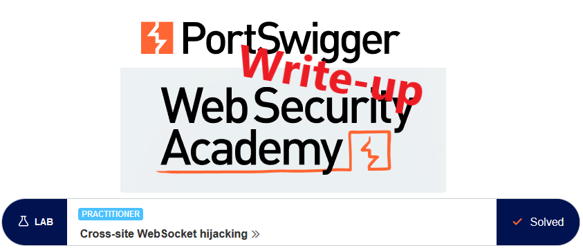

This write-up for the lab *Cross-site WebSocket hijacking* is part of my walkthrough series for [PortSwigger's Web Security Academy](https://portswigger.net/web-security).

Lab-Link: <https://portswigger.net/web-security/websockets/cross-site-websocket-hijacking/lab>  
Difficulty: PRACTITIONER  
Python script: No script available  
Burp Suite Professional is required to solve this lab!

## Lab description

- The lab application supports a live chat feature using WebSockets
  
### Goals

Create an HTML/JavaScript page that uses a cross-site WebSocket hijacking attack to

- exfiltrate the chat history of the victim
- gain access to the account of the victim

## Steps

### Analysis

The lab application is a shop website offering chat support. After loading the page, I go straight to the chat feature and start chatting with the agent:

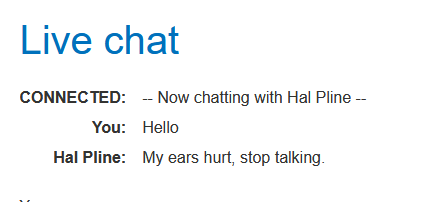

The message exchange runs via WebSockets, with me sending messages to the server and the server sending back whatever needs to be written in the chat on my side:

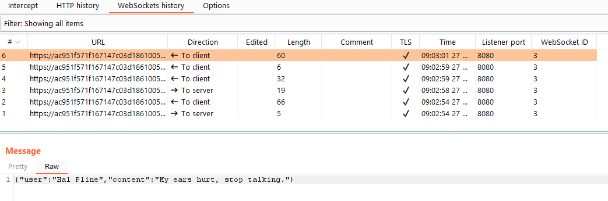

The next thing is to look at the handshake to see how the WebSocket is established:

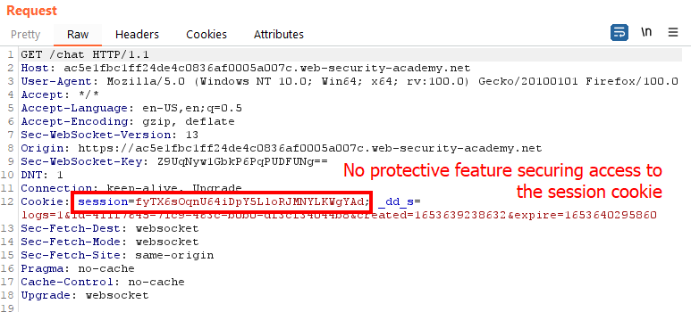

There is a single identifying feature in the request, the session cookie, without any protection against CSRF attacks. 

The cookie is automatically sent by the browser. If I create my own web application that utilizes this WebSocket, I can therefore use this connection to perform any action and read any data the victim has access to.

What is also noteworthy is that once the WebSocket connection is established, the server sends the full history of the chat. This is noticeable on the chat page. No matter how often I reload the page, the full chat history is displayed.

If I can utilize this connection to retrieve the chat content of my victim, I may be able to find useful information.

### Craft malicious application

Let's start the malicious application. The [WebSocket page on javascript.info](https://javascript.info/websocket) provides a good example to follow. The chat always starts with a `READY` message, so I reproduce this.

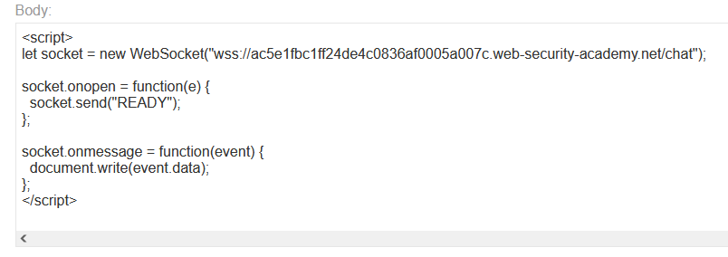

Once I open the page, I get my full chat history displayed:

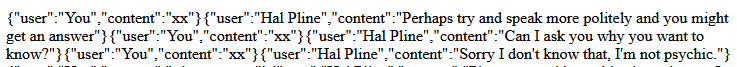

Now that I know it works, I can start exfiltrating the data.

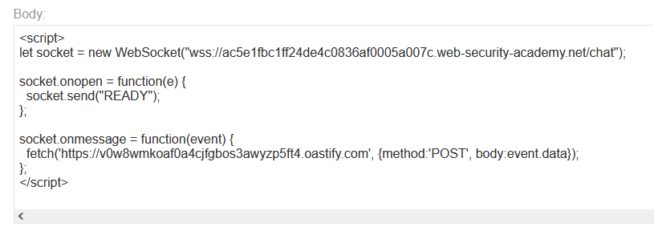

I see a lot of errors in the browser console:

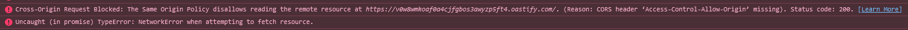

This does not prevent the exfiltration of the chat data as it refers to the connection to the collaborator URL, not the WebSocket. In my Burp Collaborator client, I get all my chat history. 

If I want to get rid of these error messages, the documentation on [mozilla.org](https://developer.mozilla.org/en-US/docs/Web/API/Request/mode) leads to the `RequestMode`. Setting this to `no-cors` stops the errors.

After delivering the exploit to my victim, I check the Burp interactions and see some:

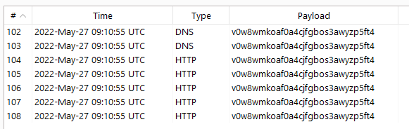

The messages are out of order, but going through the requests the following conversation is visible:

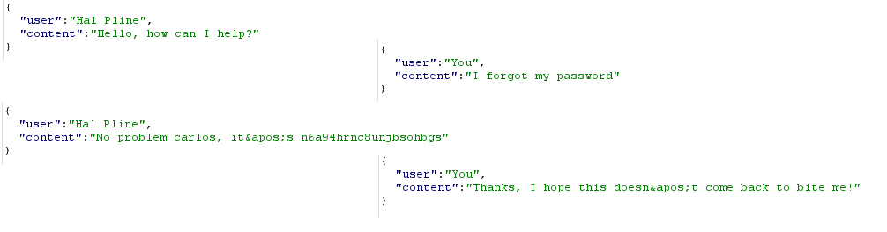

Using both the username and password from the conversation, I log in to the application and the lab updates to 

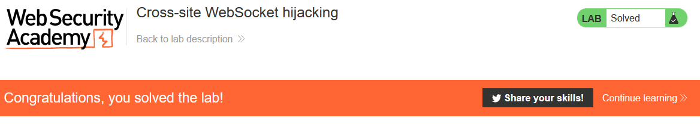
