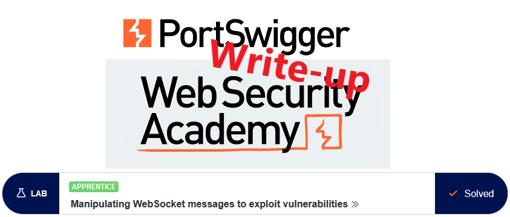
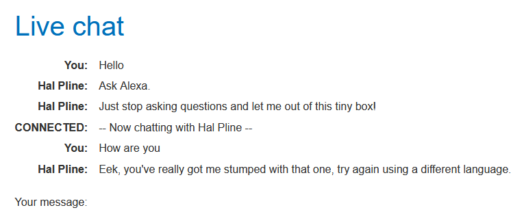
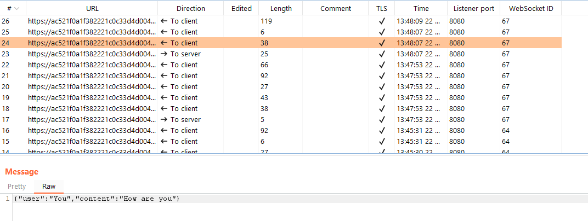
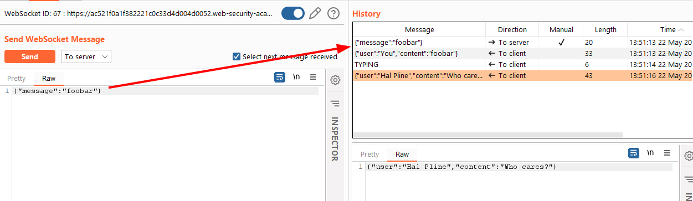
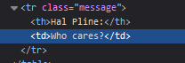
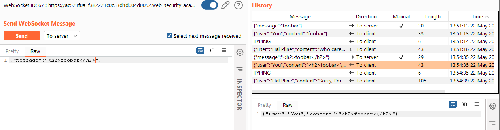
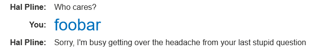
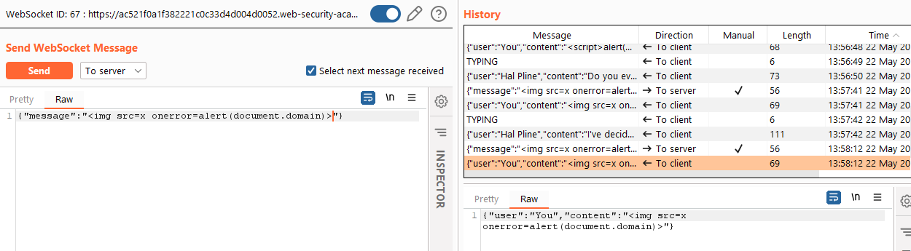
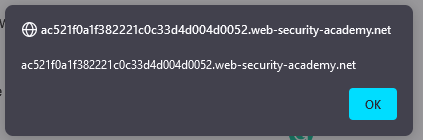
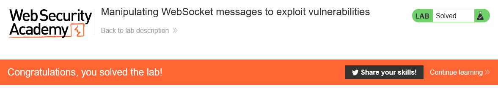

# Write-up: Manipulating WebSocket messages to exploit vulnerabilities @ PortSwigger Academy

This write-up for the lab *Manipulating WebSocket messages to exploit vulnerabilities* is part of my walk-through series for [PortSwigger's Web Security Academy](https://portswigger.net/web-security).

Lab-Link: <https://portswigger.net/web-security/websockets/lab-manipulating-messages-to-exploit-vulnerabilities>  
Difficulty: APPRENTICE  
Python script: Sorry, currently no script

## Lab description

- The lab application supports a live chat feature using [WebSockets](https://portswigger.net/web-security/websockets)
- Chat messages are viewed by an agent in real-time

### Goals

Use a WebSocket message to trigger an `alert()` for the agent.

## Steps

The lab application is a shop website offering chat support. After loading the page, I go straight to the chat feature. So I start annoying the agent:

The message exchange runs via WebSockets, with me sending messages to the server and the server sending back whatever needs to be written in the chat on my side (including a mirror of my own messages):

So I put the message into Repeater and start playing around:

In my browser, the messages are embedded into an HTML table:

So what happens if I start using HTML tags in  my messages:

Assuming that the view of the agent is similar, I try running a script via an `` tag

Of course, as the content gets reflected, I also get that popup, confirming that it worked at least on my side:

At the same time, the lab updates to

