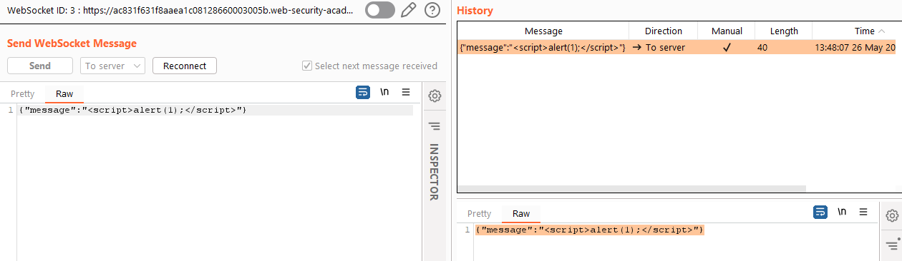

# Write-up: Manipulating the WebSocket handshake to exploit vulnerabilities @ PortSwigger Academy

This write-up for the lab *Manipulating the WebSocket handshake to exploit vulnerabilities* is part of my walk-through series for [PortSwigger's Web Security Academy](https://portswigger.net/web-security).

Lab-Link: <https://portswigger.net/web-security/websockets/lab-manipulating-handshake-to-exploit-vulnerabilities>  
Difficulty: PRACTITIONER  
Python script: Sorry, currently no script 

## Lab description

- The lab application supports a live chat feature using [WebSockets](https://portswigger.net/web-security/websockets)
- An aggressive but flawed XSS filter is used

### Goals

Use a WebSocket message to trigger an `alert()` popup for the chat agent 

## Steps

### Analysis

The lab application is a shop website offering chat support. After loading the page, I go straight to the chat feature. So I start annoying the agent:

The message exchange runs via WebSockets, with me sending messages to the server and the server sending back whatever needs to be written in the chat on my side (including a reflection of my own messages):

In the [previous lab](../Manipulating_WebSocket_messages_to_exploit_vulnerabilities/README.md), plain HTML could be used. In this lab, the description mentions an aggressive XSS filter, so of course, I can not resist trying it out in Repeater:

I don't get any response and the connection is terminated. In the proxy history tab, the last message received shows the reason:

From that point onwards, I can not initiate a new chat as I'm blacklisted:

As I don't want to wait for the lab to expire, I need to find a way to prevent the lockout. In some yet unknown way, the application can determine that I am the source of the JavaScript attack it detected before. This could be done in multiple ways, including using the session cookie, identifying me by IP or trying to determine where I'm coming from.

### Avoid blacklisting

#### Manipulate cookies

As a first step, I delete all cookies I have for that domain. I still get the blacklisted message when trying to load the chat, ruling this option out.

#### Modifying headers

I continue with trying to modify some request headers in case one is used as a source for the blacklisting.

I try the `Origin` and `Referer` headers to no avail. 

In the authentication lab [Username enumeration via response timing](../../02-authentication/Username_enumeration_via_response_timing/README.md), the `X-Forwarded-For` header is used to bypass some login lockout:

Now, I do not receive the `blacklisted` message but the normal response, confirming that the `X-Forwarded-For` header, if existent, is used for the blacklisting. The chat still disconnected immediately:

To be able to continue chatting regardless of whether the XSS protection finds something or not, I need two things:

1. Automatically include an `X-Forwarded-For` header for all requests
2. Randomize the value of this header so I can restart the chat immediately once I'm kicked out

##### Add header

To automatically add a header to all requests, I add this to the Burp Proxy `Match and Replace` option (for the `#RANDOM#` part see next section):

Now every request that passes through the proxy will have this header set.

##### Randomize header content

To generate a random header content for each request, I use the `Request Randomizer` extension from the `BApp Store`:

It requires [Jython](https://www.jython.org/download), if you don't have it installed ensure to use the standalone version and add it to the extender options:

To be able to use the extension, I need to add a session handling rule to the project. In the scope, ensure that the proxy is included (by default it is not) and that the lab URL is in the scope:

Now, every request done will have the `X-Forwarded-For` header added with a random value, even though the proxy history does not show it:

It still works, when the server discovers a JavaScript attack I can immediately reload the `/chat` page to continue.

### Circumvent XSS protection

Now that I don't have to worry about the blacklisting, I can find a way to avoid the XSS protection.

Using simple capitalization of the `onerror` does not work, but at least the `Reconnect` button works now thanks to the randomized header content:

The [XSS cheat sheet](https://portswigger.net/web-security/cross-site-scripting/cheat-sheet#waf-bypass-global-objects) provided by PortSwigger provides some nice examples of how to obfuscate JavaScript strings.

I try to inject my payload into the window object:

Immediately two things are obvious: 

1. the connection is not terminated 
2. the server reflects my payload back to me.

I go to the browser, the chat welcomes me with an `alert` box and the lab is already updated to

