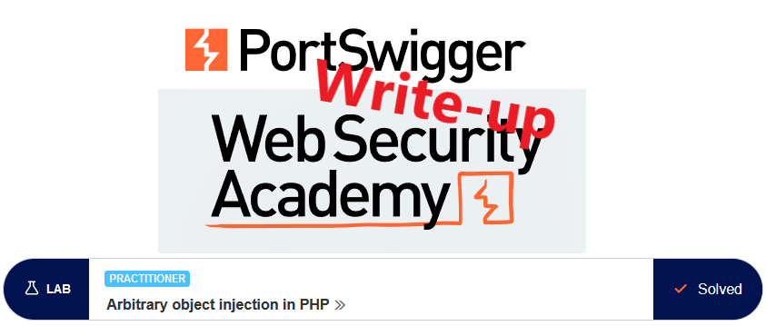
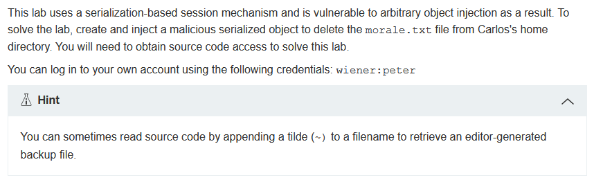
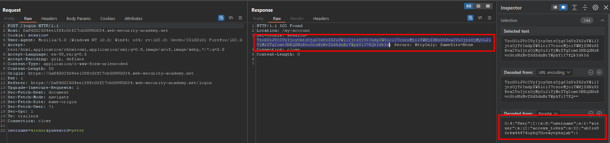
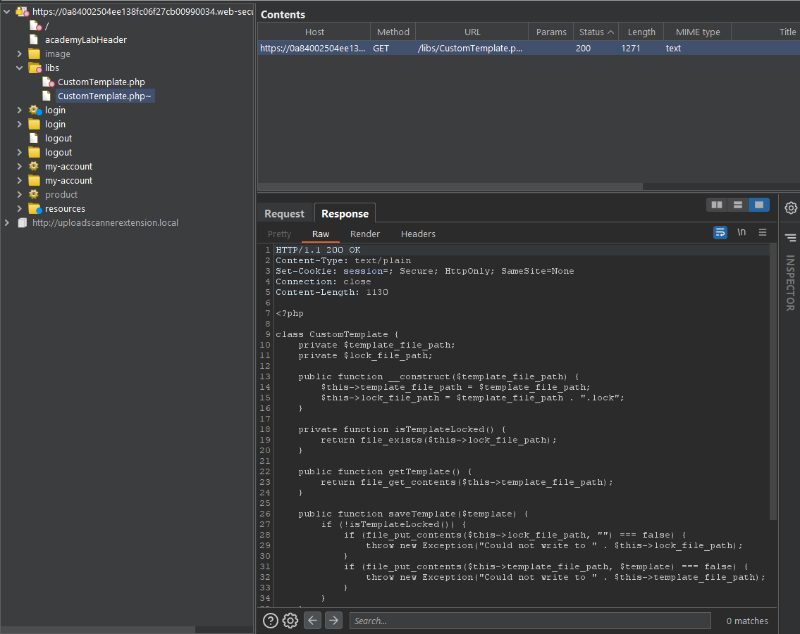
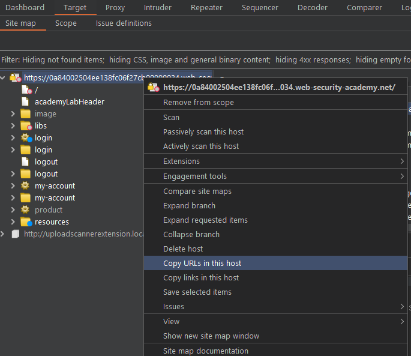
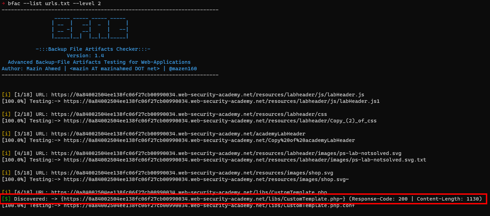
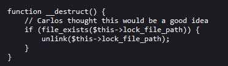

# Write-up: Arbitrary object injection in PHP @ PortSwigger Academy



This write-up for the lab *Arbitrary object injection in PHP* is part of my walk-through series for [PortSwigger's Web Security Academy](https://portswigger.net/web-security).

**Learning path**: Advanced topics → Insecure deserialization

Lab-Link: <https://portswigger.net/web-security/deserialization/exploiting/lab-deserialization-arbitrary-object-injection-in-php>  
Difficulty: PRACTITIONER  
Python script: [script.py](script.py)  

## Lab description



## Steps

### Analysis

As usual, the first step is to analyze the functionality of the lab application. In this lab, it is a shop website.

According to the lab description, the vulnerability is in authenticated functionality, so I log in with the known credentials of `wiener` and look at the response:



The session cookie is both URL- and base64 encoded, so I use Inspector to see its content. Some of the last labs covered vulnerabilities with the `access_token`, so I will not repeat these steps here, the labs are usually single-purpose.

### The theory

Usually, when assessing a website one of the first steps is to attempt to find all files that exist on the server. This does not stop on files that are referenced in the application but also files that the site owner tries to hide or are there by accident.

For trying to hide hidden files, Burp Suite offers the `Content discovery` option, which is a Professional option and not available in the Community edition. For free tools, fuzzing tools like [gobuster](https://github.com/OJ/gobuster) or [wfuzz](https://github.com/xmendez/wfuzz) are great options.

Files that are there by accident can include backup files. These are dangerous, as they allow reading the content of files that are usually not provided to the client but executed server side. Web servers are usually configured to run files like `.php, .phtml, .php5, ...` with the PHP interpreter and not send them to the browser. With `.php.bak` or `.php~`, this might be different, which allows an attacker to read through code to find vulnerabilities.

### Search for files (Burp Pro)

Burp Suite contains this check in the `Content discovery` functionality. Unfortunately, not all common extensions are included by default. For example, `vi` adds a `~` to the filename for the backup file which is not included in the extension list provided by Burp.

If I add it, then Burp will discover an interesting file during the `Content discovery`, which allows me to read through the PHP code:



### Search for files (free)

For a free alternative, [bfac (Backup File Artifacts Checker)](https://github.com/mazen160/bfac) is a nice tool to search for backup files.

I export the URLs from the site map in Burp (`Right-click->Copy URLs in this host`) and store them in a text file:



This file contains a few duplications so I manually remove them.

Now I start bfac with this list and wait a bit. After a while, a finding is shown



### Code review time

Now that I can access the PHP code of this file it is time for a quick code review and I discover an interesting function:



If I can cause the creation of an instance of the class `CustomTemplate` with content defined by me, then I can delete any file matching these criteria:

1. I know the name of the file.
1. The web server has sufficient privileges to delete it.

I know the file is named `morale.txt` and is located in the home directory of `carlos`, so I can guess the path is `/home/carlos/morale.txt`.

Deserialization usually does not know beforehand what objects they are going to deserialize, this information is contained within the serialized string itself.

### The malicious payload

So I need to ensure that the cookie contains a `CustomTemplate` object. I can take the `User` object as a blueprint to create it.

```
O:4:"User":2:{
    s:8:"username";s:6:"wiener";
    s:12:"access_token";s:32:"b04u6l9jk7tsdu4pmig28okdklir3hoe";
}
```

To break it down a bit:

| Serialized | Meaning |
| --- | --- |
| `O:4:"User":2` | Object, its type name is 4 characters long and is "User". It contains 2 serialized members |
| `s:8:"username";s:6:"wiener";` | The name of the first member has 8 characters and is "username", the content is the 6 character string "wiener" |
| `s:12:"access_token";s:32:"b04u6l9jk7tsdu4pmig28okdklir3hoe";` | The name of the second member has 12 characters and is "access_token", the content is the 32-character string "b04...hoe" |

Using this as blueprint, I can create a `CustomTemplate` object:

| Serialized | Meaning |
| --- | --- |
| `O:14:"CustomTemplate":1` | Object, its type name is 14 characters long and is "CustomTemplate". It contains 1 serialized member |
| `s:14:"lock_file_path";s:23:"/home/carlos/morale.txt";` | The name of the first member has 14 characters and is "lock_file_path", the content is the 23 character string "/home/carlos/morale.txt" |

All together, it forms the serialized string:

```
O:14:"CustomTemplate":1:{s:14:"lock_file_path";s:23:"/home/carlos/morale.txt";}
```

I base64- and URL-encode it and store it in my cookie. Now I refresh the page. 

Of course, the page logic fails as it expects a `User` object which is not there. But my `CustomTemplate` object was deserialized and instantiated. Upon destruction, the file referenced in my cookie was deleted in the destructor and the lab updates to:


---

If you found this article helpful, please give it a clap. To get notified of more write-ups, follow me on [GitHub](https://github.com/frank-leitner) or [medium](https://medium.com/@frank.leitner).
