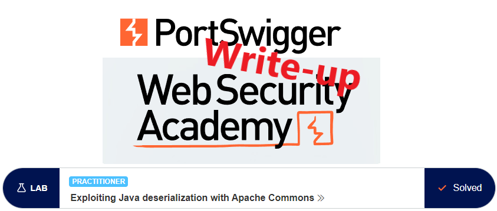
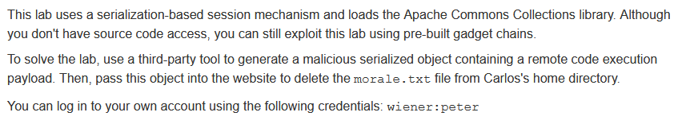
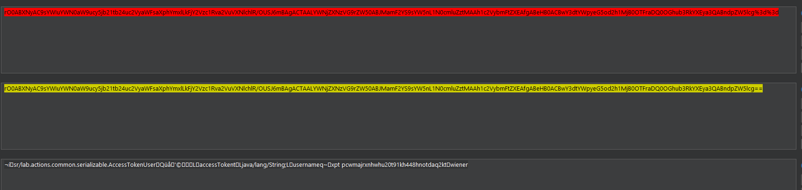
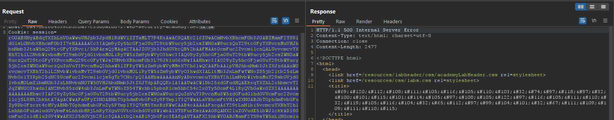
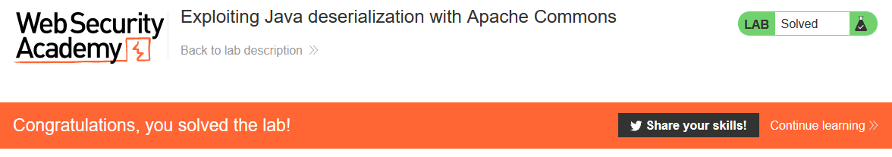

# Write-up: Exploiting Java deserialization with Apache Commons @ PortSwigger Academy



This write-up for the lab *Exploiting Java deserialization with Apache Commons* is part of my walk-through series for [PortSwigger's Web Security Academy](https://portswigger.net/web-security).

**Learning path**: Advanced topics → Insecure deserialization

Lab-Link: <https://portswigger.net/web-security/deserialization/exploiting/lab-deserialization-exploiting-java-deserialization-with-apache-commons>  
Difficulty: PRACTITIONER  
Python script: Sorry, no script available

## Lab description



## Steps

### Analysis

As usual, the first step is to analyze the functionality of the lab application. In this lab, it is a shop website.

I use the provided credentials and log into the account of `wiener`. The response to the log-in contains a session cookie. It starts with `rO0` which is a strong indication that it is a base64 encoded serialized Java object. I load it into Decoder and perform both a URL- and base64 decode:



The cookie contains some non-printable characters, but a few things can be found here:

- The backend is Java driven
- The serialized object is of class AccessTokenUser
- It contains my username as String member field

### Missing link

Unfortunately, I do not find any indication of the framework used outside of the lab description so I'm unsure how to get from this step to the next one apart from the Academy context of the lab (`ysoserial`).

If you have any links explaining how to find the framework used from within the lab, please share a link in the comments.

### The malicious payload

I get the latest release of the tool `ysoserial` and start to generate payloads for `CommonsCollections`. When using `CommonsCollections4`, it becomes interesting.

```
java -jar ysoserial-all.jar CommonsCollections4 'rm /home/carlos/morale.txt' | base64
```

The result is a rather long string of characters.

I load one request from the proxy into Repeater and replace the session cookie with this string. The full value must be on one line, so ensure that it does not include `\r\n` when copying it from the terminal.

I select the full string and URL-encode key characters - it is likely that the only changes are equal signs at the end of the string. Then I send the request.

The result is a `500 Internal Server Error`:



This is expected, as the application expects but does not receive an object of type `AccessTokenUser`. Still, the payload is executed by the backend and the lab updates to:



---

If you found this article helpful, please give it a clap. To get notified of more write-ups, follow me on [GitHub](https://github.com/frank-leitner) or [medium](https://medium.com/@frank.leitner).
