# Write-up: Exploiting PHP deserialization with a pre-built gadget chain @ PortSwigger Academy

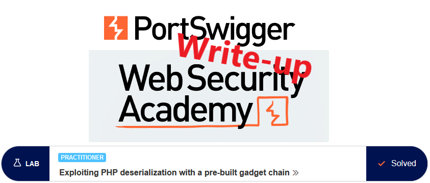

This write-up for the lab *Exploiting PHP deserialization with a pre-built gadget chain* is part of my walk-through series for [PortSwigger's Web Security Academy](https://portswigger.net/web-security).

**Learning path**: Server/Client-side/Advanced topics → XZY

Lab-Link: <https://portswigger.net/web-security/deserialization/exploiting/lab-deserialization-exploiting-php-deserialization-with-a-pre-built-gadget-chain>  
Difficulty: PRACTITIONER  
Python script: [script.py](script.py)  

## Lab description

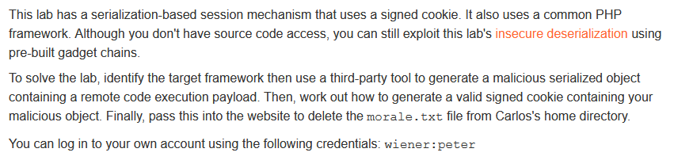

## Steps

### Analysis

As usual, the first step is to analyze the functionality of the lab application. In this lab, it is a shop website.

With the credentials provided, I log into the account of `wiener` and check the login response. The session cookie I send to Decoder and URL-decode the cookie. The token value looks like a base64-encoded string, so I decode it as well:

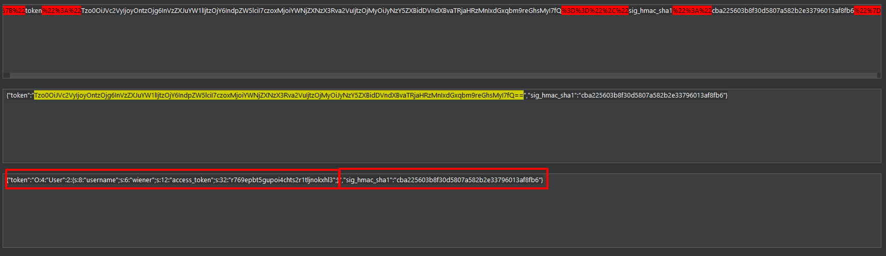

It can be seen that the token is a serialized PHP object containing a username and an access token as well as an HMAC signature. 

An HMAC, or hash-based message authentication code, is an authentication method that uses a hash function, in this case, SHA-1, together with a secret key as additional input. I can't create a new valid token without knowing the secret key. At least if it is implemented correctly. So this is the first thing I try out.

---

### Creating an invalid token

Creating an invalid token is easy. I load a request into Repeater and change a single character in the HMAC string. This request results in an interesting response:

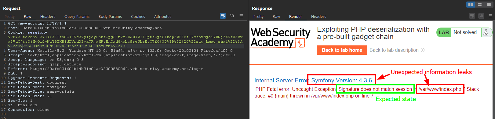

It shows that it checks for and validates the signature, but without handling this gracefully. As result, an exception is shown leaking information:

- The framework used by the application: Symfony 4.3.6
- The path on the server

The same happens if I remove the signature completely. So while it does not allow me to bypass the signature check, it still provides useful information. The first one especially is critical as it provides me with additional information about the backend system that supports me in finding a vulnerability.

---

### Dangerous comments

While looking through the requests and responses, an HTML comment jumps out:

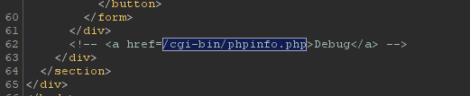

This comment indicates the existence of a `/cgi-bin/` directory and worse, a `phpinfo.php` file. If this is really present on the live system it is an absolute critical leak, as a `phpinfo` page usually contains all types of valuable information.

So I try straight away if this file exists:

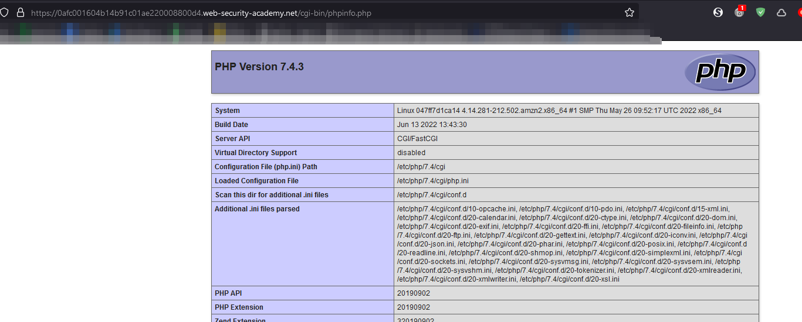

Upon looking through the file, one section is of special interest, the PHP variables:

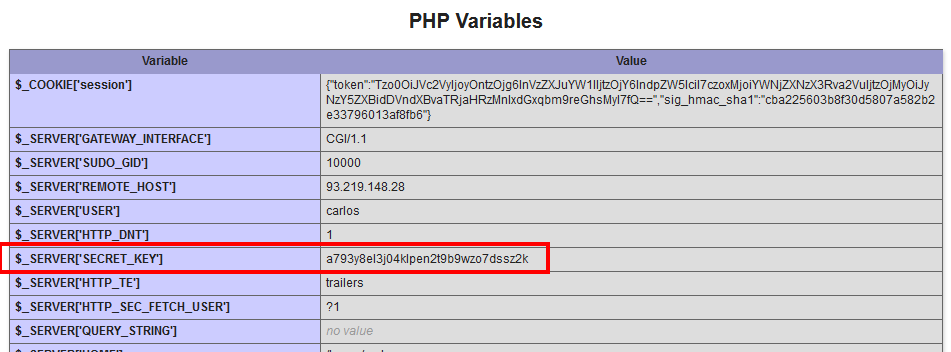

**Side note**

As a side note, even without the comment, it is trivial for an attacker to find such obviously named directories and files with simple fuzzing tools like [gobuster](https://github.com/OJ/gobuster) or [wfuzz](https://github.com/xmendez/wfuzz):

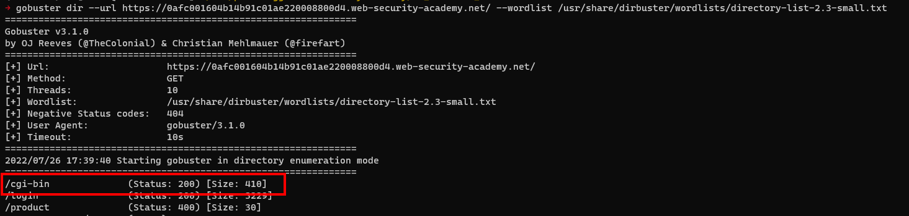

---

### Finding the correct gadget chain

Now that I know the secret key, I can create valid tokens containing arbitrary data, for example, my own serialized classes.

From the exception above I know the framework that is used: Symfony 4.3.6

So I download the [PHP Generic Gadget Chains](https://github.com/ambionics/phpggc) from GitHub and look at the available gadget chains for Symfony with `phpggc --list`:

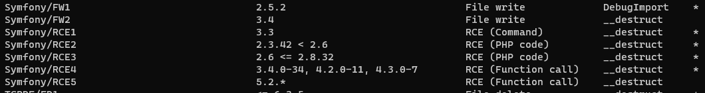

There is an exact version match for `Symfony/RCE4`, so I will use that.

---

### The malicious payload

With phpggc I can now create a PHP object that will remove `/home/carlos/morale.txt`:

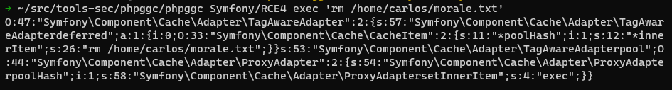

For generating the cookie, I use some tools on the command line:

```
obj=$(~/src/tools-sec/phpggc/phpggc Symfony/RCE4 exec 'rm /home/carlos/morale.txt' | base64 --wrap=0)
hash=$(echo -n $obj | openssl dgst -sha1 -hmac "a793y8el3j04klpen2t9b9wzo7dssz2k" | cut -d' ' -f2)
echo -n '{"token":"'$obj'","sig_hmac_sha1":"'$hash'"}'
```

In the first line, I create the object and base64-encode it.

In the second line, I use OpenSSL to create the sha1-HMAC from this object and the leaked secret key. Openssl prints some additional output, so I remove it with `cut`.

Finally, I put object and hash in the correct syntax to be used as the value of the session cookie:

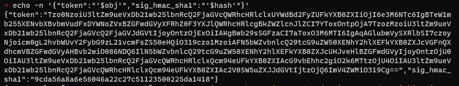

I copy the token into my session cookie, URLencode key characters and send the request:

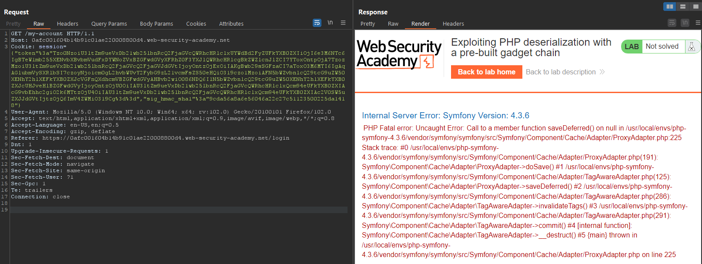

As expected, an error is thrown. What is important is that it comes from a `TagAwareAdapter` object, which was used in the output generated by `phpggc`.

Reloading the lab applications shows that the lab was solved:

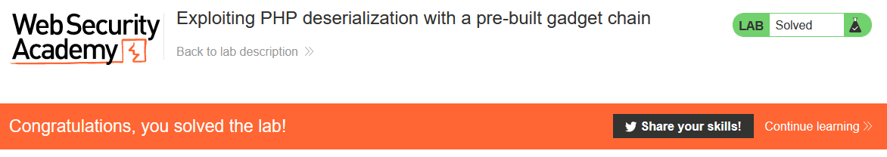

---

If you found this article helpful, please give it a clap. To get notified of more write-ups, follow me on [GitHub](https://github.com/frank-leitner) or [medium](https://medium.com/@frank.leitner).
