# Write-up: Modifying serialized data types @ PortSwigger Academy

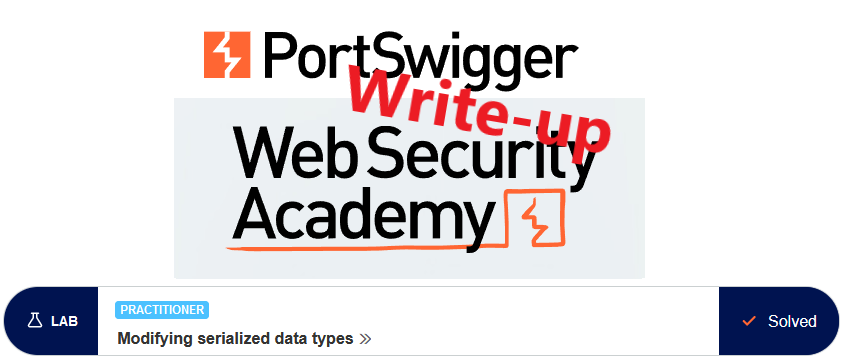

This write-up for the lab *Modifying serialized data types* is part of my walk-through series for [PortSwigger's Web Security Academy](https://portswigger.net/web-security).

**Learning path**: Advanced topics → Insecure deserialization

Lab-Link: <https://portswigger.net/web-security/deserialization/exploiting/lab-deserialization-modifying-serialized-data-types>  
Difficulty: PRACTITIONER  
Python script: [script.py](script.py)  

## Lab description

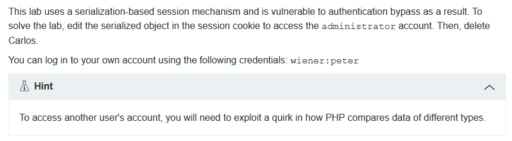

## Steps

### Analysis

As usual, the first step is to analyze the functionality of the lab application. In this lab, it is a shop website.

The vulnerability is in authenticated functionality, so I log in with the known credentials of `wiener` and look at the response:

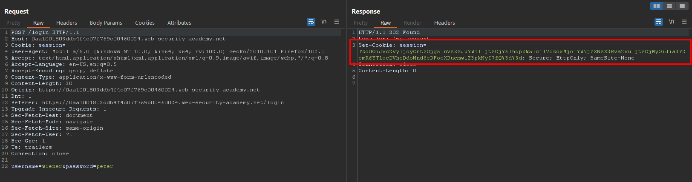

The application stores a session cookie after login. It is visible that it ends with two URL-encoded `=` characters. That is a strong indication that the cookie is base64-encoded.

I send the string to Burp Decoder and look at its content:

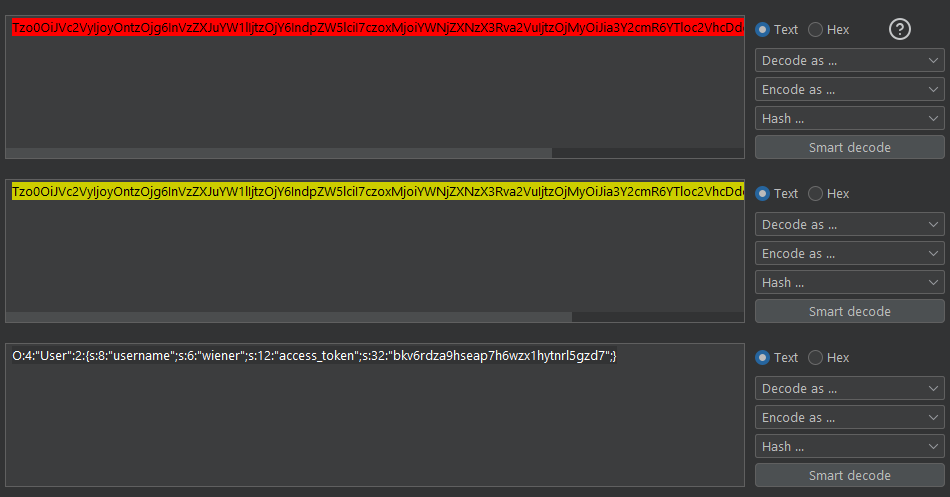

It contains two values, my `username` and an `access_token`.

---

### The unintended way

I wonder what will happen if I set the username to `administrator` and use a boolean as the access code.

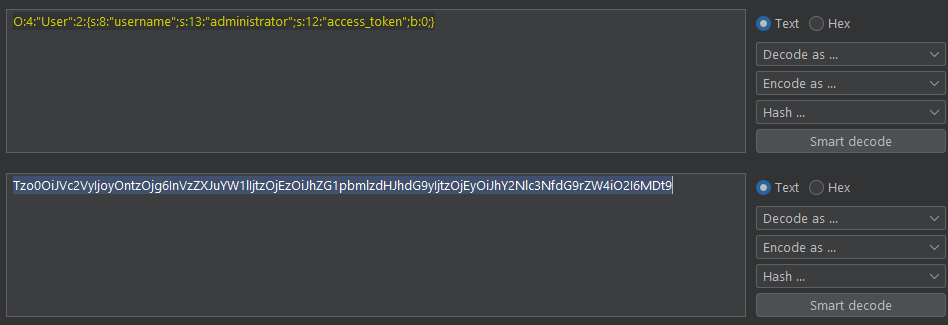

The base64-encoded string does not end with `=`, so no URL-encoding is required. I store the string in my cookie and refresh the page. The result is somewhat unexpected and very interesting. It shows an internal server error that shows me all access tokens:

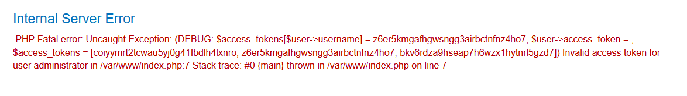

The last one `bkv...` is my own, and there are two additional tokens. Fortunately, the exception message shows exactly which one is required for the user `administrator`: `z6er...`.

So I quickly use this string for the cookie, store it and refresh.

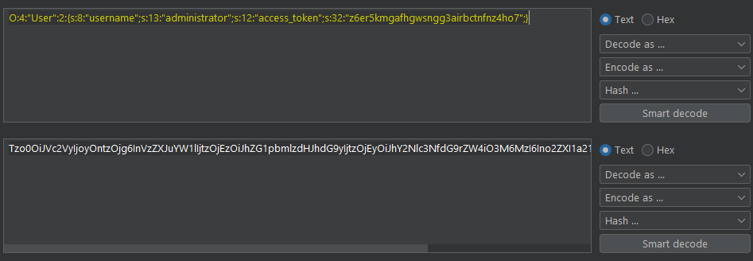

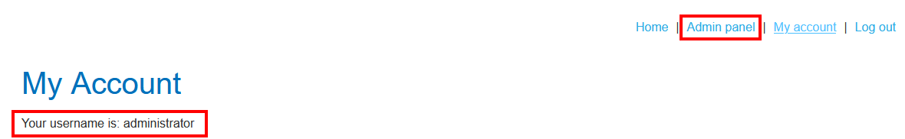

And I can see the admin panel where I can delete the users. Even though it would work it is clearly not the intended way, so I log out again and restart manipulating the cookie.

---

### The intended payload

Trying a boolean value for the access code did not work the intended way, so I retry using an integer value:

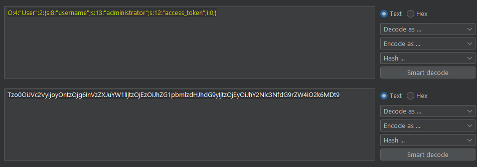

I store it in the browser and refresh the page:

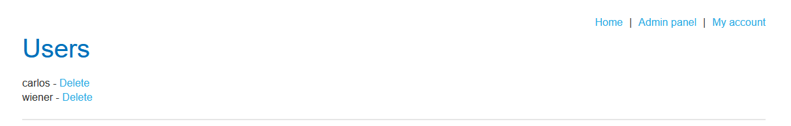

Now I go to the admin panel and delete user `carlos`. The lab updates to 

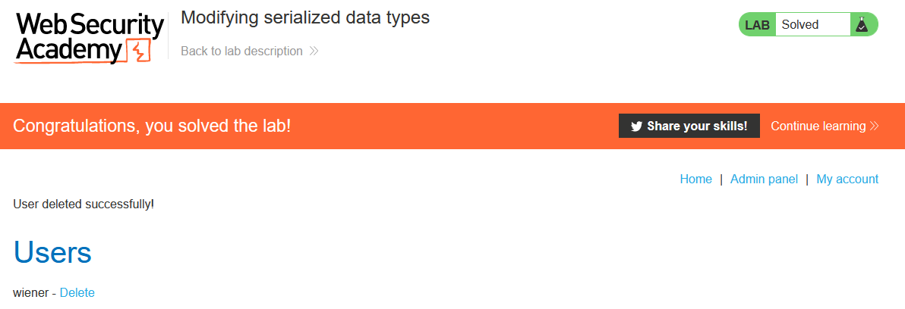

---

This lab shows nicely that often there are multiple ways to reach the goal. And it emphasizes that it is important to *never reveal any internal data in error messages*. Especially exceptions often show a lot of interesting information, like data types or even values, or stack traces revealing file names and paths.

---

If you found this article helpful, please give it a clap. To get notified of more write-ups, follow me on [GitHub](https://github.com/frank-leitner) or [medium](https://medium.com/@frank.leitner).
